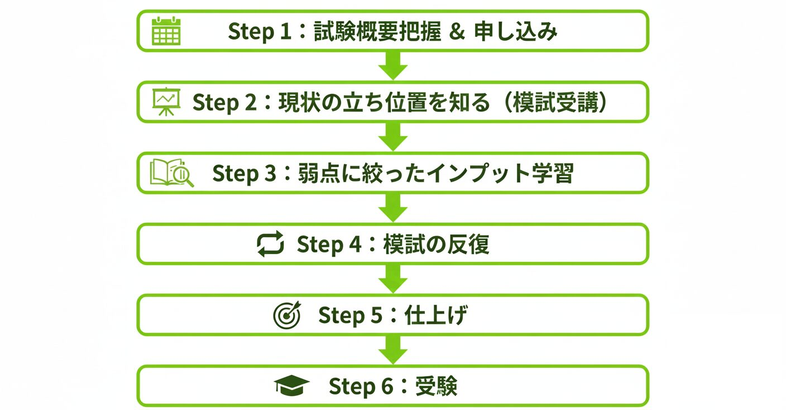

本記事では、AWS SAA合格に向けた36日間の学習スケジュールや使用する教材について詳しく紹介します。  
受験後の結果と、実際にやってみた経験からブラッシュアップした修正版のロードマップは別の記事にてご紹介する予定です。

## 1\. 現在のAWS理解度

実務経験は約1年ですが、使用しているサービスには偏りがある状態です。

- **経験あり:** Lambda、API Gateway、S3、IoT などのサーバーレス構成

- **未経験・知識不足:** VPCのネットワーク設計、EC2、RDSの詳細設定、オンプレミスからの移行など

## 2\. なぜ今受験するのか

私は2026年1月現在、フリーランスエンジニアとして活動しています。  
今までの案件の内容として、担当工程としては詳細設計~実装テストが多く、技術はバックエンド、フロントエンド、インフラと広く浅く触れてきました。

しかし今後のキャリアを考えたときに、

- 自分より優秀なエンジニアがどんどん輩出されてくる

- 生成AI技術が発達し、下流工程はAIに任せることが当たり前になる

そんな想像をしていると、現在の自分の状況に強い危機感を感じました。

それらの不安を打ち払うため「**クラウドソリューションアーキテクト**」という軸を持とうと考えています。  
その第一歩として、AWS 認定ソリューションアーキテクト – アソシエイト（SAA-C03）の受験を決めました。  
単なる「プログラマー」ではなく、クラウドソリューションアーキテクトとしての実績を作ることで、より上流工程からの提案や、高単価な案件への参画を目指します。

## 3\. 試験日と学習計画

### 試験日

**2026年2月15日**  
[初回受験料25%OFF & 再受験料無料キャンペーン](https://pages.awscloud.com/GLOBAL-other-GC-Traincert-Global-Retake-Registration-2025.html?gc-language=ja-jp)が実施されており、適用条件が`2026年2月15日までに受験`だったためここにしました。  
もっと早くに気づいていれば勉強時間も充分に確保できたのですが、仕方ないですね。  
こちらのキャンペーンは定期的に実施されているようなので受験を検討している方は要チェックです。

### 学習期間・時間

学習開始日は記事執筆日の翌日、2025年1月10日です。

AWS実務経験者の学習時間の目安としては、サイトによってバラつきはありますが大体60時間程度あれば充分そうです。  
しかしお得なキャンペーンに目がくらんだ自分は試験日が決められているため、試験当日までの**約36日間**、合計**46時間**で合格を目指します。  
（「もしダメでも再受験無料だし」という甘えは排除して臨みます）

|  | 平均学習時間 | 期間内の合計 |
| --- | --- | --- |
| 平日 | 1時間 | 26日間 × 1h = 26h |
| 休日 | 2時間 | 10日間 × 2h = 20h |
| **合計** | \- | **46時間** |

この表を見ると「休日もっと勉強できるだろ」という声が聞こえてきそうですが、そんな方にはこの言葉を贈ります。

> **考えることはいっしょだ。わしも最初はそうだった。となりゃあこんなとこで使っちゃあいられねぇよな。気持ちはわかるよ。けど、無理はいけねぇ。無理は続かない。自分を適度に許すことが、長続きのコツさ**
> 
> 賭博破戒録カイジ より引用

## 4\. 合格へのロードマップ

以下のステップで学習を進める予定です。  
実際にやってみて微妙だなと思うところがあれば随時軌道修正します。

* * *

### Step 1：試験概要把握 ＆ 申し込み

『敵を知り己を知れば百戦危うからず』と孫氏の言葉にあるように、まずは敵を知ることから始めます。  
これは[公式サイト](https://aws.amazon.com/jp/certification/certified-solutions-architect-associate/)をざっと確認すればよいでしょう。

そして後戻りできないように先に試験予約を完了させます。

### Step 2：現状の立ち位置を知る（模試受講）

次に己を知ります。  
模試を解いてみて合格ラインからどの程度差があるかを把握します。

教材には合格体験記を書かれているほとんどの方が紹介されていた[【2025年版】AWS認定ソリューションアーキテクト アソシエイト模擬試験問題集（6回分390問）](https://www.udemy.com/course/aws-knan/?srsltid=AfmBOoruxJdtyWxc6DldHPbqz7RdFDwwmCww6E8Z333lftDjUgqMQP7-&couponCode=CP250102JP)を使用します。  
セール期間中であれば1,000円代で購入できるので非常にお得です。

こちらの模試を本番と同じく130分の制限時間で実施します。  
本番よりも難易度が高いようですが、これを8割方正解できるようになれば本番も余裕だろうというスタンスでいきます。

### Step 3：弱点に絞ったインプット学習

模試で間違えた箇所を中心に、知識の穴を埋めていきます。

使用する教材は模試と同じくUdemyの[【SAA-C03版】これだけでOK！ AWS 認定ソリューションアーキテクト – アソシエイト試験突破講座](https://www.udemy.com/course/aws-associate/?couponCode=CP250102JP)をメインに進めます。  
こちらの講座で理解が難しい箇所はAWS公式のBlack BeltやYouTube動画などで補完していきます。

### Step 4：模試の反復

再度模試を受講し、正答率が80%を超えるまで繰り返します。  
8割を超えたら次の模試を受験し、同じく間違えた箇所を中心にインプットをしていきます。

今回使用するUdemyの教材には全6回分の模試が含まれているとのことなので、時間が許す限りで全ての模試で8割を超えるよう模試と復習を繰り返します。

### Step 5：仕上げの「ping-t」

時間に余裕があれば、[ping-t](https://mondai.ping-t.com/g)の模試も活用しようと思っています。  
ただ、恐らく時間が足りないでしょう。

### Step 6：受験

キャンペーンがあるからまだ一回チャンスがあるなどと思ってはいけません。  
決死の覚悟で挑みます。

## おわりに

学習は未来への投資です。  
2月15日の合格に向けて、今日から一歩ずつ積み上げていきます。  
日々の進捗についてはXにて報告していきますので、よろしければフォローお願いします。
