この記事で解決できるお悩み

- [Python用の正規表現チェッカーを探しているけどどれがいいか分からない...](#結局どれを使えばいいの)

- [それぞれの正規表現チェッカーの特徴を比較したい](#各チェッカーの機能早見表)

- [正規表現チェッカーの具体的な使い方を知りたい](#各チェッカーの使い方)

こんな悩みを解決できます！

この記事では「これを使っておけばOK！」という正規表現チェッカーの紹介と、その他のおすすめチェッカーとの比較や使い方をご紹介します。

この記事を読み終えれば、お気に入りの正規表現チェッカーが見つかっているはずですよ！

## 正規表現とは？

正規表現とは`^`や`$`などの特殊な記号を使うことで、複数の文字列をたった一つの文字列で表す方法です。

例えば以下の文字列が電話番号かどうか判別してくださいと言われたらどうするでしょうか？

```
090-XXXX-XXXX /* X = 数字 */
```

人間からすれば一目見て電話番号だとわかりますが、コンピュータはそうはいきません。

コンピュータに「`090-0000-0000`は電話番号だよ、`090-0000-0001`は電話番号だよ、`090-0000-0002`は、、」と1つずつ教えれば判別してくれますが、無駄が多すぎです。

そこで「**先頭に0~9までの数字が3つ、その後にハイフン、その後ろに...**」のように電話番号とはどんなパターンの文字列なのかを説明してあげればよいではないか。と昔の偉い人は考えました。

その説明をするために必要なのが正規表現です。

電話番号を正規表現で書くと以下のようになります。

```
[0-9]{3}-[0-9]{4}-[0-9]{4} 
/* = 左から、0~9の数字が3つ、ハイフン1つ、0~9の数字が4つ、ハイフン1つ、0~9の数字が4つある文字列 */
```

この正規表現を使えば、コンピュータ側が電話番号というものを理解し、大量の文章の中から電話番号だけを取得するといったことが可能になります。

このように欲しい文字列のパターンを指定することで1つの文字列で複数の文字列を表すことができるのが正規表現です。

### 正規表現チェッカーはなぜ必要なのか？

上の例のように、正規表現は人間からするとややわかりづらいです。

なのでその正規表現が意図したものになっているかチェックする必要がありますが、Pythonコード上のチェックでは手間がかかり、出力結果もわかりづらくなりがちです。

しかし正規表現チェッカーではお手軽かつ視覚的にもわかりやすくチェック結果を出力してくれます！

正規表現チェッカーを使えば、チェックしたい正規表現とマッチ対象の文字列を入力するだけでマッチ確認、置換結果確認、マッチした文字列のリスト出力などなど...さまざまな機能を提供してくれます！

正規表現を扱う上でこんなに便利なものはないので、積極的に活用することをおすすめします！

## 結局どれを使えばいいの？

結論から言うと**[regex101](https://regex101.com)**が圧倒的におすすめです。

理由はダントツで高機能だからです。

正規表現チェックや置換機能はもちろん、正規表現解説やステップ数（≒ 正規表現のパフォーマンス）の確認機能まで搭載されています。

さらにPythonだけでなくJavaScriptやPHP、Javaなどさまざまな言語に対応しているので、正規表現に関しては**このツールを使っておけば間違いない！**と断言できます。

ただあまりにも多機能だったり、使い方が一目ではわかりづらかったりと、初心者の方には合わない可能性もあります。

そういった方はこの後紹介するその他の正規表現チェッカーも検討してみてください。

## Python用の正規表現チェッカーおすすめ3選

ここからは、regex101も含めたおすすめ正規表現チェッカーを3つ紹介します。

### 1 : [regex101](https://regex101.com)

<figure>

[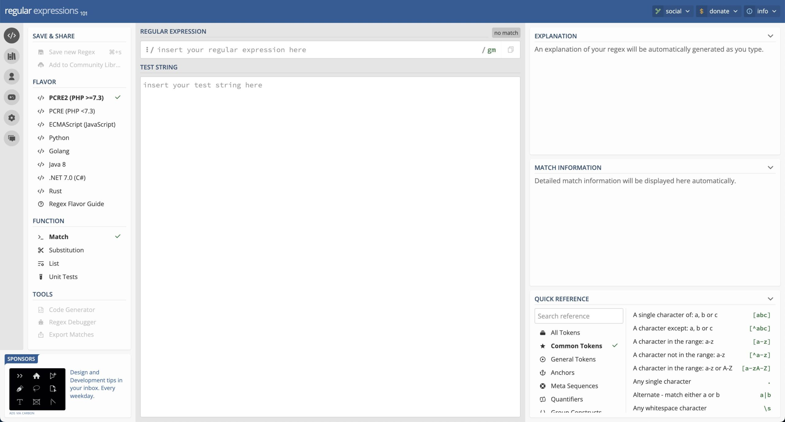](https://regex101.com)

<figcaption>

[https://regex101.com/](https://regex101.com/)

</figcaption>

</figure>

自分が把握している正規表現チェッカーの中で最も高機能です。

このツールには正規表現チェッカーに必要なほぼ全ての機能が搭載されています。

特にデバッグ機能では正規表現がマッチするまでにかかったステップ数、つまり**正規表現のパフォーマンスを計測することができます**。

普段あまり気にすることはないかもしれませんが、上級者の方にはこれほど便利な機能はないと思います。

またPython以外の言語にも対応しており、迷ったらこちらを選んでおけば問題ないでしょう。

### 2 : [Debuggex](https://www.debuggex.com/)

<figure>

[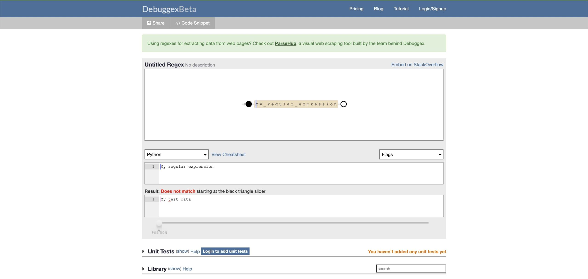](https://www.debuggex.com/)

<figcaption>

[https://www.debuggex.com/](https://www.debuggex.com/)

</figcaption>

</figure>

機能的には[regex101](#1--regex101)に劣りますが、正規表現の視覚化機能が優れておりわかりやすいです。

またこちらのツールにもデバッグ機能が搭載されているので正規表現の処理順序を確認したい場合にも便利です。

### 3 : [Pythex](https://pythex.org/)

<figure>

[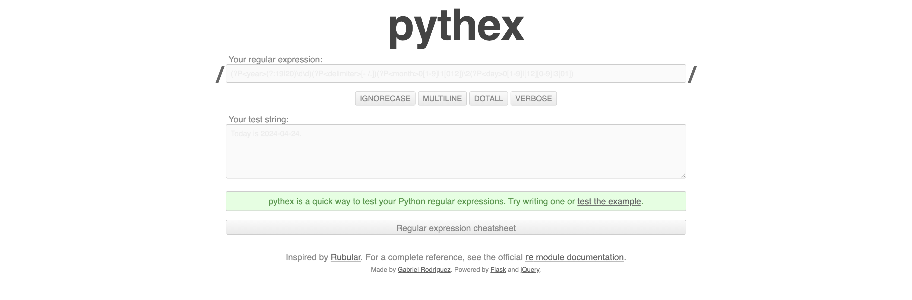](https://pythex.org/)

<figcaption>

[https://pythex.org/](https://pythex.org/)

</figcaption>

</figure>

こちらがおすすめの理由はそのシンプルさです。

機能は正規表現マッチ結果の確認のみなので、細かい機能はいらないよ！という方にはこちらをおすすめします。

### 各チェッカーの機能早見表

ここまで紹介してきた正規表現チェッカー3つの機能を表にまとめました。

それぞれの項目の説明は以下の通りです。

- **マッチ** ... 正規表現が対象の文字列にマッチするか確認できる機能

- **置換** ... マッチした文字列を置換する機能

- **リスト** ... マッチした文字列をリストとしてまとめて確認できる機能

- **視覚化** ... 正規表現を視覚的に表示する機能

- **デバッグ** ... 正規表現がマッチするまでの処理手順や試行回数を確認できる機能

- **コードジェネレーター** ... 入力した正規表現と対象文字列を元にコードを生成する機能

|  | マッチ | 置換 | リスト | 視覚化 | デバッグ | コード   ジェネレーター |
| --- | --- | --- | --- | --- | --- | --- |
| [regex101](#1--regex101) | ◯ | ◯ | ◯ | ◯ | ◯ | ◯ |
| [Debuggex](#2--debuggex) | ◯ | × | × | ◯ | ◯ | × |
| [Pythex](#3--pythex) | ◯ | × | × | × | × | × |

## 各チェッカーの使い方

### 1 : [regex101](#1--regex101)

最もおすすめのregex101から説明していきます。

ここでは4つの機能の使い方を説明します！

1. 基本の使い方（正規表現マッチ）

3. 置換機能

5. リスト出力機能

7. デバッグ機能

#### 1 : 基本の使い方（正規表現マッチ）

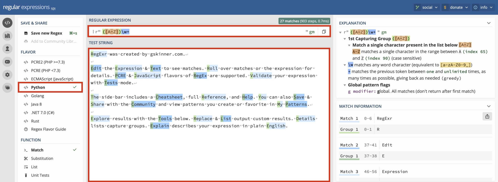

① 『FLAVOR』欄で『Python』を選択  
  
② 『REGULAR EXPRESSION』欄に正規表現を入力  
  
③ 『TEST STRING』欄にチェック対象の文字列を入力

そうすると、『TEST STRING』に入力した文字列のうち、正規表現にマッチしたものだけマーキングされます。

ちなみに`( )`でグループ指定などしているとマーキング色を分けてくれるので視覚的にもどの正規表現がどことマッチしているかがわかりやすいです。

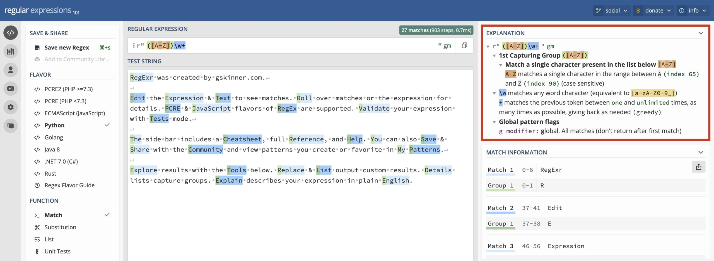

『REGULAR EXPRESSION』欄に正規表現を入力すると、自動的に『EXPLANATION』欄で正規表現の解説をしてくれます。

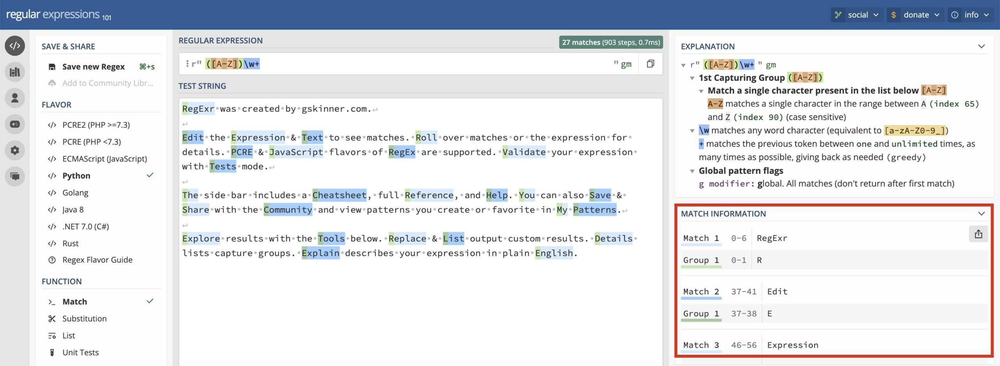

また、『MATCH INFORMATION』欄では正規表現にマッチした文字列（とグループ化していればその文字列）をリスト表示してくれます。

#### 2 : 置換機能

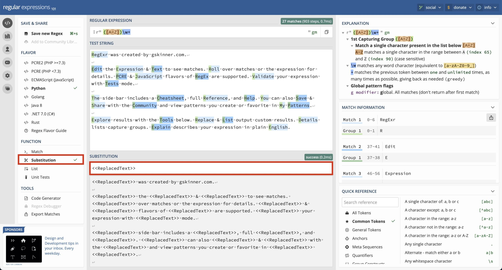

① 画面左『FUNCTION』で『Substitution』を選択  
  
② 画面中央の『SUBSTITUTION』欄に置換文字列を入力

すると下に置換結果を出力してくれます！

#### 3 : リスト出力機能

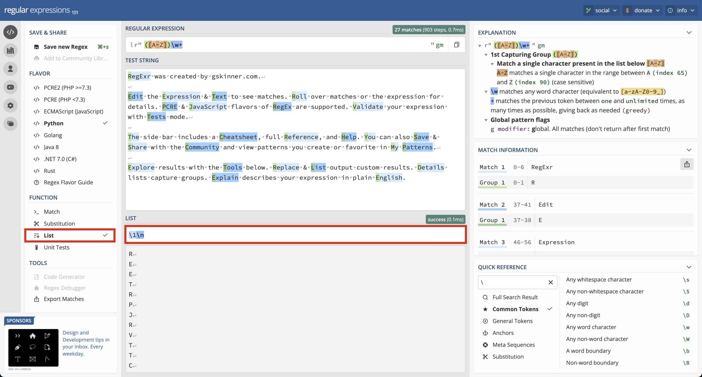

① 画面左『FUNCTION』で『List』を選択  
  
② 画面中央の『List』欄にリスト出力形式を入力

これでキャプチャした文字列などをリスト化して出力してくれます。

正規表現では、`()` で囲んだ部分にマッチした文字列は別枠で変数などに格納されます。  
この機能をキャプチャと言います。

#### 4 : デバッグ機能

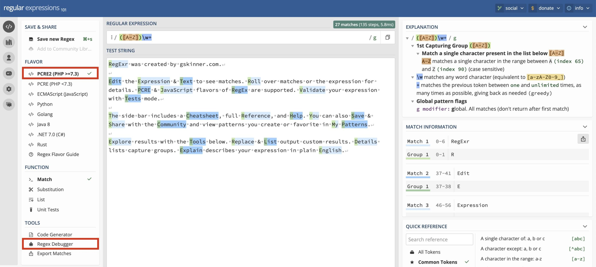

① 『FLAVOR』で『PCRE2 (PHP >=7.3)』を選択  
**※ 2024年4月現在PCRE以外にはデバッグ機能は対応していません！**  
  
② 『Tool』欄で『Regex Debugger』をクリック

すると以下のような画面が出てきます。

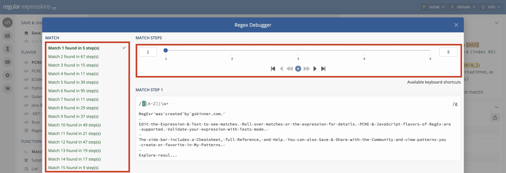

① 左側の『MATCH』でチェックしたいマッチを選択  
  
② 右側の『MATCH STEPS』で合計ステップ数やステップごとの処理内容を確認

ややわかりづらいですが、上記の例だと**「1つ目のマッチに合計5ステップかかった」**ということがわかります。  
このステップ数が異常に多い場合は正規表現の見直しをした方が良いですね。

また『MATCH STEPS』の再生ボタンや、矢印ボタンを押すことで各ステップで対象文字列のどこをチェックしているのかが視覚的にわかり便利です。

### 2 : [Debuggex](#2--debuggex)

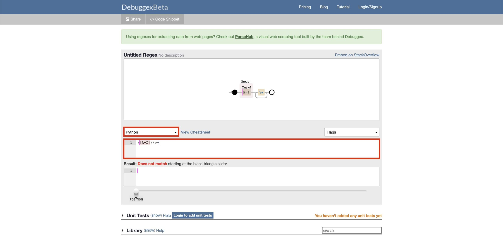

① 言語選択で『Python』を選択  
  
② その下のテキストボックスに正規表現を入力

そうすると、画面上に入力した正規表現を視覚化して表示してくれます。

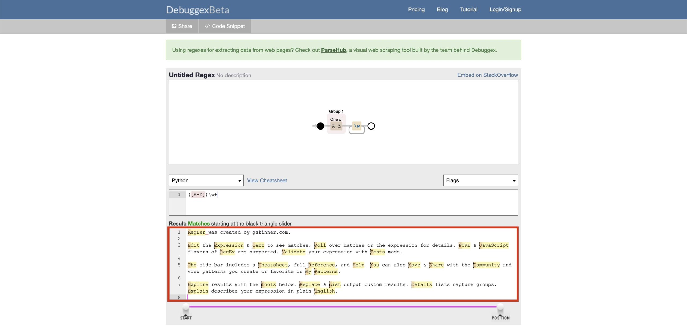

③ 正規表現を入力したボックスの下のテキストボックスに検索対象の文字列を入力

するとマッチした文字列がマーキングされます。

さらに、その下にある『POSITION』と書かれているポインタを動かすと正規表現の処理の流れを確認することができます。

### 3 : [Pythex](#3--pythex)

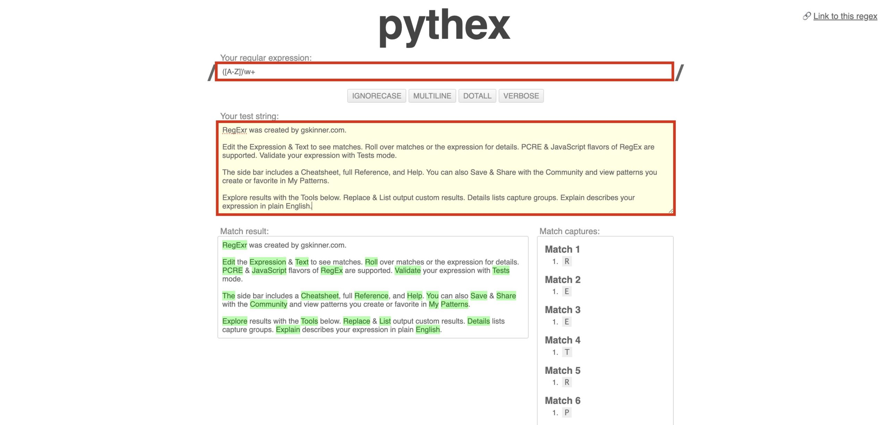

① 『Your regular expression』欄にチェックしたい正規表現を入力  
  
② 『Your test string』欄にチェック対象の文字列を入力

すると画面下左にマッチした文字列をマーキングして表示し、右にキャプチャした文字列をリスト化して表示してくれます。

## まとめ

ここまでで紹介した正規表現チェッカーからお気に入りを見つければ、今後は正規表現チェックに手間取ることもなくなり、業務効率UP間違いなしです。

最後にもう一度おすすめの正規表現チェッカーをまとめておきます。

おすすめのPython用正規表現チェッカー3つ

- [**regex101**](#1--regex101)  
    → 迷ったらこれ！トップレベルで多機能。

- [**Debuggex**](#2--debuggex)  
    → 優秀な視覚化機能。

- [**Pythex**](#3--pythex)  
    → シンプルさを求める方におすすめ。

正規表現を1から勉強したい！という方はこちらの書籍がおすすめです。

[詳説 正規表現 第3版](http://www.amazon.co.jp/dp/4873113598)

  
なんとなく初心者にとっつきにくいイメージがあるオライリー本ですが、こちらは正規表現に馴染みのない方でも読みやすく、初心者にもおすすめです！
