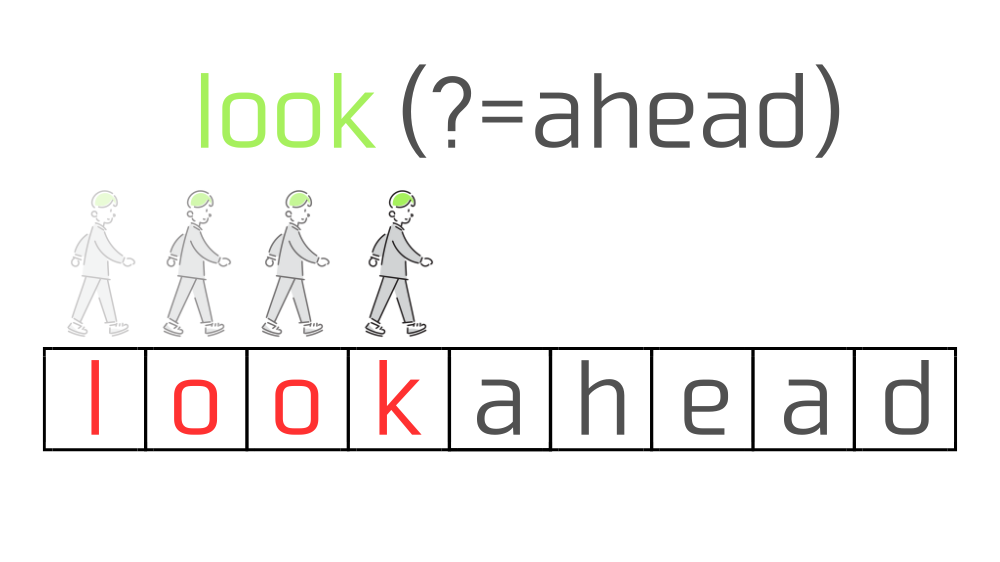
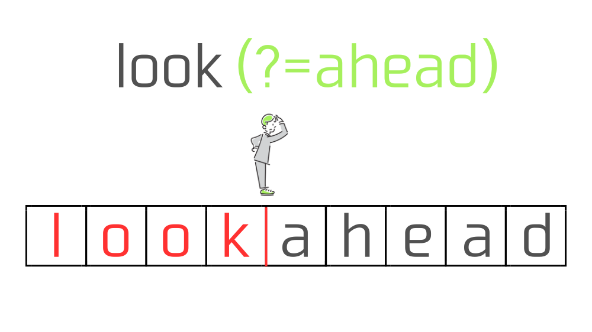
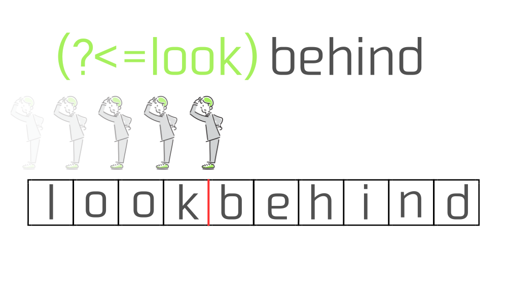
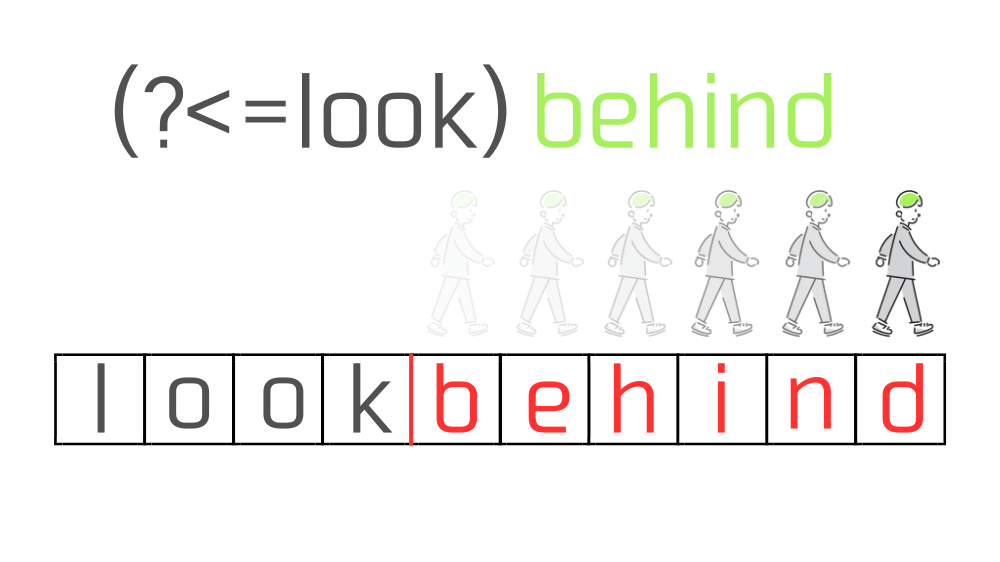
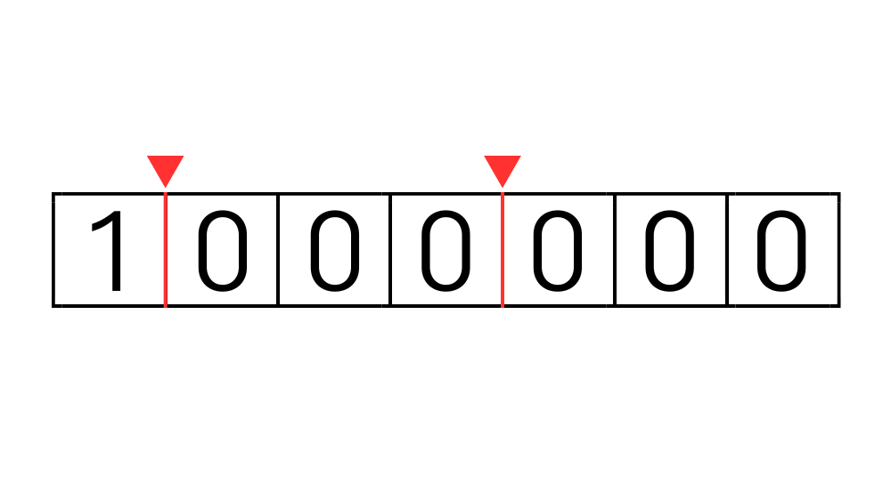

この記事で解決できるお悩み

- [正規表現の先読み・後読みについてしっかり理解したい！](#先読み後読みは位置へのマッチである)

- [先読み・後読みの具体的な使い方を知りたい](#先読み後読みの便利な使い方)

こんな悩みを解決できます！

この記事では正規表現の先読み・後読みについて、図を使ってそれぞれのイメージを説明しつつ、具体的な活用方法を解説します。

この記事を読み終えれば、正規表現の先読み・後読みを理解してプロダクト開発に役立てることができますよ。

## 先読み・後読みは『位置へのマッチ』である

先読み・後読みについて説明する前に、前提知識として正規表現の「位置へのマッチ」について説明します。

正規表現のマッチには『**文字列へのマッチ**』と『**位置へのマッチ**』の2種類あり、先読み・後読みは『位置へのマッチ』が行われます。

例えば`"REGEX"`という文字列に対して、`REG`という正規表現を実行すると


このように文字列`"REG"`にマッチします。

関数などで実行した場合は文字列`"REG"`が返り値として取得できると思います。

これが『文字列へのマッチ』です。

一方で、`"REGEX"`に対して`^`という正規表現を実行すると、


このように文字列にはマッチせず、『文字列の先頭』つまり位置にマッチします。

この場合は文字列にはマッチしていないので関数を実行しても空の値が返ってきます。

これが「位置へのマッチ」です。

今回説明する先読み・後読みも『位置へのマッチ』なので文字列にはマッチしない、ということに注意してください。

## 先読みと後読み

ここから先読みと後読みについて説明します。

読みながら自分でも実際に試してみたい！という方は [regex101](https://regex101.com/) という正規表現チェッカーをおすすめします。

詳しい使い方やその他の正規表現チェッカーについてはこちらの記事で解説しています。

\[st-postgroup html\_class="" id="301" rank="0"\]

### 先読み（lookahead）とは

先読みとは、今いる位置から右側に指定した文字列があるかチェックする機能です。

先読みは以下のように記述します。

```
(?=チェックしたい文字列)
```

例として`"lookahead"`の`"look"`、つまり右側に`"ahead"`がくっついている文字列`"look"`にマッチさせたい場合、正規表現はこのようになります。

```
look(?=ahead)
```

この正規表現を`"lookahead"`という文字列に適用した場合の動きは以下のようなイメージです。

正規表現エンジンはまず、`look(?=ahead)`のうち`look`を実行します。

この時正規表現は左から右に向かって、1文字ずつマッチするかをチェックしていきます。



すると`"lookahead"`に含まれる文字列`"look"`がマッチします。

その後、先読み部分の`(?=ahead)`の処理を実行します。

先読みは『今いる位置から右側に指定の文字列が存在するか』をチェックするので、今回は`"look"`の直後の位置から右側に`"ahead"`が存在するかチェックします。

この時正規表現は`"ahead"`の方に進んでいくのではなく、あくまで`"look"`の直後の位置から`"ahead"`があるかどうか眺めているだけ、というイメージを持つと理解しやすいかと思います。



`"ahead"`が存在しない場合はマッチ不成立となりますが、今回は`"ahead"`が存在しているので`"look"`の直後の位置にマッチします。

結果、マッチ文字列として`"look"`が得られます。

先にも説明しましたが、先読み・後読みは『位置へのマッチ』が行われるのでマッチ結果として文字列は返ってきません。

先読みのポイントは2つです。

1. 先読みは今いる位置から右側に文字列があるかチェックする

3. 先読みは文字列ではなく位置にマッチする

### 後読み（lookbehind）とは

後読みとは、今いる位置から左側に指定した文字列があるかチェックする機能です。

後読みは以下のように記述します。

```
(?<=チェックしたい文字列)
```

`"lookbehind"`の`"behind"`、つまり左側に`"look"`がくっついている`"behind"`という文字列にマッチさせたい場合、正規表現はこのようになります。

```
(?<=look)behind
```

この正規表現を`"lookbehind"`という文字列に適用した場合の動きは以下のようなイメージです。

正規表現エンジンはまず、`(?<=look)behind`のうち`(?<=look)`を実行します。

文字列の先頭の位置から左を向いて`"look"`があるかチェック、1文字分進んで`"l"`の直後の位置に移動、そこから左を向いて`"look"`があるかチェック、さらに1文字分進んで...といった具合に、1歩進んで後ろを振り返るような動きを繰り返して`"look"`を探します。



`"k"`の直後の位置からみると`"look"`が存在していることが確認できたので、正規表現`(?<=look)`は`"k"`の直後の位置にマッチします。

あとは今の位置から右側に`"behind"`が存在するかを見ていくだけです。



結果`"behind"`が存在していたので、マッチ文字列として`"behind"`が得られます。

後読みのポイントは2つです。

1. 後読みは今いる位置から左側に文字列があるかチェックする

3. 後読みは文字列ではなく位置にマッチする

### 先読み・後読みの便利な使い方

「先読みと後読みが何なのかはわかったけど、具体的にどう使うの？」という方向けに、先読み・後読みの便利な使い方を3つ紹介します。

#### 1\. タグで囲まれた文字列を取得する

HTMLファイルの中で、pタグやh1~6タグに囲まれた文字列だけ取得したい！ということが可能です。

今回はh2タグに囲まれた文字列だけ取得したい場合の例を紹介します。

```
(?<=<h2>)[^<>]+(?=<\/h2>)
```

この正規表現を大きく3つに分けて説明すると、

```
(?<=<h2>)
```

は後読みを使っており、左側に`"<h2>"`が存在する位置にマッチします。

この正規表現だとh2タグにクラスが付与されて <h2 class="hoge"> となっている場合はマッチしません。

```
[^<>]+
```

こちらはh2タグの中身を指定しています。

h2タグで囲まれている中に`"<"`と`">"`があって欲しくないため、否定文字クラス（`[^]`）を使って除外しています。

結果『`"<"`でも`">"`でもない文字が1文字以上ある』という意味になります。

```
(?=<\/h2>)
```

最後に、こちらは先読みを使い右側に`"</h2>"`が存在するかチェックしています。

先読みと後読みの部分は文字列にはマッチしないため、h2タグに囲まれた文字列だけを取得することができます。

#### 2\. パスワードに英数字が使われているかチェック

以下の正規表現を使えば、『パスワードにアルファベットと数字がそれぞれ1文字以上使われているか』といったチェックが可能です。

```
^(?=.*[0-9])(?=.*[a-zA-Z])[a-zA-Z0-9]{8,}$
```

こちらも3ブロックに分けて説明します。

```
(?=.*[0-9])
```

では先読みを使っており、1文字でも数字が使われていればマッチします。

```
(?=.*[a-zA-Z])
```

こちらも同じく先読みを使い、小文字、大文字関係なくアルファベットが1文字あればマッチします。

```
[a-zA-Z0-9]{8,}
```

こちらは『アルファベットか数字のみを使い8文字以上』をパスワードの条件に設定しています。

つまりこの正規表現は『**数字を1文字以上使っている**』『**アルファベットを一文字以上使っている**』『**アルファベットか数字のみを使い8文字以上**』の3つの条件を全て満たす文字列にのみマッチするということになります。

#### 3\. 3桁ごとにカンマ区切りを入れる

この正規表現を使えば桁数が多い数値に対して、3桁ごとにカンマ区切りを入れることが可能です。

```
(?<=\d)(?=(\d\d\d)+$)
```

**`\d`** は`**[0-9]**` と同じ意味です。

こちらは大きく分けて2ブロックあり、

```
(?<=\d)
```

こちらは後読みを使って左側に数字があるかチェックしています。

これは`",100,000"`のように数字の先頭にカンマがつくのを防ぐためです。

```
(?=(\d\d\d)+$)
```

こちらは日本語で表すと「右側に3桁の数字が1組以上あり、行末がある位置」という意味になります。

ややこしいですが、要は3桁、6桁、9桁、12桁...と3の倍数桁の数字が右側にある位置にマッチします。

改めてこの正規表現でマッチする箇所を図示するとこのようになります。



これでマッチした位置を`","`で置換すれば3桁ごとにカンマ区切りを入れることができます。

## 否定先読みと否定後読み

ここまでで説明した先読み・後読みには否定の形が存在します。

そのため普通の『先読み・後読み』はそれぞれ『肯定先読み・肯定後読み』と呼ばれることもあります。

基本的な動きは肯定の形と同じなので、簡単に説明していきます。

### 否定先読みとは

先読みの否定形です。

今いる位置から右側に指定した文字列が"ない"ことをチェックする機能です。

否定先読みは以下のように記述します。

```
(?!チェックしたい文字列)
```

`"lookahead"`以外の`"look"`にマッチさせたい場合は以下のような正規表現になります。

```
look(?!ahead)
```

この場合、`"look"`単体や`"lookbehind"`などの`"look"`にはマッチしますが、`"lookahead"`の`"**look**"`にはマッチしません。

### 否定後読みとは

後読みの否定形です。

今いる位置から左側に指定した文字列が"ない"ことをチェックする機能です。

否定後読みは以下のように記述します。

```
(?<!チェックしたい文字列)
```

`"lookbehind"`以外の`"behind"`にマッチさせたい場合は以下のような正規表現になります。

```
(?<!look)behind
```

この場合、`"behind"`単体や`"left behind"`などの`"behind"`にはマッチしますが、`"lookbehind"`の"look"にはマッチしません。

## まとめ

この記事を読んで、正規表現の先読み・後読みについて理解できた！という方がいれば嬉しいです。

具体的な使い方も紹介したので、ぜひ今後の開発に役立てていってください！

最後にもう一度今回のポイントをまとめておきます。

- **先読み・後読みは文字列ではなく今いる位置にマッチする**

- **先読みは今いる位置から右側に指定の文字列があるかチェックする**

- **後読みは今いる位置から左側に指定の文字列があるかチェックする**

- **否定先読みは今いる位置から右側に指定の文字列がないことをチェックする**

- **否定後読みは今いる位置から左側に指定の文字列がないことをチェックする**

正規表現を一から勉強したい！という方はこちらの書籍がおすすめです。

[詳説 正規表現 第3版](http://www.amazon.co.jp/dp/4873113598)

  
なんとなく初心者にとっつきにくいイメージがあるオライリー本ですが、こちらは正規表現に馴染みのない方でも読みやすく初心者にもおすすめです！
