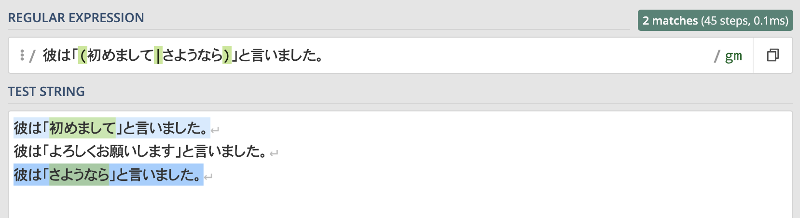
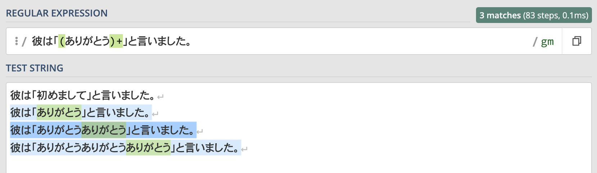
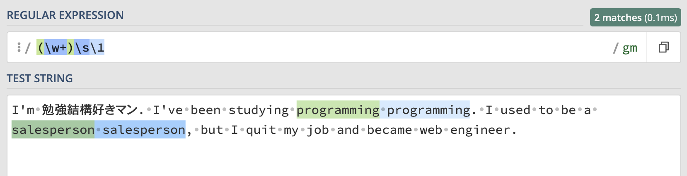

この記事で解決できるお悩み

- [正規表現で使われている括弧ってどういう意味？](#1)

- [グループ化って聞いたことあるけど具体的にどういうこと？](#2)

- [キャプチャって何？](#3)

\[st-kaiwa2 html\_class="wp-block-st-blocks-st-kaiwa"\]

こんな悩みを解決できます！

営業職から会社員WEBエンジニア、  
その後フリーランスWEBエンジニアに転向した自分が解説します。

\[/st-kaiwa2\]

この記事では正規表現における括弧の意味と詳しい使い方について解説します。

この記事を読み終えれば括弧の使い方を理解し、正規表現のレベルを一段階レベルアップさせることができますよ！

## 正規表現における括弧の意味は？

正規表現における括弧の使い道は大きく分けると2つです。

1. グループ化

3. キャプチャグループ

それぞれについて詳しく説明していきます！

自分でも試してみたい！という方は[regex101](https://regex101.com/)という正規表現チェッカーをおすすめします。

詳しい使い方やその他の正規表現チェッカーについてはこちらの記事で解説しています。

\[st-postgroup html\_class="" id="301" rank="0"\]

## グループ化

グループ化とは複数の文字を1つのかたまりとして扱うことです。

グループ化は主に2通りの使い方をされます。

### 選択（or）の範囲を指定する

グループ化をするとパイプを使った選択（or）の範囲を指定することができます。

例えば"彼は「初めまして」と言いました。"と"彼は「さようなら」と言いました。"という2つの文字列に正規表現をマッチさせたい場合はどうすれば良いでしょうか？

もちろん以下のように2つの文字列をパイプで区切ればどちらにもマッチさせることができます。

```
彼は「初めまして」と言いました。|彼は「さようなら」と言いました。
```

しかし"初めまして"と"さようなら"以外は全く同じ文字列なのにこれはあまりに非効率的です。

そこで、括弧を使うと必要な部分だけを選択（or）の対象にすることができます。

```
彼は「(初めまして|さようなら)」と言いました。
```

ここでは混乱を防ぐためただの括弧を使用していますが、基本的にはこの後紹介する『名前付きキャプチャグループ』か『非キャプチャグループ』を使うことをおすすめします。

この正規表現を実行した結果はこちらです。



この記事ではregex101という正規表現チェッカーを使用しています。  
「REGULAR EXPRESSION」欄には正規表現を、「TEST STRING」には検索対象の文字列を入力することで正規表現にマッチする文字列がマーキングされます。

期待通り"彼は「初めまして」と言いました。"と"彼は「さようなら」と言いました。"の2つにマッチしていることがわかります。

このようにグループ化を使えば選択（or）の範囲を指定することができます。

### 量指定子の適用範囲を指定する

疑問符やスター（アスタリスク）、プラスなどの量指定子の効果は直前の1文字に適用されます。

ですが括弧を使えば複数の文字のまとまりに対して繰り返し回数の指定をすることができます。

例えば"彼は「ありがとう」と言いました。""彼は「ありがとうありがとう」と言いました。"といったように"ありがとう"は何個あってもマッチさせたいとします。

まずは括弧を使わずに以下のような正規表現を書いてみます。

```
彼は「ありがとう+」と言いました。
```

これでは`+`は直前の文字列`う`にだけ影響するので、"彼は「ありがとうう」と言いました。"や"彼は「ありがとうううう」と言いました。"にはマッチしますが"彼は「ありがとうありがとう」と言いました。" にはマッチしません。

そこで括弧を使ってグループ化することによって"ありがとう"という文字列のかたまりに対して量指定子の効果を適用させることができます。

```
彼は「(ありがとう)+」と言いました。
```

ここでは混乱を防ぐためただの括弧を使用していますが、基本的にはこの後紹介する『名前付きキャプチャグループ』か『非キャプチャグループ』を使うことをおすすめします。

この正規表現を実行した結果はこちらです。



このようにグループ化することによって量指定子の適用範囲を指定することができます。

## キャプチャグループ

括弧によるキャプチャグループの機能を使えば一部の正規表現にマッチした文字列だけ取得することができます。

キャプチャグループには3種類あるのでそれぞれ詳しく解説していきます。

### 通常キャプチャグループ

キャプチャグループの基本形です。

括弧で囲んだ部分にマッチした文字列を取得することができます。

例えば"2024-04-01" など年月日を表す文字列にマッチさせたい場合に以下のような正規表現を書いたとします。

```
/*
  \d = 半角数字1文字
  {n} = 直前の文字をn回繰り返す
*/
\d{4}-\d{2}-\d{2}
```

このうち年・月・日を別々に取得したい場合には、括弧を使いこのように書くことができます。

```
(\d{4})-(\d{2})-(\d{2})
```

このように個別で取得したい箇所を括弧で囲むことでキャプチャを行うことができます。

キャプチャした文字列の使い道は主に2つです。

#### 1\. 後方参照

後方参照とはキャプチャした文字列を同じ正規表現内で参照することができる機能です。

後方参照は\\1 \\2 \\3のようにバックスラッシュとキャプチャ番号を組み合わせて使います。

1つ目の括弧でキャプチャした値は`\1`で呼び出し、2つ目の括弧でキャプチャした値は`\2`で呼び出すといった感じで、キャプチャ番号は何個目の括弧でキャプチャした値かを表します。

具体的な使い方として、同じ単語を連続で使用していないかのチェックを行うことができます。

例えば以下の英文では"programming"と"salesperson"が誤って2回続けて書かれています。

```
I'm 勉強結構好きマン. I've been studying programming programming.
I used to be a salesperson salesperson, but I quit my job and became web engineer.
```

このように、2回連続で同じ単語を使っている箇所にマッチングする正規表現を書いてみましょう。

```
/*
  [a-zA-Z] = 小文字もしくは大文字のアルファベット1文字
*/
([a-zA-Z]+) \1
```

この正規表現を日本語で表すと『1文字以上の英単語があり、スペースを挟んで同じ英単語がある文字列』という意味になります

この正規表現を実行した結果がこちらです。



このように単語が重複して使われているかどうかをチェックすることができます。

#### 2\. プログラム内で変数として扱う

キャプチャグループで取得した文字列をプログラム内で扱うこともできます。

先ほどの年月日を取得する例で使ったこちらの正規表現を使って説明します。

```
(\d{4})-(\d{2})-(\d{2})
```

この正規表現をJavaScriptで文字列`"2024-04-01"`に対して実行した結果がこちらです。

JavaScript

```
const regex = /(\d{4})-(\d{2})-(\d{2})/gm;

const str = "2024-04-01";

let match = regex.exec(str);
console.log(match);
/** 出力 :
    [
      '2024-04-01',
      '2024',
      '04',
      '01',
      index: 0,
      input: '2024-04-01',
      groups: undefined
    ]
*/
```

このように正規表現の実行結果として配列が返ってきます。（8~16行目）

0番目には通常のマッチ結果が入り、1~3番目にはそれぞれキャプチャ順に年月日の文字列が入っていることがわかります。

この値を使い`"2024年04月01日"`の形式にフォーマットを書き換えるコードを書いてみます。

JavaScript

```
const newStr = `${match[1]}年${match[2]}月${match[3]}日`;
console.log(newStr); // 出力 : 2024年04月01日
```

このように、正規表現でキャプチャされた文字列はプログラム内で変数として扱うことができます。

キャプチャした文字列の扱い方は言語ごとに違うので詳細は使用する言語の公式ドキュメントを参照することをおすすめします。

### 名前付きキャプチャグループ

名前付きキャプチャグループとは、その名の通りキャプチャした文字列に対して名前をつけることができる機能です。

通常キャプチャグループでキャプチャされた文字列は\\1の形で後方参照ができると説明しました。

しかし\\1と書かれているだけではぱっと見て何の値を意味しているのかがわかりません。

さらに、後からキャプチャグループを増やすとなった場合は番号を変える必要も出てきます。

ですが名前付きキャプチャグループを使えばそういったデメリットを一掃することができます。

名前付きキャプチャグループは(?<name>...)、名前付きキャプチャグループの後方参照は\\k<name>と記述します。

これを使い、先ほどの同じ英単語が重複しているかをチェックする正規表現を書き直してみましょう。

```
// 通常キャプチャグループを使用した場合
(\w+)\s\1

// 名前付きキャプチャグループを使用した場合
(?<word>\w+)\s\k<word>
```

マッチ結果としては通常キャプチャグループを使った場合と変化はありませんが、参照している値が何を意味しているかわかりやすくなります。

プログラム内でも名前付きキャプチャグループは便利です。  
例えばJavaScriptではmatch.groups.wordのような形でキャプチャ文字列を扱うことができます。

このように名前付きキャプチャグループは通常キャプチャグループの欠点をカバーしてくれるものなので積極的に使っていくことをおすすめします。

言語やツールによっては名前付きキャプチャグループに対応していないものもあるようです。

### 非キャプチャグループ

非キャプチャグループは括弧がキャプチャを行わないようにする機能です。

括弧の使い道として、以下のように文字列のグループ化ができると説明しました。

```
彼は「(初めまして|さようなら)」と言いました。
```

この場合は"初めまして""さようなら"の文字列をキャプチャする必要はありませんが、(...)は通常キャプチャグループ扱いなので無駄なキャプチャが行われてしまいます。

このようにキャプチャとしての機能が不要な場合には非キャプチャグループが便利です。

非キャプチャグループは(?: ...)と記述します。

これを使い上の正規表現を書き換えたものがこちらです。

```
彼は「(?:初めまして|さようなら)」と言いました。
```

マッチ結果としては変化はありませんが、無駄なキャプチャをしないことで正規表現のパフォーマンス向上につながります。

## まとめ

この記事を読み終えていただいた皆さんは、正規表現における括弧の意味とその使い方を理解できたかと思います。

括弧は色々な意味や書き方があって混乱しやすいですが、1つ1つの機能を理解すれば必ず使いこなせるようになります。

最後にもう一度ポイントをまとめておきます。

正規表現の括弧のポイントまとめ

- 正規表現における括弧の使い道はグループ化とキャプチャグループの2種類

- グループ化は主にパイプの選択範囲指定と量指定子の適用範囲の指定に使われる

- キャプチャグループとは一部の正規表現にマッチした文字列を取得する機能

- キャプチャグループには通常キャプチャグループ、名前付きキャプチャグループ、非キャプチャグループの3種類がある

正規表現を1から勉強したい！という方はこちらの書籍がおすすめです。

[詳説 正規表現 第3版](http://www.amazon.co.jp/dp/4873113598)

  
なんとなく初心者にとっつきにくいイメージがあるオライリー本ですが、こちらは正規表現に馴染みのない方でも読みやすく初心者にもおすすめです！
