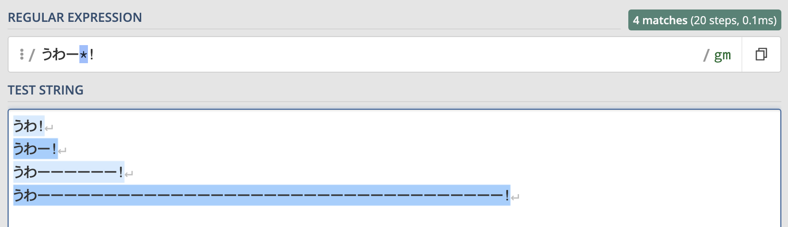
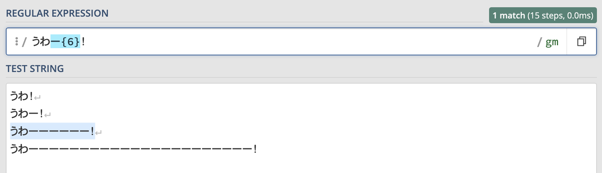
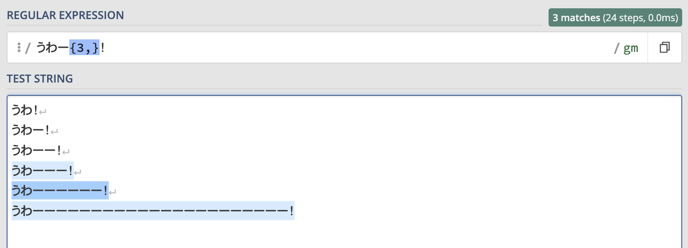
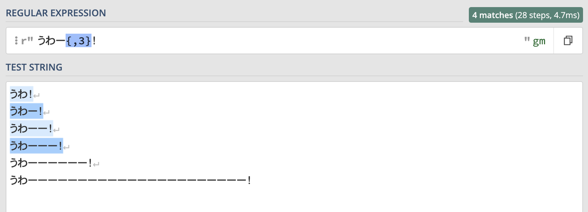
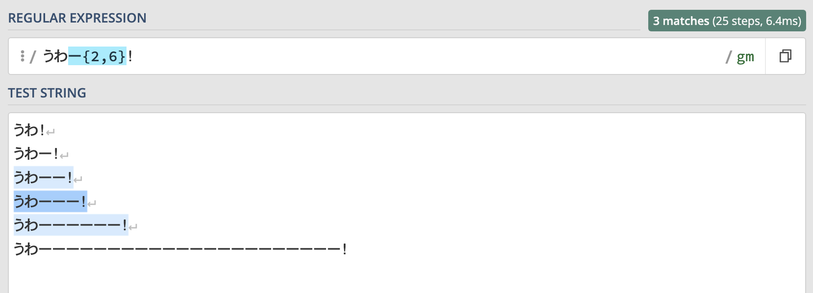
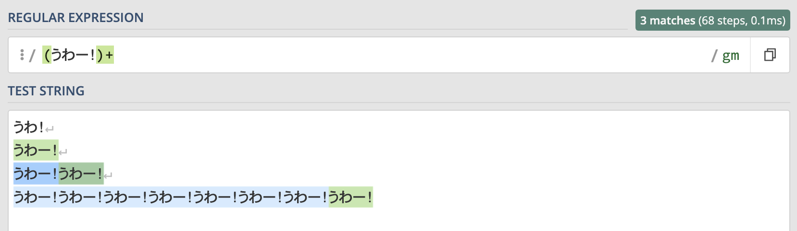
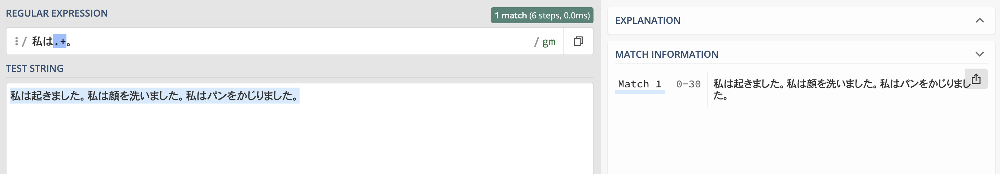
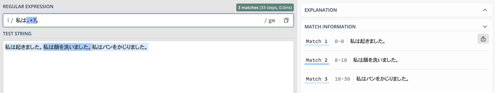

この記事で解決できるお悩み

- [正規表現で繰り返し回数を指定するにはどうしたらいい？](#正規表現で繰り返し回数を指定するには)

- [それぞれの量指定子の意味と使い方を知りたい](#量指定子の一覧)

こんな悩みを解決できます！

この記事では正規表現で繰り返し回数を指定するための方法を解説していきます。

この記事を読み終えれば正規表現の繰り返し回数の指定方法を理解し、実践に活かすことができますよ！

## 正規表現で繰り返し回数を指定するには？

正規表現での文字列の繰り返し回数の指定は『量指定子』と呼ばれるメタ文字を使うことで可能です。

メタ文字とは、正規表現内で特殊な効果を発揮する記号のことです。

そのメタ文字の中でも、文字列の繰り返し回数を指定することができるものを『量指定子』と呼びます。

「そもそも正規表現ってなんなのかよくわからないよ！」という方は先に以下の記事を読んでみてください。

\[st-postgroup html\_class="" id="450" rank="0"\]

## 量指定子の一覧

まずは全体像を把握するため、一覧をざっと眺めてみてください。

最長一致・最短一致とありますが、記事の後半で解説しているので今は気にしなくて大丈夫です。

| メタ文字   （最長一致） | メタ文字   （最短一致） | 名前 | 意味 | 詳細 |
| --- | --- | --- | --- | --- |
| ? | ?? | 疑問符 | 直前の文字が0個または1つ | [\>>](#疑問符) |
| \* | \*? | スター   （アスタリスク） | 直前の文字が0個以上 | [\>>](#スター) |
| + | +? | プラス | 直前の文字が1個以上 | [\>>](#プラス) |
| {N} | \- | 範囲指定 | 直前の文字がN個 | [\>>](#n) |
| {min,} | {min,}? | 範囲指定 | 直前の文字が min 個以上 | [\>>](#min) |
| {,max} | {,max}? | 範囲指定 | 直前の文字が max 個以下 | [\>>](#max) |
| {min,max} | {min,max}? | 範囲指定 | 直前の文字が min 個以上 max 個以下 | [\>>](#min-max) |

使用するツールによっては若干記述方法が異なる可能性があります。

## 量指定子の説明

それではそれぞれの量指定子について詳しい使い方を説明します。

「自分でも試してみたい！」という方は[regex101](https://regex101.com/)という正規表現チェッカーを使うことをおすすめします。

詳しい使い方やその他の正規表現チェッカーについては以下の記事で解説しています。

\[st-postgroup html\_class="" id="301" rank="0"\]

### ?（疑問符）

`?`は直前の文字が0個または1個ある場合にマッチします。

つまり『なくてもいいし、あってもいい』という意味です。

例えば"こんにちは"という文字列に加えて、"こんにちは！"のようにびっくりマークが付いてる場合もマッチさせたい場合はこのように書きます。

```
こんにちは！?
```

この正規表現を使ったマッチ結果は以下のようになります。


水色にマーキングされている箇所がマッチ箇所です。

びっくりマークがあってもなくてもマッチしていることがわかります。

このように`?`は直前の文字がない、もしくは1個ある場合にマッチします。

### \*（スター）

`*`は直前の文字が0個以上ある場合にマッチします。

つまり『なくてもいいし、ある場合はいくつあってもいい』という意味です。

例えば"うわ！"という文字列に加えて"うわー！"や"うわーー！"のように伸ばし棒があるときもマッチさせたい場合はこのように書きます。

```
うわー*！
```

この正規表現を使ったマッチ結果は以下のようになります。



伸ばし棒が何個あろうとなかろうと、全ての"うわ！"にマッチします。

このように`*`は直前の文字がない、もしくは1個以上ある場合にマッチします。

### +（プラス）

`+`は直前の文字が1個以上ある場合にマッチします。

つまり『少なくとも一つはあって欲しい』という意味です。

こちらは上のスターの例で使った正規表現です。

```
うわー*！
```

この正規表現の`*`を`+`に変えて試してみましょう。

```
うわー+！
```

この正規表現を使ったマッチ結果は以下のようになります。


`*`を使った場合は"うわ！"にもマッチしましたが、`+`を使った場合は伸ばし棒が少なくとも1つはないといけないのでマッチしません。

このように`+`は直前の文字が1個以上ある場合にのみマッチします。

### {...}（範囲指定）

`{...}`を使えば『直前の文字列が最低何個、最大何個ある場合にマッチする』といった指定が可能になります。

範囲指定にはいくつかバリエーションがあるのでそれぞれ説明します。

#### {N}

「直前の文字がぴったりN個ある時だけマッチさせたい！」という時にはこちらを使います。

"うわー！"という文字列の伸ばし棒が6個ある時だけマッチさせる場合はこのように書きます。

```
うわー{6}！
```

この正規表現を使ったマッチ結果は以下のようになります。



このように伸ばし棒が6個ちょうどある文字列にのみマッチします。

#### {min,}

「直前の文字が最低~個ある時はマッチさせたい！」という時はこちらを使います。

"うわー！"の伸ばし棒が3個以上ある時だけマッチさせる場合はこのように書きます。

```
うわー{3,}！
```

この正規表現を使ったマッチ結果は以下のようになります。



このように伸ばし棒が3個以上ある文字列にのみマッチします。

#### {,max}

「直前の文字が最大~個ある時はマッチさせたい！」という時はこちらを使います。

"うわー！"の伸ばし棒が3個以下ある時だけマッチさせる場合はこのように書きます。

```
うわー{,3}！
```

この正規表現を使ったマッチ結果は以下のようになります。



このように伸ばし棒が3個以下ある文字列にのみマッチします。

#### {min, max}

「直前の文字が最低~個、最大~個ある時はマッチさせたい！」という時はこちらを使います。

"うわー！"の伸ばし棒が2個以上、6個以下ある時だけマッチさせる場合はこのように書きます。

```
うわー{2,6}！
```

この正規表現で検索した結果はこちらです。



このように伸ばし棒が2~6個ある文字列にのみマッチします。

## 量指定子の適用範囲を広げる方法

ここまで量指定子について説明してきましたが、どれも『直前の』文字列に対して繰り返し回数を指定するものです。

つまり直前の1文字にしか効果が適用されません。

では例えば"うわー！"や"うわー！うわー"のように、"うわー！"という文字列が繰り返されている文字列全てにマッチさせたい、という時はどうすれば良いでしょうか？

このような場合は括弧を使って以下のように書けます。

```
(うわー！)+
```

この正規表現で検索した結果はこちらです。



このように括弧を使って文字列を囲んであげることで、文字列のかたまりに対して量指定子の効果を適用できます。

正規表現における括弧の使い方について詳しく知りたい方はこちらの記事も読んでみてください。

\[st-postgroup html\_class="" id="481" rank="0"\]

## 最長一致・最短一致とは

量指定子には『**最長一致・最短一致**』というものがあります。

簡単にいうと最長一致はできるだけ多くの文字列をマッチさせるやり方で、最短一致はできるだけ少ない文字列をマッチさせるやり方です。

例として、以下の文字列の中から"私は~。"のように"私は"から始まり、"。"で終わる文字列をマッチさせたいとします。

```
私は起きました。私は顔を洗いました。私はパンをかじりました。
```

この時に以下のような正規表現を書いてみました。

```
私は.+。
```

.（ドット） は『なんでもいい任意の1文字』を表すメタ文字です。  
つまり"私は"と"。"の間に何かしらの文字があるものをマッチさせようとしています。

この正規表現で検索した結果はこちらです。



"私は"から始まり、"。"で終わる文字列が3つあるのにも関わらず、マッチ結果は1つになっています。

これは量指定子がデフォルトで最長一致、つまりできるだけ多くの文字列をマッチさせようとしてしまうため起こります。

ですが量指定子の後ろに?をつけることで最短一致、つまりできるだけ少ない文字列にマッチさせることができます。

先ほどの正規表現に?を追加したものを実行してみましょう。

```
私は.+?。
```

この正規表現で検索した結果はこちらです。



先ほどとは違い、"私は起きました。" "私は顔を洗いました。" "私はパンをかじりました。"がそれぞれ独立した文字列として、3つの文字列にマッチしていることがわかります。

このように最長一致・最短一致の違いによってマッチ結果が大きく変わるので量指定子を使う時は注意が必要です。

## まとめ

正規表現での繰り返し回数の指定について解説しました。

ここで学んだ知識をベースに個人開発や業務に役立てていってください！

最後にもう一度ポイントをまとめておきます。

- 正規表現で繰り返し回数を指定するためには『量指定子』を使う

- 量指定子は基本的に直前の1文字にしか効果がないが、括弧を使うことで効果範囲を広げることができる

- 量指定子は最長一致・最短一致という2つのマッチ方法がある

「より深く量指定子や正規表現について理解したい！」という方にはこちらの書籍がおすすめです。

[詳説 正規表現 第3版](http://www.amazon.co.jp/dp/4873113598)

  
なんとなくとっつきにくいイメージがあるオライリー本ですが、こちらは正規表現に馴染みのない方でも読みやすく初心者にもおすすめです！
