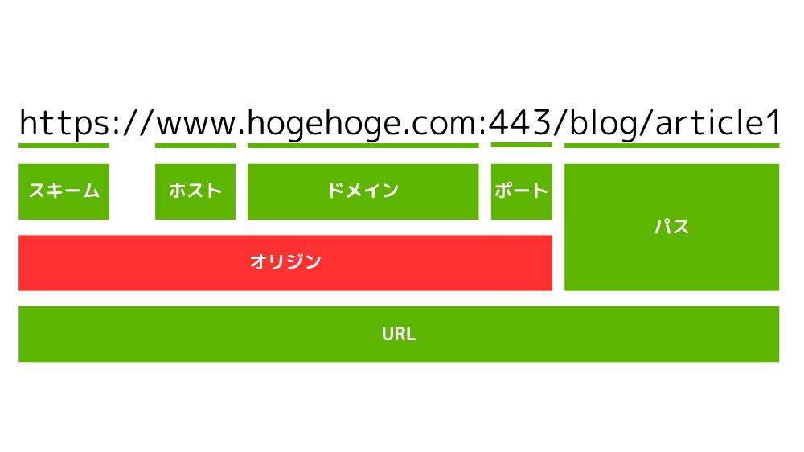
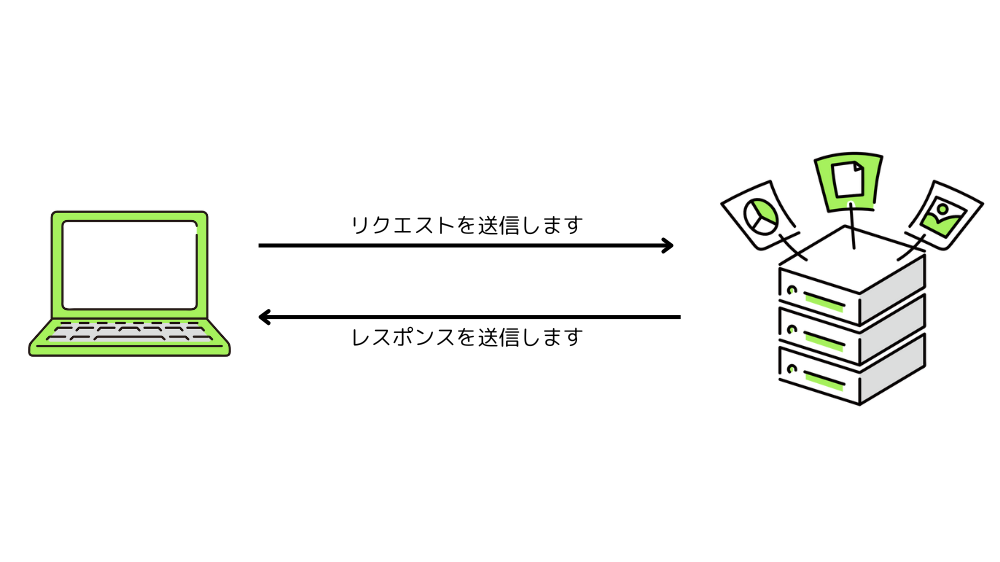
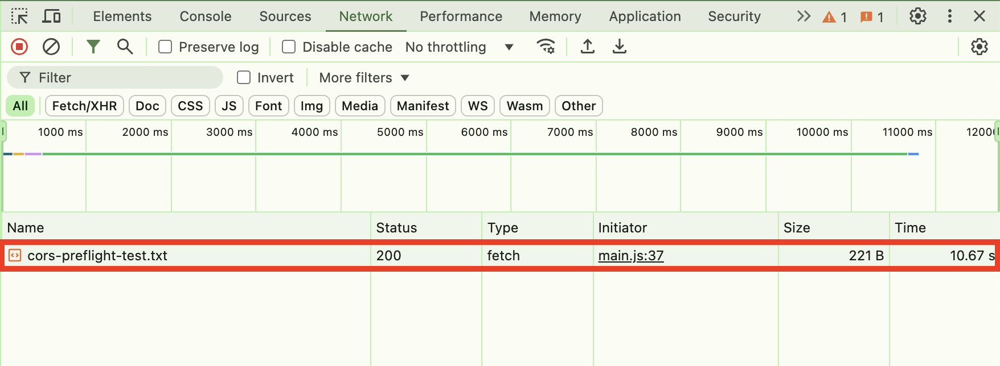
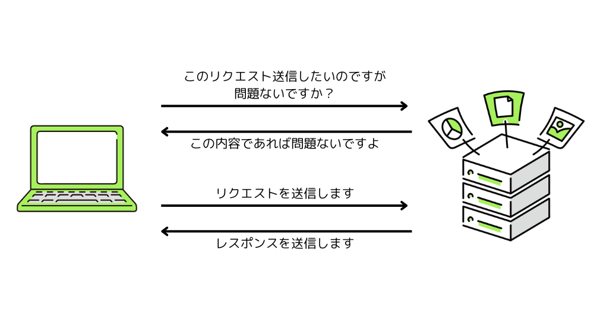
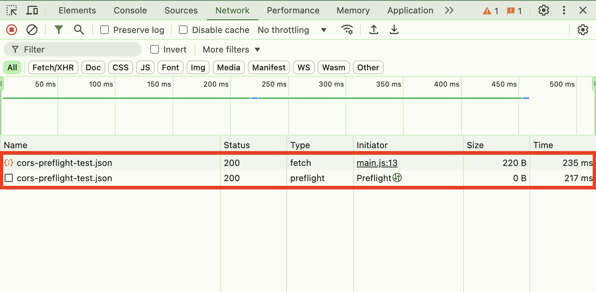
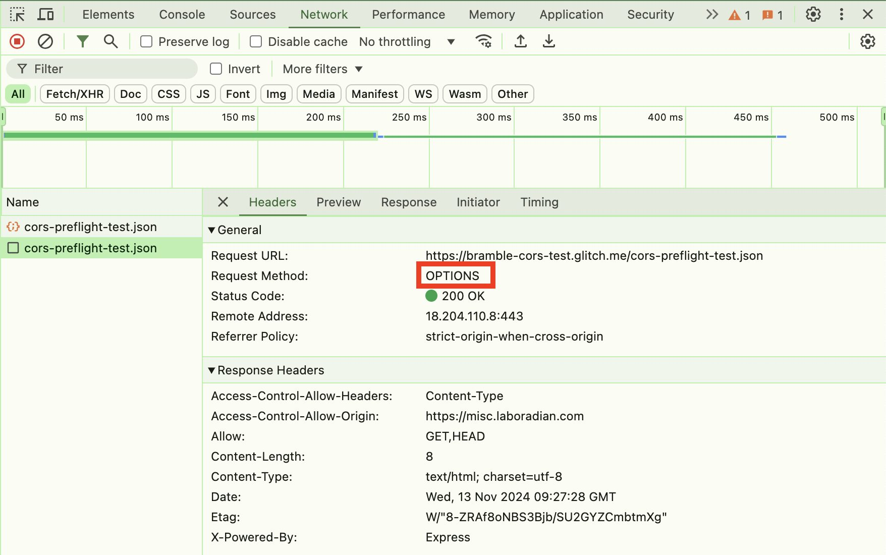
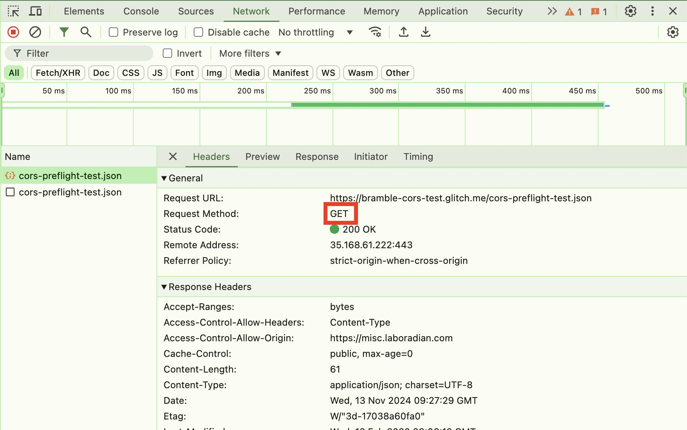

この記事で解決できるお悩み

- [CORSエラーが出たけど意味がわからない...](#corsオリジン間リソース共有とは)

- [CORSの設定方法は？](#corsの設定方法)

- [プリフライトリクエストって何？](#corsを使用したリクエストの種類)

こんな悩みを解決できます！

この記事ではCORSとは何か、CORSの設定方法などを初心者にもわかりやすく解説します。

この記事を読み終えれば、CORSエラーが出ても慌てることはなくなりますよ！

## CORS（オリジン間リソース共有）とは？

CORSとは`Cross-Origin Resource Sharing`の略で、日本語では`オリジン間リソース共有`と呼ばれます。

一言で表すと、異なるオリジンとのリソースのやり取りを可能にする仕組みです。

といってもよくわからないと思うので、順を追って説明していきます。

### オリジンとは

まずはオリジンとは何か説明します。

オリジンとはURL内の`スキーム`+`ホスト`+`ドメイン`+`ポート番号`のことです。

ただしポート番号は一般的に省略されるので、下の例だと`https//www.hogehoge.com`がオリジンになります。



### 同一オリジンポリシー（SOP）とは

CORSを理解する上で欠かせない知識として、`同一オリジンポリシー`があります。

同一オリジンポリシーは、英語では`Same-Origin Policy`の略でSOPと呼ばれます。

一言で言うと、あるオリジンから取得したリソースから別のオリジンのリソースの取得を禁止するブラウザの仕組みです。

リソース = ファイルやデータのことです。

例えば`https://aaaaa.com`のページにアクセスしたとしましょう。

その状態で同一オリジンである`https://aaaaa.com/image.png`から画像ファイルを取得して表示することは問題ありません。

しかしオリジンが違う`https://bbbbb.com/image.png`から画像ファイルを取得しようとすると、エラーが発生し画像を表示することができません。

これが同一オリジンポリシーです。

同一オリジンポリシーによって不正な処理が行われたりなどの被害を防ぐことができます。

### CORSとは

では改めてCORS（オリジン間リソース共有）とは何かを説明します。

同一オリジンポリシーによってセキュリティが高まるのは良いことですが、自分のブログ記事にYouTubeの動画を埋め込みたい時など、別オリジンのリソースを読み込みたい時はよくあります。

そんな時、YouTubeが「このオリジンならリソース使わせてやってもいいよ」とCORSの設定を行うことで異なるオリジンでもYouTubeのリソースを使用することが可能になります。

つまり、標準では異なるオリジン間でのリソースのやり取りは禁止されているため、例外的に特定のオリジンとのリソースのやり取りを可能にするための仕組みがCORSということです。

## CORSの設定方法

ここからは具体的にCORSをどう設定するかを説明します。

特定のオリジンとのリソースのやり取りを許可するにはレスポンスに`Access-Control-Allow-Origin`ヘッダを指定する必要があります。

レスポンス？ヘッダ？となる方は先にこちらの記事を読むことをおすすめします。

[HTTPリクエスト・レスポンスとは？仕組みをわかりやすく解説](/posts/what-is-http-request-response/)

`https://aaaaa.com`からのリソースの読み込みを許可したい時はこのようにレスポンスヘッダを指定します。

```
Access-Control-Allow-Origin: https://aaaaa.com
```

全てのオリジンからのアクセスを許可する場合には`*`を設定できます。

```
Access-Control-Allow-Origin: *
```

## CORSを使用したリクエストの種類

CORSを用いたリクエストには主に2種類あります。

1. シンプルリクエスト（単純リクエスト）

3. プリフライトリクエスト

それぞれ詳しく説明します。

### シンプルリクエスト

リクエストがサーバーの情報に影響を与えないと考えられる場合、直接そのリクエストを送信します。

これをシンプルリクエストと呼びます。



#### 条件

シンプルリクエストを送信するには以下のような条件を満たす必要があります。

- メソッドが以下のいずれか  
    GET, HEAD, POST

- ヘッダーは以下のみ  
    Accept, Accept-Language, Content-Language, Content-Type, Range

- Content-Typeヘッダーで指定されるTypeは以下のみ  
    application/x-www-form-urlencoded, multipart/form-data, text/plain

その他の条件に関しては[オリジン間リソース共有 (CORS) - HTTP | MDN](https://developer.mozilla.org/ja/docs/Web/HTTP/CORS#%E3%82%A2%E3%82%AF%E3%82%BB%E3%82%B9%E5%88%B6%E5%BE%A1%E3%82%B7%E3%83%8A%E3%83%AA%E3%82%AA%E3%81%AE%E4%BE%8B)を参照してください。

#### 確認方法

[CORS のプリフライト・リクエストを観察する](https://misc.laboradian.com/web-test/001/)を参考に、シンプルリクエストを確認する方法を説明します。

シンプルリクエストを送信し、デベロッパーツールで確認してみます。

デベロッパーツールの開き方  
`F12`or`Ctrl + Shift + i（Windowsの場合）`or`Cmd + Option + I（Macの場合）`

すると以下のように、送信しているリクエストは1つだけであることがわかります。



### プリフライトリクエスト

リクエストがサーバーの情報に影響を与える可能性がある場合、本命のリクエストを送る前にそのリクエストを送って問題ないか確認する用のリクエストを送信します。

これをプリフライトリクエストと呼びます。



プリフライトリクエストは`OPTIONS`メソッドで送信されます。

プリフライトリクエストの例は以下のようになります。

```
OPTIONS /doc HTTP/1.1
...
Origin: https://aaaaa.com
Access-Control-Request-Method: POST
Access-Control-Request-Headers: content-type,original-header
```

上の例のように、プリフライトリクエストには送信したいリクエストの情報として`Origin`と`Access-Control-Request-Method`、`Access-Control-Request-Headers`をヘッダーに含める必要があります。

これらのヘッダーで、送信したいリクエストがどのメソッドで何のヘッダーを持っているかをサーバーに伝えます。

このリクエストに対して、このようなレスポンスが返ってきます。

```
HTTP/1.1 204 No Content
...
Access-Control-Allow-Origin: https://aaaaa.com
Access-Control-Allow-Methods: POST, GET, OPTIONS
Access-Control-Allow-Headers: Original-Header, Content-Type
```

`Access-Control-Allow-Origin`でアクセス可能なオリジンを、`Access-Control-Allow-Methods`で送信可能なメソッドを、`Access-Control-Allow-Headers`で指定可能なヘッダーを設定しています。

今回の例では全て問題ないので続けて実際のリクエストを送信できますが、このチェックに引っかかってしまった場合は不正なリクエストとみなされ本命のリクエストを送信することはできません。

#### 確認方法

シンプルリクエストと同じく、プリフライトリクエストを確認してみましょう。

プリフライトを発生させるリクエストを送信し、デベロッパーツールで確認してみます。

すると以下のように2つのリクエストを送信していることがわかります。



それぞれのリクエストを詳しくみてみると以下のように`OPTIONS`メソッドリクエストが送信された後、`GET`メソッドリクエストが送信されていることがわかります。





このようにプリフライトリクエストでは、先に`OPTIONS`メソッドで本命のリクエストを送信して問題ないか確認し、問題なければ本命のリクエストを送信するという流れをとります。

## まとめ

この記事ではCORSとは何か、CORSの設定方法、CORSを使ったリクエストの種類を説明しました。

最後にもう一度ポイントをまとめておきます。

- CORSとは異なるオリジンとのリソースのやり取りを可能にする仕組み

- Access-Control-Allow-Originヘッダーを指定することでCORSを設定できる

- CORSを使ったリクエストにはシンプルリクエストとプリフライトリクエストの2種類がある

HTTPについてより詳しく勉強したい！という方向けに、おすすめの教材を紹介します。

[Webを支える技術 -HTTP、URI、HTML、そしてREST](http://www.amazon.co.jp/dp/4774142042)

こちらの本は正直初心者にとってはやや難しい内容もあります。

ですがHTTPやステータスコードについて非常に詳しく書かれているため、当ブログなどで簡単に理解した後にさらに理解を深めるための教材として活用してみてください！

参考  
[オリジン間リソース共有 (CORS) - HTTP | MDN](https://developer.mozilla.org/ja/docs/Web/HTTP/CORS)  
[同一オリジンポリシー - ウェブセキュリティ | MDN](https://developer.mozilla.org/ja/docs/Web/Security/Same-origin_policy)  
[オリジン間リソース共有 (CORS)とは](https://qiita.com/Hirohana/items/9b5501c561954ad32be7)  
[CORS のプリフライト・リクエストを観察する](https://misc.laboradian.com/web-test/001/)
