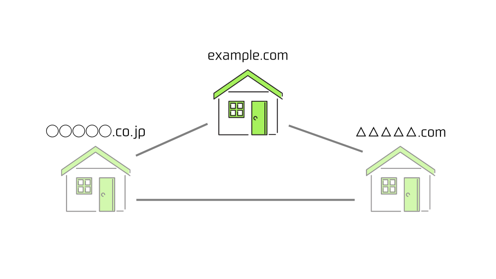
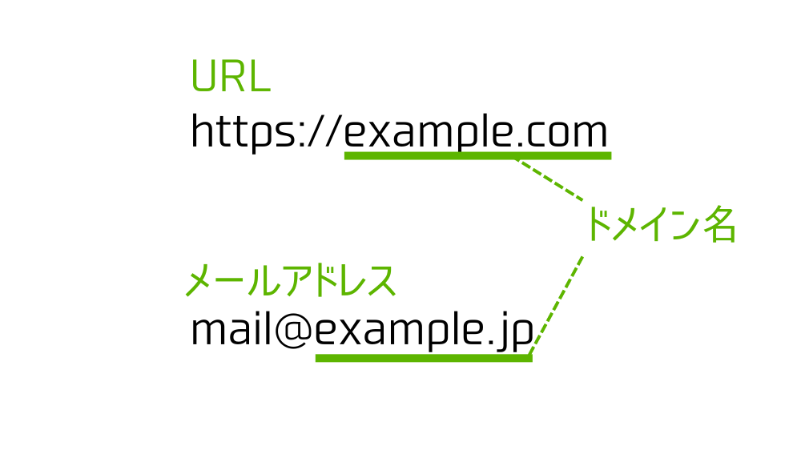
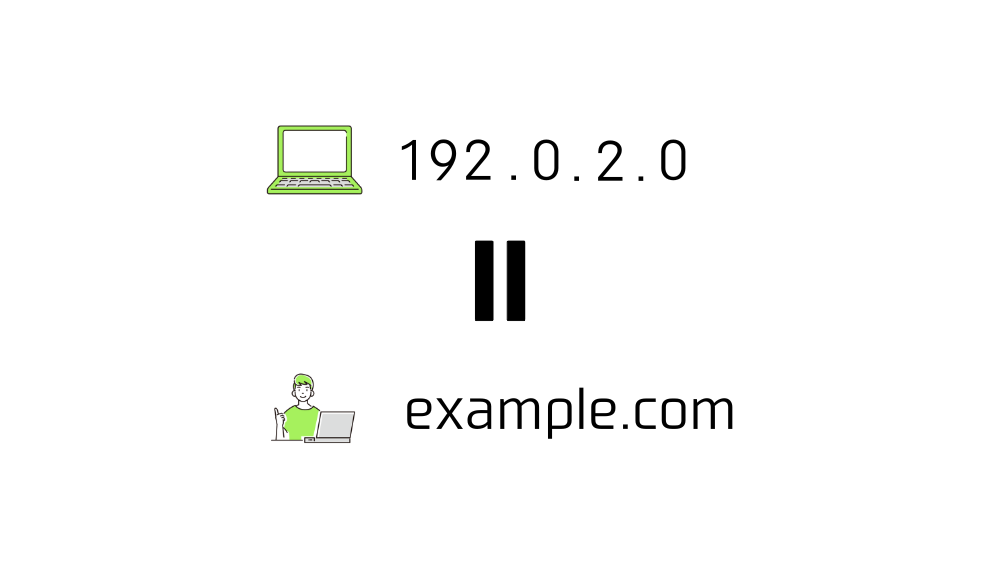
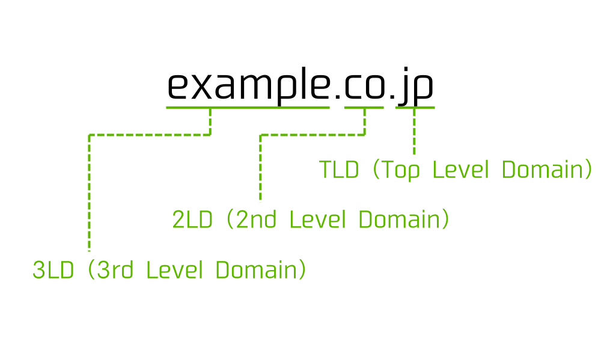
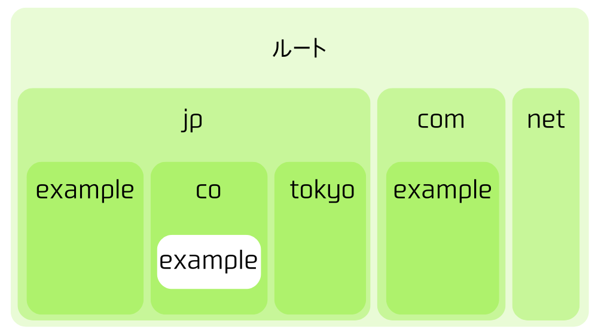

この記事で解決できるお悩み

- [ドメイン名って何...?](#1)

- [ドメイン名の構造を知りたい](https://rootful.net/what-is-domain-name#2)

- [ドメイン名とIPアドレスを紐付ける仕組みについて知りたい](#3)

\[st-kaiwa2 html\_class="wp-block-st-blocks-st-kaiwa"\]

こんな悩みを解決できます！

営業職から会社員WEBエンジニア、  
その後フリーランスWEBエンジニアに転向した自分が解説します。

\[/st-kaiwa2\]

## ドメイン名とは？

ドメイン名とはインターネットにおけるコンピュータの住所です。

インターネット上に存在する無数のコンピュータの中から目当てのものを特定するために使われます。

ドメイン名は

```
example.com
```

のように文字列をドットで区切った形で扱われます。



ドメイン名はURLやメールアドレスの一部として使われています。

URLやメールアドレスにドメイン名を使うことで、コンピュータ側が『どのコンピュータとデータをやり取りするか』を判断できるようになります。



### IPアドレスとの関係

ドメイン名はIPアドレスを人間が読みやすい形に変換したものです。

IPアドレスはドメイン名と同じくインターネットにおけるコンピュータの住所を表しますが、コンピュータ内部で使われる値です。

コンピュータ内部では`11000000.00000000.00000010.00000000`のように2進数で扱われますが、人間にとっては非常に読みづらいので通常以下のように10進数表記で扱われます。

```
192.0.2.0
```

ですが、人間にとってはこのままでも非常に覚えづらいです。

そのため、この数字の羅列を人間が覚えやすい形に変換したものがドメイン名になります。



IPアドレスについて詳しく知りたい方はこちらの記事がおすすめです。

\[st-postgroup html\_class="" id="601" rank="0"\]

## ドメイン名の構成

ドメイン名は文字列をドットで繋げた形で構成されます。

ドメイン名を構成する要素は右から順番に、

1. TLD（Top Level Domain : トップレベルドメイン）

3. 2LD（2nd Level Domain : セカンドレベルドメイン）

5. 3LD（3rd Level Domain : サードレベルドメイン）

と呼ばれます。



「.jp」や「.com」は代表的なTLDです。

### TLDの種類

ドメイン名のうち、TLD（Top Level Domain）には大きく分けて2種類あります。

1. ccTLD（Country Code Top Level Domain）

3. gTLD（Generic Top Level Domain）

ccTLDは国や地域ごとに割り当てられるTLDです。

`Japan => .jp` `China => .cn` `United Kingdom => .uk` など、国名を2文字で表したものになります。

gTLDは国や地域によらないTLDです。

`.com` や`.net` など、個人が簡単に取得できるものが多いです。

ただ一部米国の教育機関限定の `.edu` や、同じく米国の政府機関限定の `.gov` など、特定の制限が設けられているgTLDも存在します。

## ドメイン名とIPアドレスを紐付ける仕組み

私たちがWebサイトを閲覧する時はURLとしてドメイン名を指定しますが、コンピュータ側が欲しいのはIPアドレスです。

そのため、ドメイン名をIPアドレスに変換してあげる仕組みが必要です。

この「ドメイン名に紐づけられたIPアドレスを取得する」仕組みのことを『名前解決』と言います。

名前解決を行うための仕組みは以下の2つです。

1. HOSTSファイル

3. DNS（Domain Name System）

### HOSTSファイル

HOSTSファイルとは、IPアドレスとそれに紐づくドメイン名をまとめたテキストファイルです。

以下のようにIPアドレスとそれに対応する名前をつけることで、名前解決を行ってくれます。

```
# IPアドレス ホスト名 別名
192.0.2.0 example example.co.jp
```

この例だと `https://example.co.jp/` にアクセスすると `192.0.2.0` のコンピュータに接続できるようになります。

まだ開発中でインターネット上に公開されていないサイトにドメイン名を使ってアクセスしたい時などに使われます。

昔はHOSTSファイルを使ってインターネット全体の名前解決を行っていたのですが、インターネットの普及に伴ってコンピュータの数が激増し、管理に限界が来てしまいました。

その結果、現在は後述のDNS（Domain Name System）がメインで扱われています。

HOSTSファイルはほとんどのOSに存在します。  
Windowsでは `C:\Windows\System32\drivers\etc\hosts`  
Macでは `/private/etc/hosts`  
にあります。

### DNS（Domain Name System）

DNS（Domain Name System）とは、「ドメイン名に紐づけられたIPアドレスを取得する」処理を行うシステムです。

以下の図は `example.co.jp` というドメイン名を名前解決する時の流れになります。

まずは全体像をざっと把握してみてください。


DNSでは大きく分けて3つの登場人物がいます。

1. スタブリゾルバー

3. フルリゾルバー

5. 権威サーバー

#### スタブリゾルバー

『名前解決の窓口』です。

私たちが使うPCやスマートフォン上で動作します。

この後説明するフルリゾルバーに「名前解決お願いします」と依頼をして、名前解決の結果得た情報を受け取ります。

#### フルリゾルバー

『名前解決の請負人』です。

スタブリゾルバーから名前解決を依頼されると、権威サーバーにIPアドレスを問い合わせます。

また同じサイトに何度もアクセスするのに毎回問い合わせを行うのは非効率なため、一度名前解決を行なって得た情報をフルリゾルバー内に保存しておくことができます。

保存された情報は『キャッシュ』と呼ばれるため、フルリゾルバーは別名『キャッシュDNSサーバー』とも呼ばれます。

#### 権威サーバー

『ドメイン名とIPアドレスの管理者』です。

権威サーバーは複数存在し、階層構造でドメイン名を管理しています。

最上位管理者であるルートは直下のTLD（下図で言うところの「jp」「com」「net」）を管理します。

そして各TLDの管理者は各々の直下にある2LD（「jp」であれば「example」「co」「tokyo」）を管理します。

そして各2LDの管理者は各々の直下にある3LDを...といった形で管理が行われています。



それぞれのサーバーは

1. 自分で管理するドメイン情報

3. 子サーバーが管理しているドメイン名

の2つを持っています。

### 名前解決の流れ

登場人物の概要がわかったところで、名前解決の流れを説明します。

1. スタブリゾルバーからフルリゾルバーに対して「名前解決お願いします」という依頼がされる

3. フルリゾルバーは最初にルートサーバーに対して問い合わせをする

5. ルートサーバーはドメイン名の情報は持っていないが、どの子サーバーが該当のドメイン名を管理しているのか知っているので、その子サーバーの情報を教える

7. フルリゾルバーは教えてもらったサーバーに対して問い合わせをする

9. 問い合わせを受けたサーバーがドメイン名の情報を持っていればフルリゾルバーへ渡す、持っていなければそのドメイン名を管理している子サーバーの情報を渡す

11. ドメイン名の情報を受け取ったフルリゾルバーは、スタブリゾルバーへ情報を渡す

上記の流れを知った上で改めて以下の図を見てもらうと、DNSの処理の流れが理解しやすいと思います。


## まとめ

最後にもう一度ポイントをまとめておきます。

- ドメイン名とはインターネットにおけるコンピュータの住所

- ドメイン名はIPアドレスを人間が覚えやすい形に変換したもの

- ドメインに紐づいたIPアドレスを取得する仕組みとして、HOSTSファイルとDNSがある

この記事で、まずはドメイン名の全体像を把握できるよう努めました。

特にDNSは奥が深いので、気になった方は調べてみることをお勧めします。

DNSについてわかりやすく解説しているおすすめの教材は紹介こちらです。

[DNSがよくわかる教科書](http://www.amazon.co.jp/dp/479739448X)
