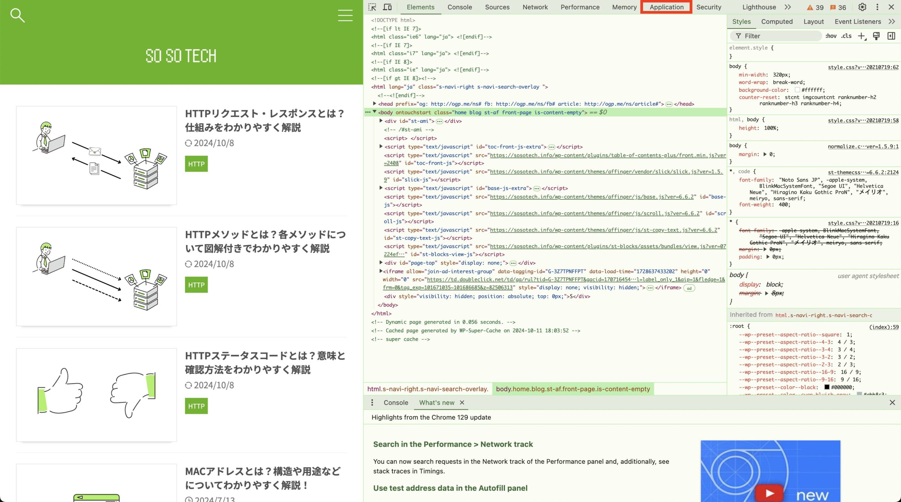
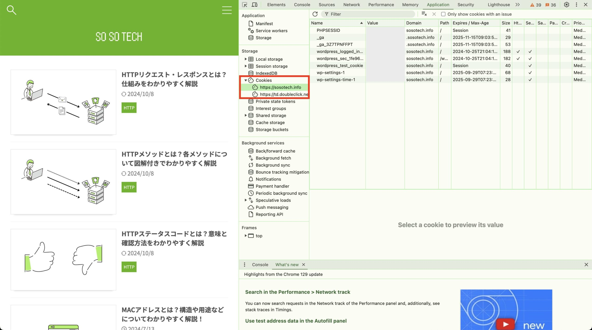

この記事で解決できるお悩み

- [Cookieってよく聞くけど何かよくわからない...](#1)

- [Cookieって何に使われるの？](#4)

- [Cookieの確認方法が知りたい](#6)

\[st-kaiwa2 html\_class="wp-block-st-blocks-st-kaiwa"\]

こんな悩みを解決できます！

営業職から会社員WEBエンジニア、  
その後フリーランスWEBエンジニアに転向した自分が解説します。

\[/st-kaiwa2\]

この記事ではCookieとは何かの説明から始まり、用途や確認方法まで初心者にもわかりやすく解説します。

この記事を読み終える頃にはCookieについての理解が深まっているはずです！

## Cookieとは？

一言で言うと、Cookieとはユーザーの状態を維持したり管理するための仕組みです。

と言ってもよくわからないと思うので順を追って説明します。

まずはCookieの土台となるHTTPについてです。

### HTTP（HyperText Transfer Protocol）とは

英語と日本語の会話では意味が通じないように、インターネット通信も共通のルールに基づいて行う必要があります。

**その「インターネット通信のルール」として定められているのがHTTPです。**

CookieもHTTPの中で定められているルールの1つです。

### HTTP通信の流れ

HTTP通信における重要な要素として、**クライアント**と**サーバー**があります。

HTTPでは、スマホやPCなどのインターネットを利用する側である**クライアント**と、Webページやアプリケーションなどのソースコードやデータを持ち、クライアントに提供する**サーバー**の2者間で通信が行われます。

クライアントは「◯◯のページが見たいです」などのお願いをサーバーに送り、サーバーはそれを受けて「これが◯◯のページです」と応答することで、クライアント、つまり我々ユーザーはWebページを閲覧することができます。


しかしHTTPはステートレスな通信、つまり「5分前に〇〇のサイトにログインした」などの状態を維持せずに通信を行います。

そうなると、同じサイトにアクセスしてもサーバーからはクライアントがログイン済みかどうか判断できず、アクセスの度に毎回ログインしなくてはいけなくなり大変面倒です。

そんな面倒をなくすため使われるのがCookieという仕組みです。

### Cookie = ユーザーの情報を維持・管理するための仕組み

Cookieを使うことで「サイトにログインした」「〇〇のサイトにアクセスした」などのユーザーの状態を維持することができます。

そうすることで、一度ログインしたサイトに再びアクセスした時にまたログインする必要がなくなったり、今まで閲覧したサイトの情報から自分に合った広告を表示してくれたりといったことが可能になります。

ここまでの説明でCookieとはユーザーの状態を維持したり管理するための仕組みという意味がわかったでしょうか。

## Cookieを使った通信の流れ

ここからは具体的にCookieがHTTP通信の中でどのように使われるのかを説明します。

クライアントがログインすると、サーバーはログインした証明としてCookie情報をクライアントに送信します。

それを受け取ったクライアントはCookie情報をブラウザに保存し、再度アクセスした時にそのCookie情報をサーバーに送信します。

するとサーバーは「この前ログインした奴だな」と判断して、ログイン済みユーザー向けのページを表示する、といった流れになります。


上の図ではこの記事では説明していないワードがいくつかあるので簡単に説明します。  
  
①ヘッダ ... クライアントからサーバーへのリクエスト、サーバーからクライアントへのレスポンスに付加できる追加情報  
②リソース ... サーバーからクライアントに渡されるファイルやデータのこと

リクエスト・レスポンス、ヘッダなどについて詳しく知りたい方はこちらの記事がおすすめです。

\[st-postgroup html\_class="" id="832" rank="0"\]

## Cookieの中身

それでは次にCookieにはどんな情報が入っているか説明します。

サーバーからクライアントへ送られる`Set-Cookie`ヘッダは以下のような形式で送られます。

```
Set-Cookie: id=1234abcd; Path=/; Domain=example.com
```

この例の`id`、`Path`、`Domain`などを属性と呼び、各属性にはCookieの情報を付与することができます。

`Set-Cookie`ヘッダに定義できる主な属性はこちらです。

| 属性 | 説明 |
| --- | --- |
| Name | Cookieの名前と値（ヘッダの先頭に置かれ、属性名はNameでなくても可） |
| Expires | Cookieの有効期限を日時で指定 |
| Max-Age | Cookieの有効時間を秒数で指定 |
| Domain | Cookieが有効なドメイン範囲の指定   これに `sosotech.info` が指定されている場合、それ以外のドメインでは有効なCookieとして扱われない |
| Path | Cookieが有効なパスの範囲を指定   これに `/http/cookie（この記事のパス）` が指定されている場合、それ以外のページでは有効なCookieとして扱われない |
| Secure | HTTPS通信時にのみCookieを送信 |
| HttpOnly | CookieをJavaScriptからアクセスできないよう制限 |

## Cookieの用途

ではCookieは実際にどんなことに使われるのでしょうか？

ここではCookieの主な用途を3つ紹介します。

1. セッション管理（Session Management）

3. パーソナライゼーション（Personalization）

5. トラッキング（Tracking）

### セッション管理（Session Management）

Cookieを使ってログイン状態を維持することができます。

あなたがログインすると、サーバーからクライアントへSet-Cookieヘッダが送信され、クライアントはそれをブラウザに保存します。

そしてまた同じサイトにアクセスした時に、先ほど保存したCookieをサーバーへ送信することでCookieの有効期限中であればログインなしでアクセスすることができます。

### パーソナライゼーション（Personalization）

Cookieを使用することでユーザーの利便性を高めることができます。

あなたがログインフォームを送信した時に、ユーザー名がCookieに保存されます。

すると再度ログインしようとした時にユーザー名の欄に自動的に前回入力した内容を表示するといったことができます。

### トラッキング（Tracking）

Cookieを使用することでユーザーごとに特化した広告表示ができます。

もしあなたがプログラミングスクールのサイトにアクセスした場合、そのサイトにアクセスしたという履歴がCookieに保存されます。

その後トラッキングを行う別のサイトにアクセスすると、あなたが興味のあるプログラミングスクールの広告を表示するといったことができます。

トラッキングは全てのサイトで行われるわけではありません。  
また、ブラウザの設定でトラッキングを許可しないよう設定することもできます。

## Cookieの種類

Cookieには大きく分けて2種類あります。

1. ファーストパーティクッキー（1st Party Cookie）

3. サードパーティクッキー（3rd Party Cookie）

### ファーストパーティCookie（1st Party Cookie）

アクセスしたドメインから発行されたCookieのことです。

例えばこのブログのドメインは`sosotech.info`ですが、このブログにアクセスした時に発行された`Domain=sosotech.info`のような属性を持つCookieはファーストパーティCookieに分類されます。

### サードパーティCookie（3rd Party Cookie）

アクセスしたドメインとは別のドメインから発行されたCookieのことです。

例えばブログに広告が表示されることがありますが、あれは広告用のサーバーが提供しているものです。

そのためCookieを発行するドメインも別となり、サードパーティCookieに分類されます。

サードパーティCookieを使うことで前述したトラッキングをすることができます。

このブログにアクセスして`hogehogead.com`からCookieが発行された後に別のサイトにアクセスしたとします。

その時にまた`hogehogead.com`が提供する広告が表示されていた場合、ブラウザに保存されていたCookieが広告Webサーバーに送信され、このブログにアクセスした履歴があることがわかります。

そうしてユーザーに特化した広告を表示するといった流れです。

別のサイトを見ているのに同じような広告が表示されるのはこういった仕組みの元に成り立っています。

* * *

ドメインについて詳しく知りたい方はこちらの記事がおすすめです。

\[st-postgroup html\_class="" id="617" rank="0"\]

## Cookieの確認方法

それでは、実際にブラウザに保存されているCookieの確認方法を説明します。

ここではChromeを使った確認方法を説明します。

1. `F12`or`Ctrl + Shift + i（Windowsの場合）`or`Cmd + Option + I（Macの場合）`を押してデベロッパーツールを開く  
      
    

3. 「Application」を選択  
      
      
    

5. 「Storage」欄にある「Cookie」を開き、閲覧したいドメインをクリック  
    すると、右側にそのドメインから発行されたCookie情報を一覧で見ることができます。  
    

## まとめ

この記事ではCookieとは何か、Cookieの用途、Cookieの確認方法などについて解説しました。

Cookieについての理解が少しでも深まってくれれば嬉しいです。

最後にもう一度ポイントをまとめておきます。

- Cookieとはユーザーの状態を維持したり管理するための仕組み

- Cookieの主な用途はセッション管理、パーソナライゼーション、トラッキングの3つ

- CookieはファーストパーティCookieとサードパーティCookieに分類できる

最後に「HTTPについてもっと知りたい！」という方向けにおすすめの教材を紹介します。

[Webを支える技術 -HTTP、URI、HTML、そしてREST](http://www.amazon.co.jp/dp/4774142042)

こちらの本は正直初心者にとってはやや難しい内容もあります。

ですがHTTPやステータスコードについて非常に詳しく書かれているため、当ブログなどで簡単に理解した後にさらに理解を深めるための教材として活用してみてください！

参考  
[HTTP Cookie（クッキー）とは](https://www.infraexpert.com/study/tcpip16.6.html)  
[HTTP Cookie の使用 - HTTP | MDN](https://developer.mozilla.org/ja/docs/Web/HTTP/Cookies)
