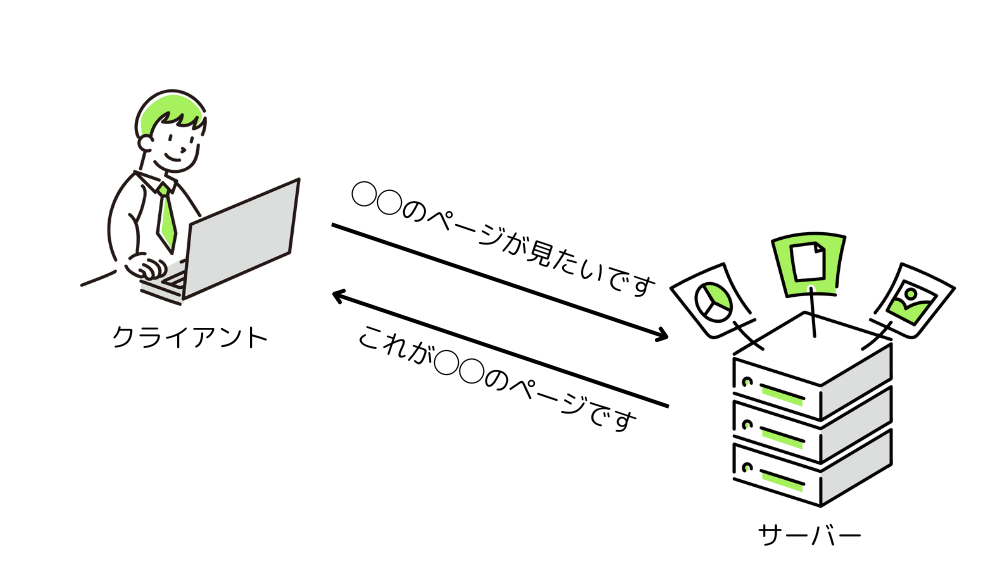
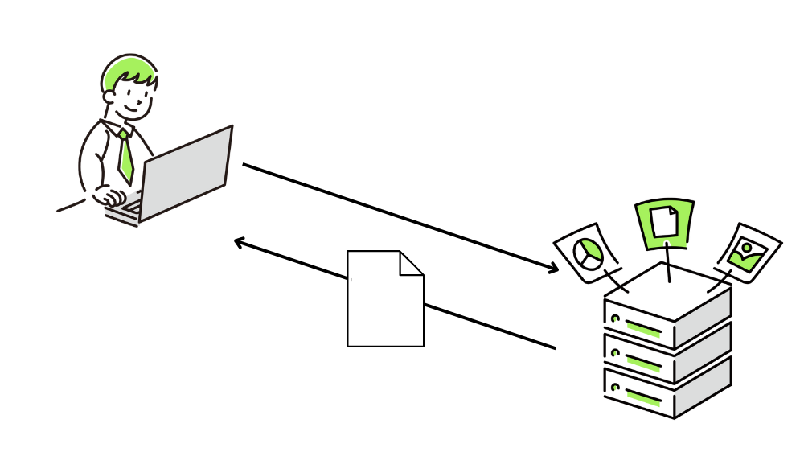
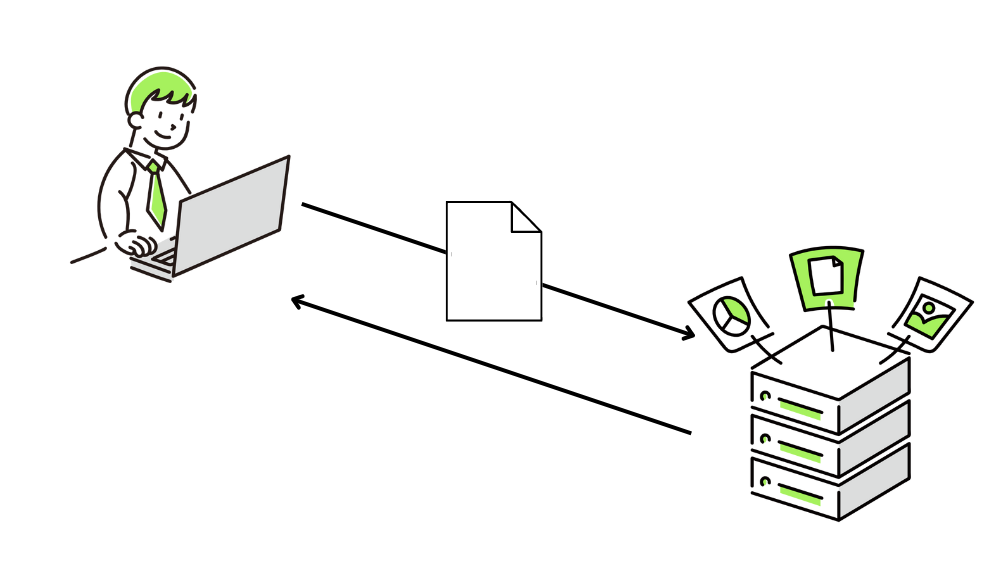
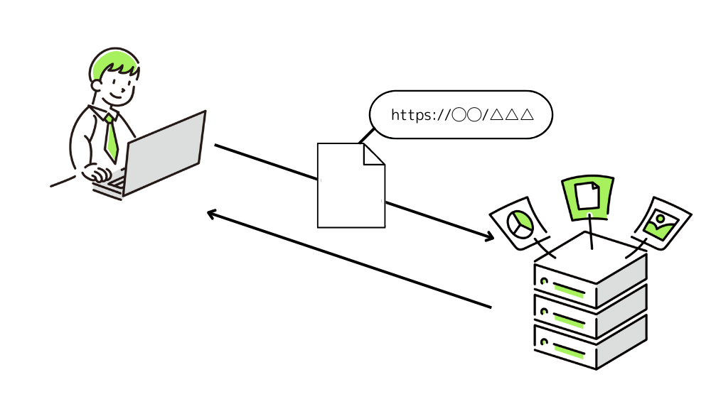
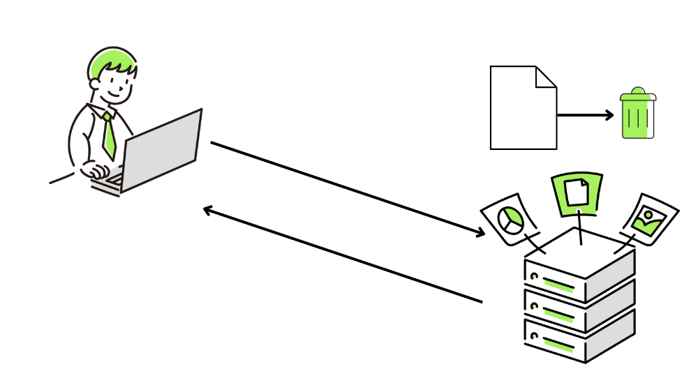
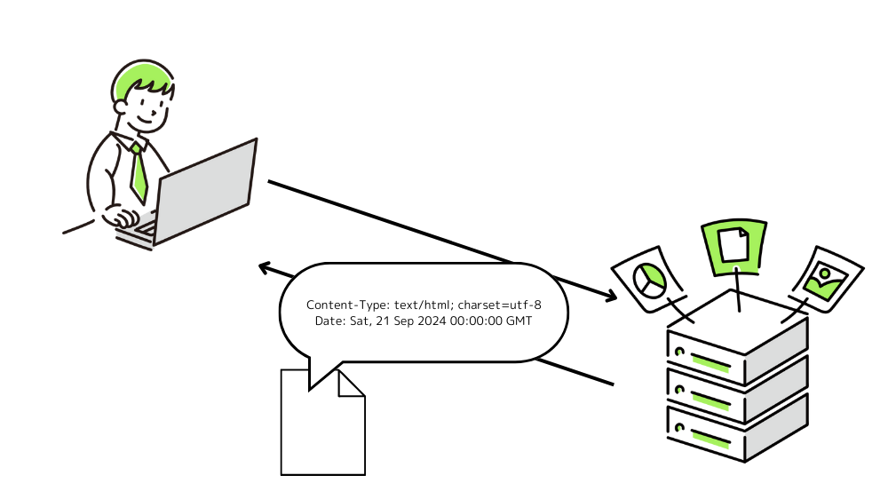
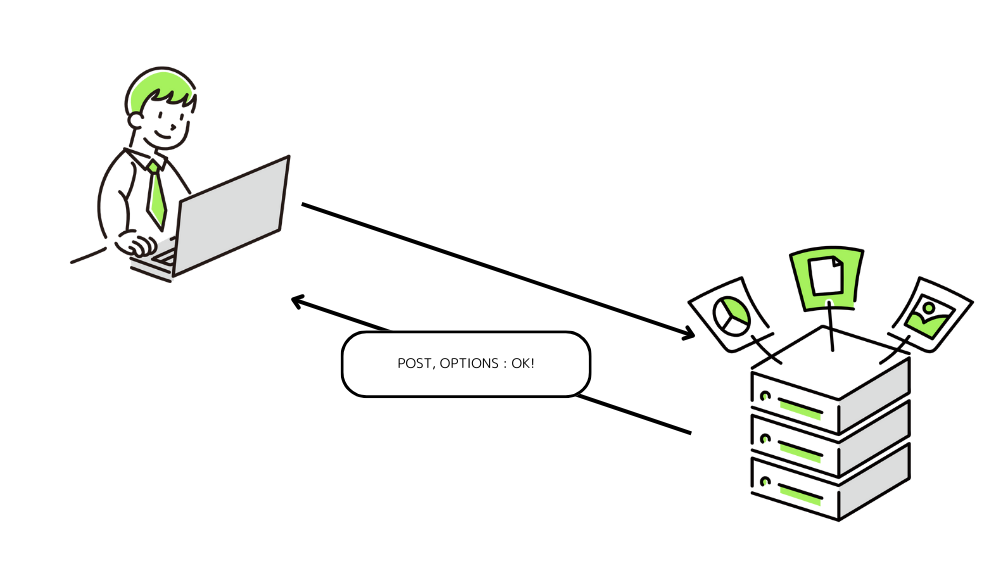
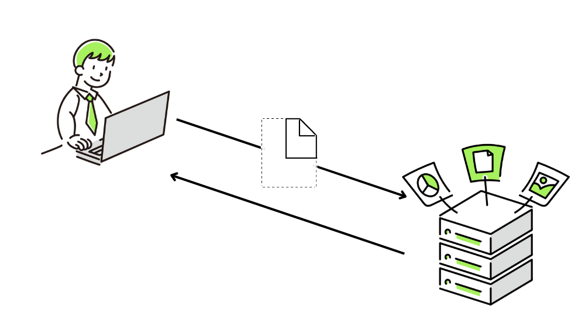

この記事で解決できるお悩み

- [HTTPメソッドって何？](#1)

- [各メソッドの使い道がわからない...](#4)

\[st-kaiwa2 html\_class="wp-block-st-blocks-st-kaiwa"\]

こんな悩みを解決できます！

営業職から会社員WEBエンジニア、  
その後フリーランスWEBエンジニアに転向した自分が解説します。

\[/st-kaiwa2\]

この記事ではHTTPメソッドとは何か、各メソッドの使われ方を初心者にもわかりやすく解説します。

この記事を読み終えればHTTPメソッドについて理解でき、業務や個人開発に役立てることができますよ！

## HTTPメソッドとは

HTTPメソッドとは、クライアントからサーバーに発行されるリクエストの種類です。

といってもよくわからないと思うので順を追って説明します。

まずはHTTPメソッドのルールを定めているHTTPプロトコルについてです。

### HTTP（HyperText Transfer Protocol）

英語と日本語の会話では意味が通じないように、インターネット通信も共通のルールに基づいて行う必要があります。

その「インターネット通信のルール」として定められているのがHTTPです。

HTTPメソッドもHTTPの中で定められているルールの1つです。

### HTTP通信の流れ

HTTP通信における重要な要素として、クライアントとサーバーがあります。

HTTPでは、スマホやPCなどのインターネットを利用する側であるクライアントと、Webページやアプリケーションなどのソースコードやデータを持ち、クライアントに提供するサーバーの2者間で通信が行われます。

クライアントは「◯◯のページが見たいです」などのリクエスト（要求）をサーバーに送ります。

サーバーはそれを受けて「これが◯◯のページです」というレスポンス（応答）を返すことで、クライアントはWebページを閲覧することができます。

### 改めてHTTPメソッドとは

ここまでで説明したように、HTTP通信ではクライアントからサーバーに向けてリクエストを送ることでWebページを閲覧することが可能になります。

ですが実際にはWebページ閲覧だけでなく、ページを更新したりフォーム送信したりと、リクエストにはいくつか種類があります。

「◯◯のページが見たいです」「◯◯のデータを送ります」「◯◯のファイルを削除してください」などのリクエストに名前をつけたものがHTTPメソッドです。

ここまでの説明で、冒頭に言った「HTTPメソッドとは、クライアントからサーバーに発行されるリクエストの種類」という意味が理解できたでしょうか。

## URI（Uniform Resource Identifier）とは

リクエストを送信する際に必要なものとしてURIがあります。

URIはリクエストの送信先情報です。

郵便で言うところの配達先住所ですね。

例えばこの記事のURIは`https://rootful.net/http-method`ですが、下記3つの情報が含まれています。

1. 使用するプロトコル

3. リクエストを送信するサーバー

5. ファイルの場所

このページを見ている皆さんは、この記事のリンクをクリックした時に`sosotech.info`のサーバーに対して「`/http-method`のページが見たいです」というリクエストを送っています。

またURIにはクエリパラメータと呼ばれる機能があります。

`https://rootful.net/http-method?page=2`のようにURIの末尾に`?パラメータ名=値`を付けることで、サーバーに「2ページ目が見たいです」などの追加情報を送ることができます。

URIはHTTPメソッドを説明する上でよく出てくる言葉なので理解しておいてください。

よく聞く言葉で「URL」がありますが、「URI」とほぼ同じものだという認識で問題ありません。

## HTTPメソッド一覧

HTTPメソッドの一覧が下記になります。

9種類ありますが、実際にユーザーや開発者が使用するのはGETとPOSTがほとんどだと思います。

このうちTRACEとCONNECTはほとんど使われていないため詳細な説明は割愛します。

| メソッド名 | 説明 |
| --- | --- |
| GET | リソースの取得 |
| POST | リソースにデータを送信 |
| PUT | リソースの更新 |
| DELETE | リソースの削除 |
| HEAD | リソースのヘッダ（メタデータ）の取得 |
| OPTIONS | リソースがサポートしているメソッドの取得 |
| PATCH | リソースの部分的な更新 |
| TRACE | 自分宛にリクエストメッセージを返す試験 |
| CONNECT | プロキシ動作のトンネル接続への変更 |

リソースとは、サーバーからのレスポンスに含まれるHTMLファイルや画像ファイルなどのことです。

## 各メソッドの説明

### GET

GETメソッドは指定したURIの情報を取得します。

Webページや画像、動画の取得など、私たちがインターネットを使用する上で欠かせないメソッドです。

あなたが今このページを見れているのも、ブラウザが`https://rootful.net/http-method`というURIに対してGETリクエストを送信しているからです。

### POST

POSTメソッドは指定したURIに対しデータを送信します。

POSTの主な使われ方は以下の3つです。

1. フォーム情報の送信

3. リソースの作成

5. リソースの更新

それぞれ解説します。

#### フォーム情報の送信

会員登録やネットショッピングなど、インターネットを利用していてフォームを入力する機会は多いです。

フォームで入力した氏名、住所、カード情報などのデータはPOSTリクエストによって指定のURIに送信されます。

そして送られた先ではデータベースに格納したりまた次の処理を行ったりといったことが可能です。

フォームで入力した情報はクエリパラメータでも送信することは可能ですが、URIにくっついているため住所やパスワードなどの情報が外部に筒抜けになってしまうリスクがあります。

一方でPOSTメソッドで送信した場合は、大切な情報が外部から見られることはありません。

そのため個人データなどを扱う場合は基本的にPOSTメソッドを使用します。

#### リソースの作成

指定したURIに対して新しいリソースを作成します。

例えばこのブログでは記事を作成するときは`https://rootful.net/wp-admin/post_new.php`というファイルを使います。

このURIに対して、POSTメソッドで新しい記事のデータを送信することで`https://rootful.net/`配下に記事リソースを作成してくれます。

#### リソースの更新

指定したURIのリソースを更新します。

このブログでは記事を編集する場合、下記のように`post.php`に対して記事IDとアクション名をクエリパラメータで渡しています。

`https://rootful.net/wp-admin/post.php?post=779&action=edit`

このURIに対してPOSTメソッドで更新したい内容を送信すると記事データを更新してくれます。

### PUT

PUTメソッドの機能は2つです。

1. リソースの作成

3. リソースの更新

#### リソースの作成

指定したURIに対して新しいリソースを作成します。

できることとしてはPOSTメソッドと同じですが、細かな違いがあります。

それはPOSTメソッドではリソースのURIを指定できないが、PUTメソッドはリソースのURIを指定できる、という点です。

例えば`https://rootful.net/wp-admin/post_new.php`に対してPOSTメソッドとPUTメソッドそれぞれで記事データを送信したとします。

POSTメソッドではサーバー側が「じゃあ`https://rootful.net/http-method`にリソース作成するわ！」と自由に決めることができますが、PUTメソッドでは強制的に`https://rootful.net/wp-admin/post_new.php`にリソース作成されてしまいます。

そのため意図しない動作を引き起こす可能性があり、基本的にはPOSTメソッドを使うことを推奨します。

#### リソースの更新

指定したURIのリソースを更新します。

こちらも上と同じ理由でPOSTメソッド推奨です。

### DELETE

DELETEメソッドは指定したURIのリソースを削除します。

### HEAD

HEADメソッドは指定したURIのヘッダ（メタデータ）のみを取得します。

GETメソッドで`https://rootful.net/http-method`というURIにリクエストすると記事データと一緒に記事データの拡張子、文字コード、更新日時などのメタデータが取得できますが、HEADはメタデータのみを取得し、記事データは取得しません。

何らかの処理を行う前にリソース情報を調べたい場合に使われます。

### OPTIONS

OPTIONSメソッドはリソースが対応しているメソッドを取得することができます。

例えば新規投稿作成用のURIである`https://rootful.net/wp-admin/post_new.php`はPOSTメソッドしか受け付けないよう設定されているとすると、このURIにOPTIONSメソッドでリクエストを送信すると`POST`のみ返却されます。

そのためOPTONSメソッドは、これから送信するリクエストのメソッドが対応しているかなどを打診するために使われることがあります。

これをプリフライトリクエストと呼び、詳しくはこちらの記事で解説しています。

\[st-postgroup html\_class="" id="948" rank="0"\]

### PATCH

PATCHメソッドは指定したURIのリソースを一部分更新します。

POSTやPUTメソッドがリソースを丸ごと送信するのに対して、PATCHメソッドは更新したい箇所だけ送信すれば良いのでパフォーマンス向上の効果があります。

## まとめ

この記事ではHTTPメソッドとは何か、HTTPメソッドの種類を解説しました。

最後にもう一度ポイントをまとめておきます。

- HTTPメソッドとはクライアントからサーバーに発行されるリクエストの種類

- HTTPメソッドは9種類あるが、よく使われるのはGETとPOSTの2種類

HTTPについてより詳しく勉強したい！という方向けに、おすすめの教材を紹介します。

[Webを支える技術 -HTTP、URI、HTML、そしてREST](http://www.amazon.co.jp/dp/4774142042)

こちらの本は正直初心者にとってはやや難しい内容もあります。

ですがHTTPやステータスコードについて非常に詳しく書かれているため、当ブログなどで簡単に理解した後にさらに理解を深めるための教材として活用してみてください！

参考  
・[HTTP リクエストメソッド - HTTP | MDN](https://developer.mozilla.org/ja/docs/Web/HTTP/Methods)  
・[Webを支える技術 -HTTP、URI、HTML、そしてREST](https://www.amazon.co.jp/dp/4774142042)
