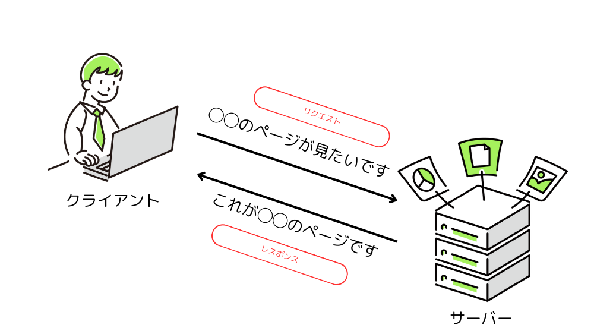
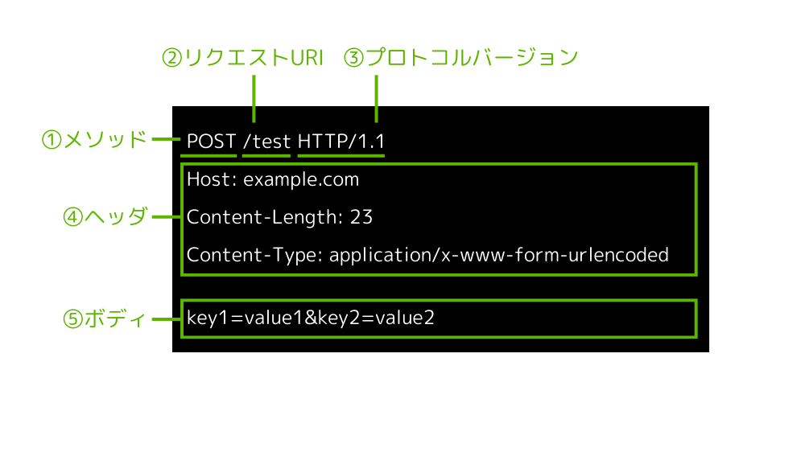
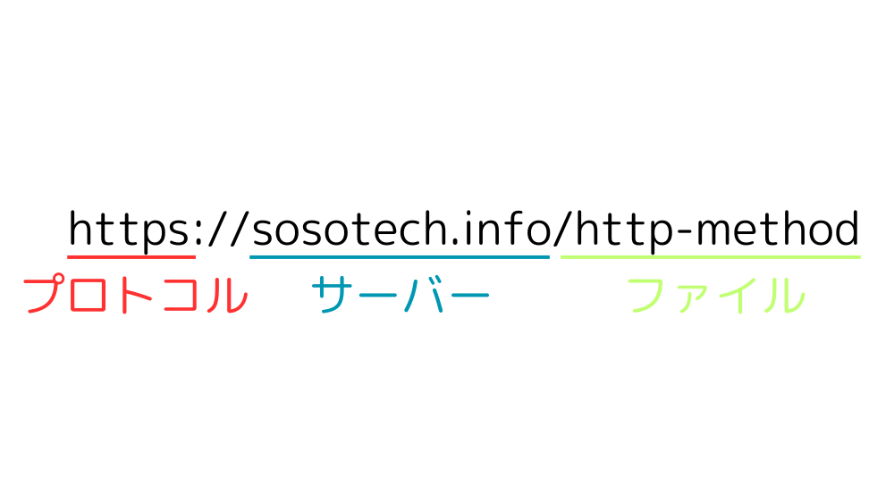
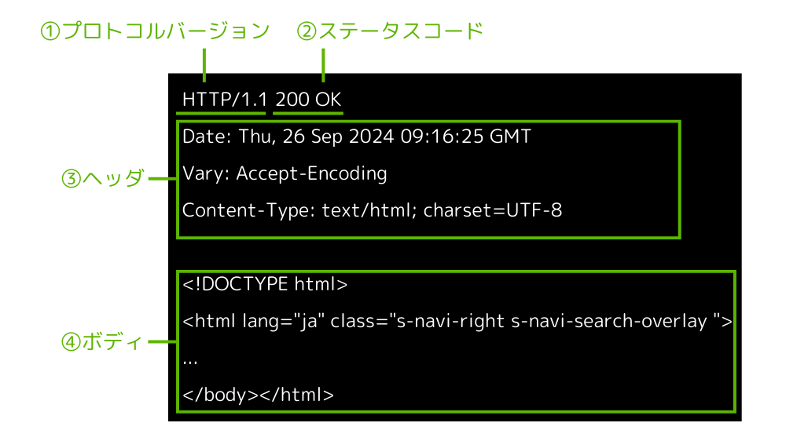
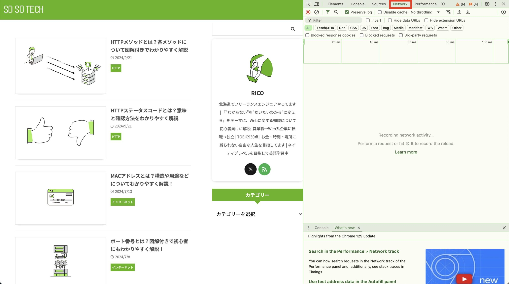
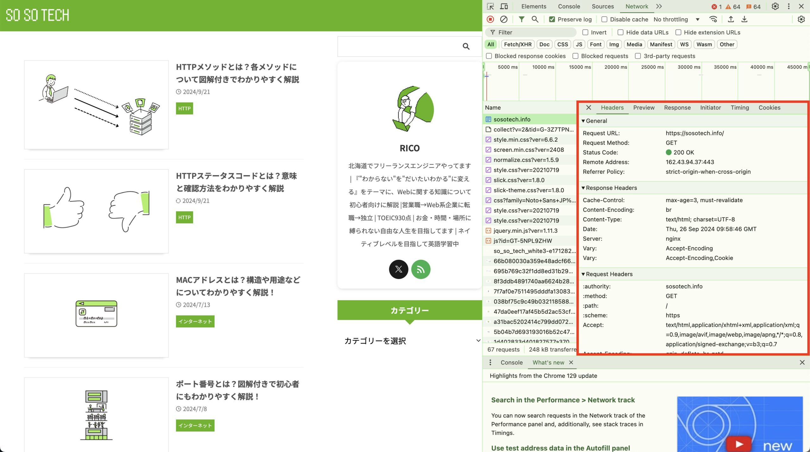
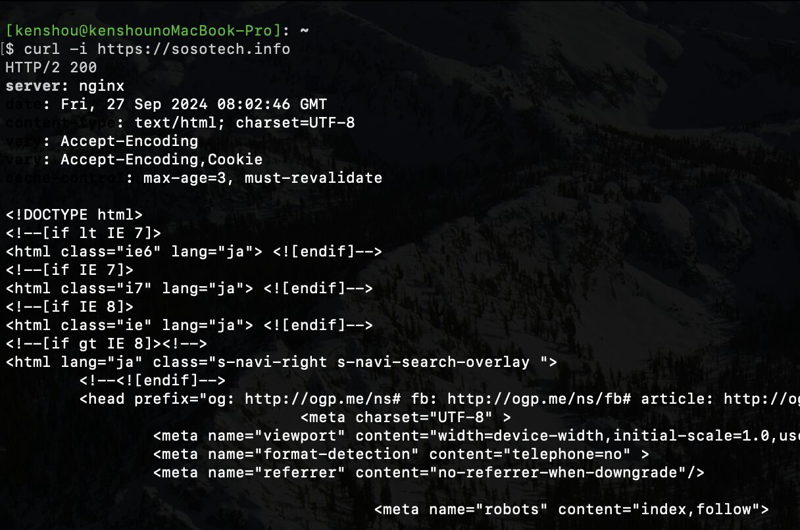

この記事で解決できるお悩み

- [HTTPのリクエスト、レスポンスって何...?](#リクエストレスポンスとは)

- [リクエストとレスポンスをどうやって確認したら良いかわからない](#リクエストレスポンスの確認方法)

- [リクエストとレスポンスの内容を理解できるようにしたい](#リクエスト)

\[st-kaiwa2 html\_class="wp-block-st-blocks-st-kaiwa"\]

こんな悩みを解決できます！

営業職から会社員WEBエンジニア、  
その後フリーランスWEBエンジニアに転向した自分が解説します。

\[/st-kaiwa2\]

この記事ではリクエスト・レスポンスとは何か？それぞれの内容について初心者向けにわかりやすく解説します。

この記事を読み終えれば、リクエスト・レスポンスを見てどんなデータが受け渡しされているか理解できるようになりますよ！

## リクエスト・レスポンスとは？

リクエストとは、クライアントからサーバーに送られるお願いのことです。

レスポンスはそのお願いを受けて、サーバーからクライアントに送られる応答のことです。

クライアント？サーバー？となる方向けに順を追って説明しますね。

### HTTP**（HyperText Transfer Protocol）**とは？

英語と日本語の会話では意味が通じないように、インターネット通信も共通のルールに基づいて行う必要があります。

**その「インターネット通信のルール」として定められているのがHTTPです。**

リクエスト・レスポンスもHTTPの中で定められているルールの1つです。

### HTTP通信の流れ

HTTP通信における重要な要素として、クライアントとサーバーがあります。

HTTPでは、スマホやPCなどのインターネットを利用する側であるクライアントと、Webページやアプリケーションなどのソースコードやデータを持ち、クライアントに提供するサーバーの2者間で通信が行われます。

クライアントは「◯◯のページが見たいです」などのお願いをサーバーに送ります。

これがリクエストです。

サーバーはそれを受けて「これが◯◯のページです」と応答することで、クライアントはWebページを閲覧することができます。

これがレスポンスです。



## リクエスト

それでは実際にクライアントからサーバーへ送られるリクエストの中身を見てみましょう。

```
POST /test HTTP/1.1
Host: example.com
Content-Length: 23
Content-Type: application/x-www-form-urlencoded

key1=value1&key2=value2
```

このリクエストには下記の要素が含まれています。

1. メソッド

3. リクエストURI

5. プロトコルバージョン

7. ヘッダ

9. ボディ



上記の例で使われているHTTP/1.1は比較的古いバージョンで、現在の主流はHTTP/2、HTTP/3です。  
リクエスト・レスポンスの形式は違いますが基本的な部分は同じなため、この記事ではHTTP/1.1を参考にしています。

それぞれ詳しく解説していきます。

### ①メソッド

メソッドはリクエストの種類を表します。

クライアントからサーバーに送られるリクエストは「◯◯のページを見たいです」「フォーム内容を送信します」など、いくつか種類があります。

それらの種類に名前をつけたものがメソッドです。

主に見ることになるのは`GET`と`POST`の2種類です。

`GET`は指定したURIのリソース（HTMLや画像ファイル）を取得し、`POST`は指定したURIに対して何らかのデータを送信します。

メソッドについてより詳しく知りたい方はこちらの記事がおすすめです。

\[st-postgroup html\_class="" id="779" rank="0"\]

### ②リクエストURI

リクエストURIは、サーバーとそのサーバー内にあるファイルの場所を表します。

インターネット上の住所のようなものになります。

URIは大きく3ブロックに分かれており、それぞれ使用するプロトコル、リクエスト送信先のサーバー、リクエスト送信先のファイルを指定します。



上記の例の`/test`のような相対パスと、`https://example.co.jp/test`のような絶対パスを指定することができます。

似たような言葉で`URL`がありますが、ほぼ同じものだと思ってもらって差し支えありません。

### ③プロトコルバージョン

どのプロトコルのどのバージョンを使用するかを表します。

上記の例では「HTTPのバージョン1.1を使って通信します」ということを宣言しています。

ちなみにプロトコルという言葉で何だか難しそうなものに聞こえますが、**プロトコル = ルール**と考えてもらうと理解しやすいと思います。

HTTPもインターネット通信を行う際のルールを定めたものです。

### ④ヘッダ

ヘッダとは送信日時、ファイルサイズなどのリクエスト情報のことです。

`ヘッダ名:値`の形で記述し、複数設定することができます。

以下に主なリクエストヘッダをまとめました。

| ヘッダ名 | 説明 | 例 |
| --- | --- | --- |
| Host | リクエストを送信するホスト（ドメイン）とポート番号 | example.com |
| Date | メッセージを生成した日時 | Fri, 27 Sep 2024 08:02:46 GMT |
| User-Agent | クライアントブラウザのタイプ | Mozilla/5.0 (Macintosh; Intel Mac OS X 10.9; rv:50.0) Gecko/20100101 Firefox/50.0 |
| Accept | クライアントが受付可能なMIMEタイプ | text/html,application/xhtml+xml |
| Accept-Charset | クライアントが受付可能な文字エンコーディング | utf-8 |
| Accept-Language | クライアントが受付可能な言語 | en-US,ja-JP |
| Accept-Encoding | クライアントが受付可能なコンテンツのエンコーディング | gzip |
| Content-Length | ボディの長さ | 23 |
| Referer | 現在のページのリンク元 | https://rootful.net/ |
| Cache-Control | キャッシュ制御するための情報 | max-age=0 |

### ⑤ボディ

ボディはクライアントからサーバーに送られるデータです。

具体的にはフォーム入力されたID・パスワードや、SNSの投稿内容などがボディに格納されます。

GETメソッドのようにサーバーからデータを取得するだけの場合、ボディには何も入りません。

## レスポンス

次にレスポンスについても見ていきましょう。

```
HTTP/1.1 200 OK
Date: Thu, 26 Sep 2024 09:16:25 GMT
Vary: Accept-Encoding
Content-Type: text/html; charset=UTF-8

<!DOCTYPE html>
<html lang="ja" class="s-navi-right s-navi-search-overlay ">
...
</body></html>
```

このレスポンスに含まれる要素は下記になります。

1. プロトコルバージョン

3. ステータスコード

5. ヘッダ

7. ボディ



### ①プロトコルバージョン

こちらは[リクエスト](#プロトコルバージョン)と同じです。

どのプロトコルのどのバージョンを使用するかを表します。

### ②ステータスコード

ステータスコードはリクエストが成功か失敗かを示す3桁の数字です。

上記の例で返ってきている200番台はリクエスト成功を意味します。

それ以外にも400番台はクライアントが原因のエラー、といったように先頭の数字によって大きく分類されています。

ステータスコードについて、詳しくはこちらの記事で解説しています。

\[st-postgroup html\_class="" id="740" rank="0"\]

### ③ヘッダ

こちらも[リクエスト](#ヘッダ)と同じく、レスポンス情報を表します。

主なレスポンスヘッダは下記になります。（リクエストヘッダで記載したものは省略）

| ヘッダ名 | 説明 | 例 |
| --- | --- | --- |
| Access-Control-Allow-Origin | リソースを共有できるオリジンを指定 | \*, https://rootful.net |
| Content-Encoding | リソースのエンコード方式 | gzip |
| Etag | リソースのバージョン情報   前回の応答からリソースに変更がない場合は再送しないなど、前回の応答との連携に使われる | W/"0815" |
| Last-Modified | リソースの最終更新日時 | Fri, 27 Sep 2024 08:02:46 GMT |
| Server | サーバー側で使用したソフトウェア情報 | Apache/2.4.1 (Unix) |
| Set-Cookie | サーバーからクライアントへクッキーを送信する | sessionId=38afes7a8 |
| Transfer-Encoding | ボディのエンコード方式 | chunked |
| Vary | リソースの表現にどのヘッダーを使用したか | User-Agent |

### ④ボディ

こちらはリクエストとは逆で、サーバーからクライアントへ送られるデータです。

具体的には見たいページのHTML・CSS・JSファイルや画像ファイルなどなどが入ります。

## リクエスト・レスポンスの確認方法

「リクエスト・レスポンスについてはわかったけどどうやって確認するの？」という方向けに、リクエスト・レスポンスの確認方法をいくつか紹介します。

### デベロッパーツール

最もお手軽な方法がChromeのデベロッパーツールを使用する方法です。

1. `F12`or`Ctrl + Shift + i（Windowsの場合）`or`Cmd + Option + I（Macの場合）`を押してデベロッパーツールを開く  
      
      
    

3. 「Network」を選択  
      
      
    

5. リクエスト・レスポンスを確認したいURIをクリック  
    「Headers」タブでヘッダ情報、「Response」タブでボディ情報が確認できます  
    ※何も表示されていない場合はページを更新してみてください  
    

### curlコマンド

curlは様々なプロトコルで通信データの送受信を行うことができるコマンドです。

もちろんHTTPにも対応しているのでリクエスト・レスポンスの確認に便利です。

コマンドラインを開き`curl リクエストURI`を実行すると、リクエストURIに対しGETを実行してくれます。

<figure>



<figcaption>

Screenshot

</figcaption>

</figure>

インストール作業が必要になる場合があります。

オブションなしだとレスポンスボディのみが出力されますが`-i`オプションをつけるとヘッダー部分も出力してくれます。

他にも様々なオプションがあるので詳しくは調べてみてください！

## まとめ

この記事ではHTTPリクエスト・レスポンスの説明とその確認方法を解説しました。

最後にもう一度ポイントをまとめておきます。

- リクエストとは、クライアントからサーバーに送られるお願い

- レスポンスはそのお願いを受けて、サーバーからクライアントに送られる応答

- リクエスト・レスポンスはそれぞれプロトコルバージョン、ヘッダ、ボディなどの情報を含んでいる

- デベロッパーツールやcurlコマンドを使用することでリクエスト・レスポンスの中身を確認することができる

HTTPについてより詳しく勉強したい！という方向けに、おすすめの教材を紹介します。

[Webを支える技術 -HTTP、URI、HTML、そしてREST](http://www.amazon.co.jp/dp/4774142042)

こちらの本は正直初心者にとってはやや難しい内容もあります。

ですがHTTPやステータスコードについて非常に詳しく書かれているため、当ブログなどで簡単に理解した後にさらに理解を深めるための教材として活用してみてください！

参考  
・[第1章 進化するHTTPの歩み ～ HTTP/1.1とHTTP/2をおさらいし、HTTP/3の基本を知る | gihyo.jp](https://gihyo.jp/admin/serial/01/http3/0001)  
・[Request header (リクエストヘッダー) - MDN Web Docs 用語集: ウェブ関連用語の定義 | MDN](https://developer.mozilla.org/ja/docs/Glossary/Request_header)
