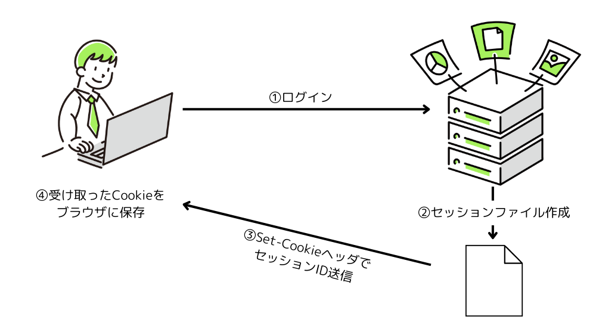
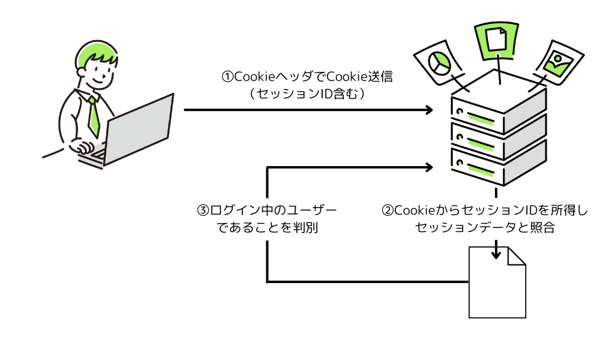

この記事で解決できるお悩み

- [セッションって何...？](#セッションとは)

- [セッションの仕組みは？](#セッションの仕組み)

- [セッションとCookieってどういう関係？](#cookie)

こんな悩みを解決できます！

この記事ではセッションとは何か、その仕組みなどについて初心者向けにわかりやすく解説します！

この記事を読み終えれば、セッションについての理解を深めることができますよ！

## セッションとは？

一言で言うと、ユーザーの状態を維持して行う一連の処理のことです。

例えばあなたがショッピングサイトにログインして以下の操作を行ったとします。

- 商品検索

- カートに入れる

- 購入

- カード情報変更

これらの処理をまとめてセッションと呼びます。

つまり、あなたがログインして行う全てのアクションを1つのまとまりとして管理するものです。

セッションの仕組みを使うことで、商品の閲覧履歴やカートの中身を維持したりすることが可能になります。

## セッションに関わる知識

といってもよくわからないと思うので、順を追って説明します。

### HTTP

英語と日本語の会話では意味が通じないように、インターネット通信も共通のルールに基づいて行う必要があります。

**その「インターネット通信のルール」として定められているのがHTTPです。**

セッションもHTTPの上に成り立っています。

### クライアント・サーバー

HTTP通信における重要な要素として、**クライアント**と**サーバー**があります。

HTTPでは、スマホやPCなどのインターネットを利用する側であるクライアントと、Webページやアプリケーションなどのソースコードやデータを持ち、クライアントに提供するサーバーの2者間で通信が行われます。

クライアントは「◯◯のページが見たいです」などのお願いをサーバーに送り、サーバーはそれを受けて「これが◯◯のページです」と応答することで、クライアント、つまり我々ユーザーはWebページを閲覧することができます。

この時のクライアントからサーバーに対するお願いをリクエスト、サーバーからクライアントへの応答をレスポンスと呼びます。

### ステートレスな通信

HTTPではリクエストとレスポンスの1往復で通信が完結します。

つまり「5分前に〇〇のサイトにログインした」「ショッピングカートに商品を追加した」などの状態を維持することができません。

このようにクライアントの状態を維持できないことをステートレスと呼びます。

ステートレスな通信では、アクセスの度に毎回ログインしなくてはいけない、カートに入れたはずなのに消えてしまうなどなど、大変面倒なことになってしまいます。

そこで、クライアントの状態を維持した状態で通信を行うために使われるのがセッションの仕組みです。

### Cookie

セッションを実現する上で欠かせないのがCookieです。

一言で言うと、**Cookieとはユーザーの状態を維持したり管理するための仕組み**です。

Cookieはログインした時などにサーバーからクライアントに送信され、クライアント側（ブラウザ）で保存されます。

そして再度同じサーバーにアクセスした時に保存していたCookieをサーバーへ送ることで、以前ログインしたことのあるユーザーであることを証明できます。

Cookieについてより詳しく知りたい方はこちらの記事がおすすめです。

[HTTP Cookieとは？用途や確認方法含めわかりやすく解説！](/posts/what-is-http-cookie/)

## セッションの仕組み

それでは実際にセッションがどのようにして実現されているか説明していきます。

ここではログインが必要なサイトにアクセスする場合を例に挙げて説明します。

### 初回アクセス

まずクライアントがログインすると、サーバーへリクエストが送信されます。

するとリクエストを受け取ったサーバーはセッションファイルと呼ばれるものを作成します。

その際、セッションファイルにセッションIDと呼ばれるユーザー番号のようなものと、ユーザーの情報を記録します。

そして`Set-Cookieヘッダ`にセッションIDを付与してレスポンスを返却します。

それを受け取ったクライアントはブラウザにセッションIDをCookieとして保存します。

ヘッダとはリクエスト・レスポンスに付与できる追加情報のようなものです。  
詳しくは以下の記事で解説しています。

[HTTPリクエスト・レスポンスとは？仕組みをわかりやすく解説](/posts/what-is-http-request-response/)

### 2回目アクセス

再度同じサイトにアクセスすると、クライアントは保存してあるCookieを`Cookieヘッダ`に付与してサーバーに送信します。

Cookieの中のセッションIDを取得したサーバーはそれをセッションファイルと照合し、対象のユーザー情報があればログイン済みと判断します。

そうすることで、サーバーはユーザーがログイン済みか判断することができます。

ログイン判定後はそのユーザーに適したコンテンツをクライアントに返却します。

## まとめ

この記事ではセッションとは何か、セッションに関わる知識と仕組みについて解説しました。

この記事でセッションについての理解が少しでも深まってくれたら嬉しいです！

最後にもう一度ポイントをまとめておきます。

- セッションとはユーザーの状態を維持して行う一連の処理のこと

- セッションはCookieを使うことで実現できる

- セッションファイルでユーザー情報を管理し、セッションIDをやり取りすることで認証ができる

最後に「HTTPについてもっと知りたい！」という方向けにおすすめの教材を紹介します。

[Webを支える技術 -HTTP、URI、HTML、そしてREST](http://www.amazon.co.jp/dp/4774142042)

こちらの本は正直初心者にとってはやや難しい内容もあります。

ですがHTTPやステータスコードについて非常に詳しく書かれているため、当ブログなどで簡単に理解した後にさらに理解を深めるための教材として活用してみてください！

参考  
[【初学者向け】セッションの概念と仕組みをCookie抜きで説明する #HTTP - Qiita](https://qiita.com/fujishiro380/items/d29bc37c9faa4fc818c2)  
[セッション管理 #HTTP - Qiita](https://qiita.com/mrshouuge/items/387b1408160022acae94)
