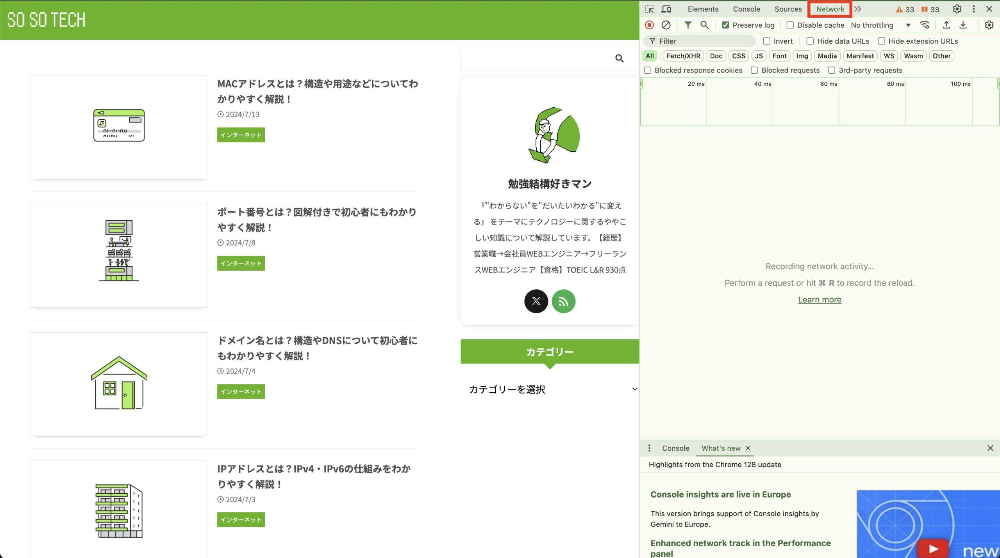
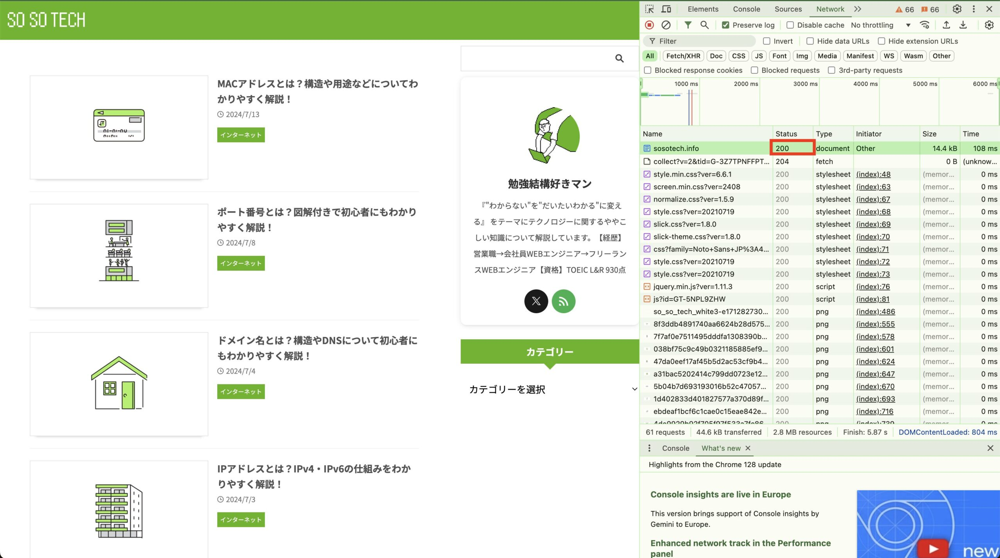
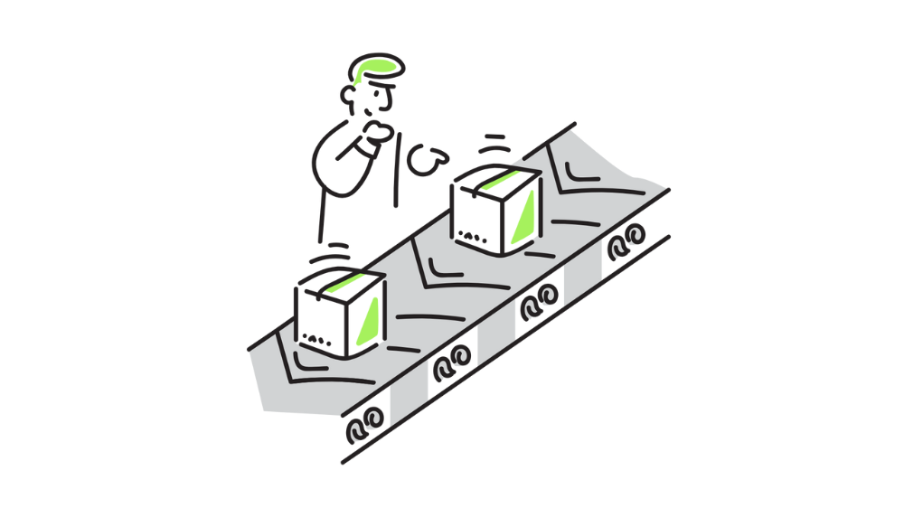
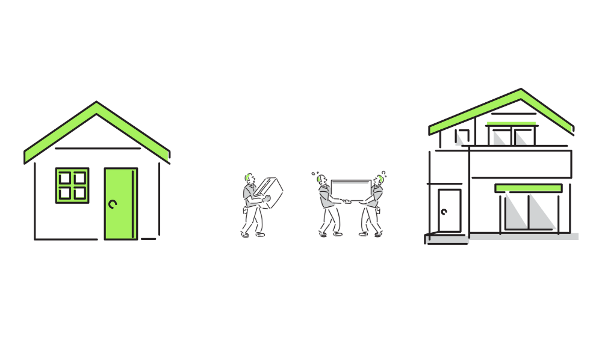
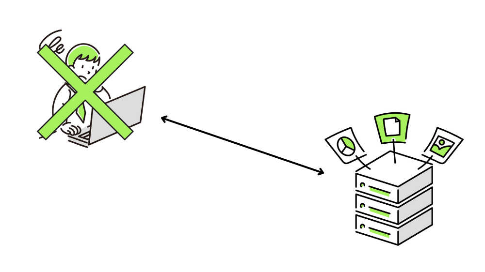
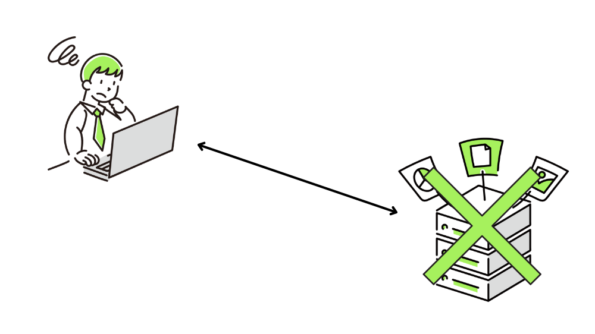

この記事で解決できるお悩み

- [ステータスコードって何？](#1)

- [たまに見る404とか500って数字は何の意味があるの？](#3)

- [ステータスコードはどうやって確認するの？](#2)

\[st-kaiwa2 html\_class="wp-block-st-blocks-st-kaiwa"\]

こんな悩みを解決できます！

営業職から会社員WEBエンジニア、  
その後フリーランスWEBエンジニアに転向した自分が解説します。

\[/st-kaiwa2\]

この記事ではステータスコードとは何か、ステータスコードの意味をわかりやすく解説します。

この記事を読めば、ステータスコードを見るだけでインターネット通信の状況を読み取ることができるようになります！

## ステータスコードとは？

一言で言うと、ステータスコードとはインターネット通信が成功したか、失敗したかどうかを表す3桁の数字です。

ステータスコードの説明をする前に、その大元であるHTTPについて簡単に説明します。

### HTTP（HyperText Transfer Protocol）

ステータスコードはHTTPの一要素です。

英語と日本語の会話では意味が通じないように、インターネット通信も共通のルールに基づいて行う必要があります。

そのため「インターネット通信のルール」としてHTTPが定められています。

ステータスコードもHTTPの中で定められているルールの1つです。

今現在、HTTPはWebサイトの閲覧やWebアプリケーションの利用には必ずと言っていいほど使われています。

URLの先頭につく「http://」や「https://」は「HTTPを使って通信を行いますよ」という宣言です。

### クライアントとサーバー

ステータスコードを理解する上で重要な要素としてクライアントとサーバーがあります。

HTTPでは、スマホやPCなどのインターネットを利用する側であるクライアントと、Webページやアプリケーションなどのソースコードやデータを持ち、クライアントに提供するサーバーの2者間で通信が行われます。

クライアントは「◯◯のページが見たいです」などのリクエスト（要求）をサーバーに送ります。

サーバーはそれを受けて「これが◯◯のページです」というレスポンス（応答）を返すことで、クライアントはWebページを閲覧することができます。

サーバーからのレスポンスに含まれるHTMLファイルや画像ファイルなどのことを**リソース**と呼びます。

ですが、何かしらの異常が発生して通信がうまくいかないことは往々にしてあります。

そんな時にサーバーから何も返事が返ってこないとクライアント側は困ってしまいますよね？

そのため、通信が成功か失敗かをクライアント側に伝えるための情報が必要です。

この、クライアントに通信結果を伝えるための情報 = ステータスコードです。

HTTPについて詳しく知りたい方はこちらの記事をおすすめします。

こちらの記事は現在準備中です。

## ステータスコードの確認方法

ステータスコードは誰でも確認することができます。

この記事ではChromeのデベロッパーツールを使った方法を紹介します。

1. `F12`or`Ctrl + Shift + i（Windowsの場合）`or`Cmd + Option + I（Macの場合）`を押してデベロッパーツールを開く  
      
      
    

3. 「Network」を選択  
      
      
    

5. 対象URLの「Status」欄を確認  
    赤枠で囲まれている「200」やその下の「204」といった数字がステータスコードになります。  
    この例ではページが問題なく表示されているので通信成功を表す「200」が表示されています。  
    ※何も表示されていない場合はページを更新してみてください  
      
    

## ステータスコードの意味

ステータスコードは3桁の数字で、先頭の数字によって以下の5つに分類されています。

そのため先頭の数字を見れば通信が成功したか失敗したかを判断することができます。

1. 1xx : 処理中

3. 2xx : 成功

5. 3xx : リダイレクト

7. 4xx : クライアントエラー

9. 5xx : サーバーエラー

この後各ステータスコードの意味を説明していきます。

1つ1つのステータスコードの意味を覚える必要はありません。  
知らないステータスコードが出てきたらその都度調べるぐらいの気持ちで大丈夫です。

### 100番台 - 処理中

100番台は処理が継続していることを表します。

クライアントはそのまま処理を継続する、また追加の情報を付け加えてサーバーに再送信するといったアクションを行います。

我々が見かけることはあまりありません。

| HTTPステータスコード | 説明 |
| --- | --- |
| 100 Continue | リクエスト継続可能 |
| 101 Switching Protocols | プロトコル切り替え |
| 102 Processing | 処理中 |
| 103 Early Hints | ヘッダの事前送信 |

### 200番台 - 成功

200番台はリクエストが成功したことを表します。

| HTTPステータスコード | 説明 |
| --- | --- |
| 200 OK | リクエスト成功 |
| 201 Created | リクエスト成功後に新たなリソースを作成 |
| 202 Accepted | リクエストは受理されたがまだ実行されていない |
| 203 Non-Authoritative Information | リクエストは成功したが信用が低いリソースが返却された |
| 204 No Content | リクエストは成功したが返却するリソースが無い |
| 205 Reset Content | クライアントに対しリクエストを送信したドキュメントをリセットするよう指示 |
| 206 Partial Content | クライアントが`Range`ヘッダーを送信した時のみ |

### 300番台 - リダイレクト

300番台は他のリソースへのリダイレクトを表します。

具体的には、アクセスしたURLに目当てのページがもう存在せず、別のURLに飛ばされる時などに返却されます。

| HTTPステータスコード | 説明 |
| --- | --- |
| 300 Multiple Choices | リクエストに対して複数のレスポンスがあることを示す |
| 301 Moved Permanently | リソースのURIが永遠に変更されたことを示す |
| 302 Found | リソースの URI が一時的に変更されたことを示す |
| 303 See Other | 別のURIをGETメソッドで参照するようクライアントに指示 |
| 304 Not Modified | リソースが更新されていないことを示す |
| 307 Temporary Redirect | 別のURIを始めのリクエストと同じメソッドで参照するようクライアントに指示 |
| 308 Permanent Redirect | リソースのURIが永遠に変更されたことを示し、変更先のURIにリクエストを送る場合は始めのリクエストと同じメソッドで参照するようクライアントに指示 |

### 400番台 - クライアントエラー

400番台はクライアントエラーを表します。

通信エラーが起こったけど悪いのはクライアント側だよ、ということを意味します。

具体的には存在しないページにアクセスしようとする、不正な値を送信する、認証が必要なリソースを認証なしで取得しようとした時などに発生します。

| HTTPステータスコード | 説明 |
| --- | --- |
| 400 Bad Request | クライアントエラーのせいでサーバーがリクエストを処理できない、もしくは処理しない |
| 401 Unauthorized | 認証を必要としているが未認証 |
| 403 Forbidden | クライアントにコンテンツのアクセス権がない |
| 404 Not Found | サーバーがリクエストされたリソースを発見できない |
| 405 Method Not Allowed | サーバーが禁止しているメソッドである |
| 406 Not Acceptable | クライアントから与えられた条件に合うコンテンツが見つからない |
| 407 Proxy Authentication Required | プロキシサーバーが認証を必要としているが未認証 |
| 408 Request Timeout | リクエスト処理時間切れ |
| 409 Conflict | リクエストがサーバーの現在の状態と矛盾する |
| 410 Gone | リクエストされたコンテンツがサーバーから永久に削除された |
| 411 Length Required | サーバーが`Content-Length`ヘッダーフィールドを要求しているが、リクエストに付与されていない |
| 412 Precondition Failed | サーバー側で適合しない前提条件がクライアント側のヘッダーに含まれている |
| 413 Payload Too Large | リクエストの本体がサーバーで定めている上限を超えている |
| 414 URI Too Long | リクエストした URI がサーバーで扱える長さを超えている |
| 415 Unsupported Media Type | リクエストされたデータのメディア形式をサーバーが対応していない |
| 416 Range Not Satisfiable | リクエスト内の `Range` ヘッダーフィールドで指定された範囲を満たすことができない |
| 417 Expectation Failed | `Expect` リクエストヘッダーで指定された内容がサーバー側と適合しない |
| 418 I'm a teapot | コーヒーポットではなくやかんにリクエストを送った   ※このステータスコードはおふざけで作られました |
| 421 Misdirected Request | リクエストがレスポンスを生成できないサーバーに送られた |
| 425 Too Early | 繰り返される可能性のあるリクエストを処理するリスクを拒否 |
| 426 Upgrade Required | リクエスト処理するためにアップグレードが必要 |
| 428 Precondition Required | リクエストが条件付きになることが必要 |
| 429 Too Many Requests | 一定の時間内に大量のリクエストを送信した |
| 431 Request Header Fields Too Large | ヘッダーフィールドが大きすぎる |
| 451 Unavailable For Legal Reasons | 政府によって検閲されたウェブページなどの違法なリソースをリクエスト |

### 500番台 - サーバーエラー

500番台はサーバーエラーを表します。

400番台の場合はクライアント側に原因がありますが、500番台の場合はサーバー側に原因があります。

そのためWebサイト閲覧時に500番台のエラーが出た場合は、クライアント側からどうにかしてページを見れるようにするといったことは基本的に不可能です。

| HTTPステータスコード | 説明 |
| --- | --- |
| 500 Internal Server Error | サーバー側で処理方法がわからない事態が発生 |
| 501 Not Implemented | リクエストメソッドをサーバーが対応しておらず扱えない |
| 502 Bad Gateway | ゲートウェイとして動作するサーバーが無効なレスポンスを受け取った |
| 503 Service Unavailable | リクエストを処理する準備ができていない |
| 504 Gateway Timeout | ゲートウェイとして動作するサーバーが時間内にレスポンスを得られない |
| 505 HTTP Version Not Supported | リクエストで使用した HTTP のバージョンにサーバーが対応していない |
| 506 Variant Also Negotiates | サーバーに内部構成エラーがある |
| 510 Not Extended | リクエスト拡張が必要 |
| 511 Network Authentication Required | クライアントがネットワークでアクセスするために認証が必要 |

【参考】[https://developer.mozilla.org/ja/docs/Web/HTTP/Status](https://developer.mozilla.org/ja/docs/Web/HTTP/Status)

## まとめ

この記事でステータスコードとは何か、ステータスコードが表す意味が理解できれば嬉しいです。

最後にもう一度ポイントをまとめておきます。

- ステータスコードとはインターネット通信の結果を表す3桁の数字

- ステータスコードはHTTPの中で定められている

- ステータスコードの先頭の数字で大まかな結果がわかる

ステータスコードについてもっと詳しく知りたい、HTTPを勉強したいという方向けにおすすめの教材を紹介します。

[Webを支える技術 -HTTP、URI、HTML、そしてREST](http://www.amazon.co.jp/dp/4774142042)

こちらの本は正直初心者にとってはやや難しい内容もあります。

ですがHTTPやステータスコードについて非常に詳しく書かれているため、当ブログなどで簡単に理解した後にさらに理解を深めるための教材として活用してみてください！
