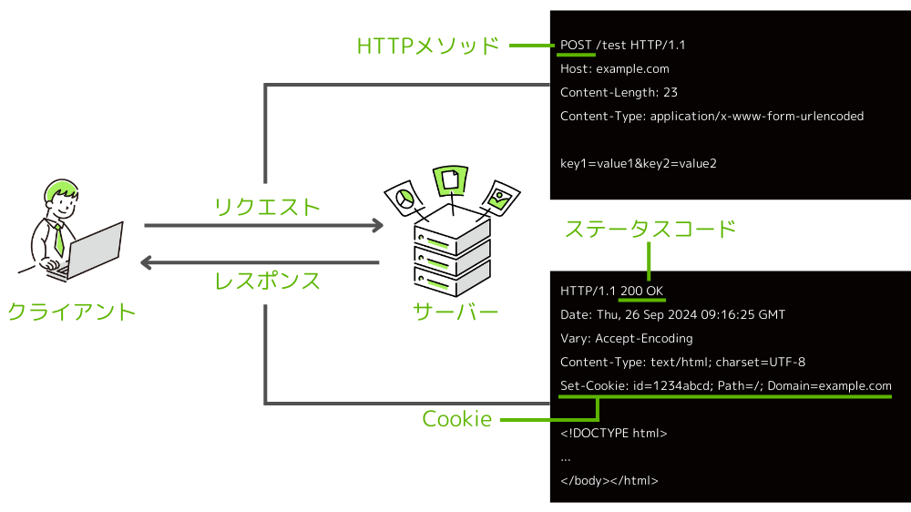
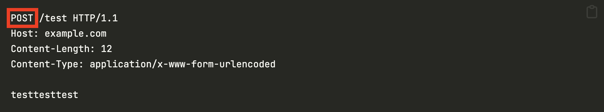
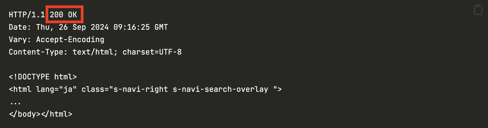
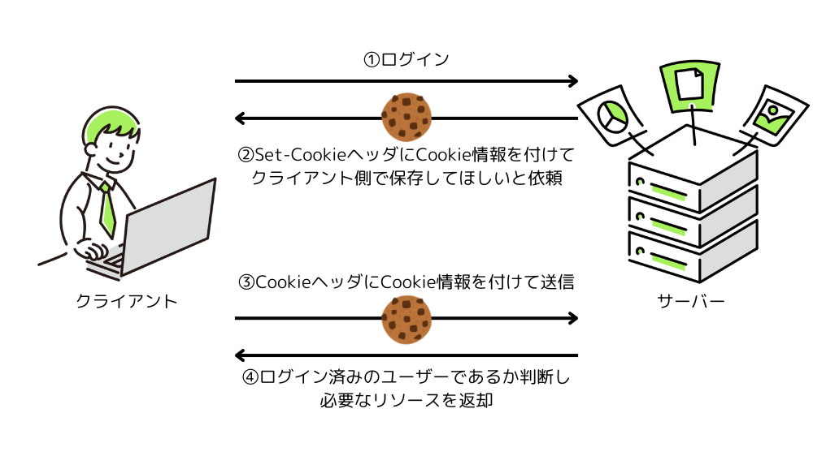

この記事で解決できるお悩み

- [HTTPって何...？](#httphypertexttransferprotocolとは)

- [HTTPを理解するには何を勉強すればいいの？](#httpの全体像)

- [HTTPとHTTPSの違いは？](#httpとhttpshypertest-transfer-protocol-secure)

こんな悩みを解決できます！

この記事ではHTTPとは何か、HTTPの仕組みなどを初心者にもわかりやすく解説します！

この記事を読めばHTTPについての理解を深めることができますよ！

## HTTP（**H**yper**T**ext **T**ransfer **P**rotocol）とは

一言で言うと、インターネット通信のルールです。

私が英語で、あなたが日本語で会話しても意味が通じませんよね？

それと同じで、インターネット通信も共通のルールに基づいて行う必要があります。

その「インターネット通信のルール」として定められているのがHTTPです。

ただし、インターネット通信のルールにはHTTP以外にもDNSやFTPなどがあるため、HTTPはそのうちの1つです。

HTTPはホームページを見るために必要なファイルの受け渡しについてのルールを定めています。

HTTP（HyperText Transfer Protocol）をざっくり日本語に訳すと  
HyperText = ホームページ用のファイルを  
Transfer = 送受信する  
Protocol = ルール  
となります。

### HTTPの全体像

HTTPについて詳しく解説する前に、HTTPの全体像を説明します。

詳しくは後ほど説明するので、まずはなんとなく眺めてみてください。



この記事ではHTTPを理解する上で欠かせない以下5つについて解説します。

1. クライアント・サーバー

3. リクエスト・レスポンス

5. HTTPメソッド

7. ステータスコード

9. Cookie

## クライアント・サーバー

HTTPを使用したインターネット通信は、クライアントとサーバーと呼ばれる機器の間で行われます。

我々がブラウザや動画を見るときに使うスマホやPCのように、サービスや機能を利用する側の機器のことを**クライアント**と呼びます。

一方で、Webページやアプリケーションなどのソースコードやデータを持ち、クライアントにサービスや機能を提供する側の機器のことを**サーバー**と呼びます。

今あなたはインターネットを利用してこのページを見ていますが、今このページを見ているあなたのスマホやPCはクライアントになります。

そしてこのページのHTMLファイルや画像ファイルなどを提供している機器がサーバーになります。

このように、インターネットを利用する際はクライアントとサーバーの2者間で通信が行われます。

## リクエスト・レスポンス

HTTP通信はクライアントとサーバーの間で行われることは説明しました。

その時、クライアントからサーバーへ送られる「◯◯のページが見たいです」「◯◯の機能を利用したいです」などのお願いのことをリクエストと呼びます。

それに対し、「お求めのページ/機能はこちらですよ」のようにリクエストに対しての応答をレスポンスと呼びます。

リクエスト・レスポンスは以下のように、それぞれ決まった形式に沿ってメッセージをやり取りすることで行われます。

下記の例で使われているHTTP/1.1は比較的古いバージョンで、現在の主流はHTTP/2、HTTP/3です。  
リクエスト・レスポンスの形式は違いますが基本的な部分は同じなため、この記事ではHTTP/1.1を参考にしています。

### リクエスト

```
POST /test HTTP/1.1
Host: example.com
Content-Length: 12
Content-Type: application/x-www-form-urlencoded
<div></div>
testtesttest
```

```
POST /test HTTP/1.1
Host: example.com
Content-Length: 12
Content-Type: application/x-www-form-urlencoded

testtesttest
```

上2行で「どんなリクエストをどのサーバーに送るか」を指定しています。

2~4行目はヘッダと呼ばれ、リクエストの送信元や送信するデータのサイズなどの追加情報を付与することができます。

クライアントからサーバーに向けて何かデータを送信する場合は、ヘッダから1行あけてリクエストボディが追加されます。

### レスポンス

```
HTTP/1.1 200 OK
Date: Thu, 26 Sep 2024 09:16:25 GMT
Vary: Accept-Encoding
Content-Type: text/html; charset=UTF-8
<div></div>
<!DOCTYPE html>
<html lang="ja" class="s-navi-right s-navi-search-overlay ">
...
</body></html>
```

```
HTTP/1.1 200 OK
Date: Thu, 26 Sep 2024 09:16:25 GMT
Vary: Accept-Encoding
Content-Type: text/html; charset=UTF-8

<!DOCTYPE html>
<html lang="ja" class="s-navi-right s-navi-search-overlay ">
...
</body></html>
```

先頭の行には「リクエストが成功したかどうか」が書かれています。

2~4行目はリクエストと同じくヘッダです。

そしてレスポンスの値として返したいデータがレスポンスボディとして設定されます。

* * *

リクエスト・レスポンスについての詳しい解説はこちらの記事でしています。

\[st-postgroup html\_class="" id="832" rank="0"\]

## HTTPメソッド

HTTPメソッドとはリクエストの種類を表します。

リクエストの例だと`POST`の部分がHTTPメソッドになります。



ここまでで説明したように、HTTP通信ではクライアントからサーバーに向けてリクエストを送ることでWebページを閲覧するなどのサービスや機能を利用することができます。

ですが実際にはWebページ閲覧だけでなく、ファイルを更新したりフォーム送信したりと、リクエストにはいくつか種類があります。

「◯◯のページが見たいです」「◯◯のデータを送ります」「◯◯のファイルを削除してください」などのリクエストに名前をつけたものがHTTPメソッドです。

主に使われるメソッドは`GET`と`POST`の2種類ですが、全て含めると9種類あり、それぞれの詳しい内容を知りたい方はこちらの記事がおすすめです。

\[st-postgroup html\_class="" id="779" rank="0"\]

## ステータスコード

ステータスコードとはリクエストが成功したか、失敗したかどうかを表す3桁の数字です。

ステータスコードは100番台~500番台の大きく5つに分けられており、それぞれ大まかな内容が決まっています。

そのため、先頭の数字を見れば通信が成功したか失敗したかを判断することができます。

1. 1xx : 処理中

3. 2xx : 成功

5. 3xx : リダイレクト

7. 4xx : クライアントエラー

9. 5xx : サーバーエラー

ステータスコードは送信されたリクエストの結果として、レスポンスとして返却されます。

レスポンスの例で言うと赤枠の部分です。



それぞれのステータスコードの詳しい解説はこちらの記事でしています。

\[st-postgroup html\_class="" id="740" rank="0"\]

## Cookie

Cookieはユーザーの状態を維持したり管理するための仕組みです。

HTTPではリクエストとレスポンスの1往復で通信が完結し、前回のリクエスト・レスポンスの内容を記録することはしません。

そのため、「5分前に〇〇のサイトにログインした」「ショッピングカートに商品を追加した」などの状態を維持することができません。

するとアクセスの度に毎回ログインしなくてはいけない、商品をカートに入れたはずなのに消えてしまうなどなど、大変面倒なことになってしまいます。

そんな面倒をなくすため使われるのがCookieという仕組みです。

Cookieを使うとサーバーから受け取った情報をブラウザに保存することができ、その情報をリクエストと一緒に送ることで以前ログインしたことのあるユーザーであることの証明などを行うことができます。

下記はログインが必要なサイトにアクセスする場合のCookieの流れです。



ログインをするとサーバーからCookie情報としてユーザーIDのようなものが渡され、それをブラウザに保存します。

2回目以降のアクセスではそのCookieを付与してリクエストを送ることで再度ログインすることなくサービスを利用することができます。

Cookieについての詳しい説明はこちらの記事でしています。

\[st-postgroup html\_class="" id="872" rank="0"\]

## HTTPとHTTPS（HyperTest Transfer Protocol Secure）

インターネットでサイトを見るとき、URLの先頭に「http://」や「https://」がついているのを見たことがあると思います。

これらはそれぞれ「HTTPプロトコルで通信するよ」「HTTPSプロトコルで通信するよ」ということを意味します。

これらの違いは通信が暗号化されているかどうかです。

HTTPプロトコルでは通信内容が暗号化されないため、パスワードやクレジットカード情報などが簡単に盗まれてしまいます。

一方でHTTPSは通信内容を暗号化してくれるため、通信を盗み見たとしても簡単に情報を盗むことはできません。

そのため現在ではHTTPSが主流となっており、HTTPを使用しているサイトは危険なためできる限り利用しない方が良いでしょう。

## まとめ

この記事ではHTTPとは何か、HTTPを理解するために必要な知識について解説しました。

全体を理解してもらうため細かい説明は省いたので、詳細はそれぞれの記事を読んでもらうか他のサイトや参考書で調べてみてください！

最後にポイントをまとめます。

- HTTPとはインターネット通信のルールである

- HTTP通信はクライアントとサーバーの2者間でやり取りが行われる

- クライアントからサーバーへの通信をリクエスト、サーバーからクライアントへの通信をレスポンスと呼ぶ

- HTTPメソッドはリクエストの種類を表す

- ステータスコードはリクエストが成功か失敗かを表す数字である

- Cookieはユーザーの状態を維持・管理するための仕組み

- HTTPSは通信内容が暗号化されるため安全に通信ができる

最後に「HTTPについてもっと知りたい！」という方向けにおすすめの教材を紹介します。

[Webを支える技術 -HTTP、URI、HTML、そしてREST](http://www.amazon.co.jp/dp/4774142042)

こちらの本は正直初心者にとってはやや難しい内容もあります。

ですがHTTPやステータスコードについて非常に詳しく書かれているため、当ブログなどで簡単に理解した後にさらに理解を深めるための教材として活用してみてください！
