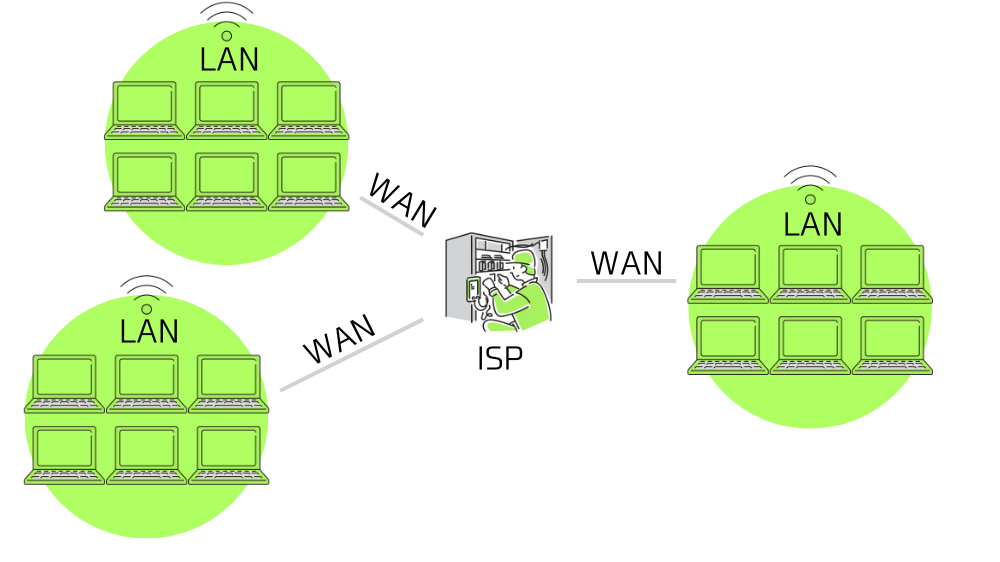
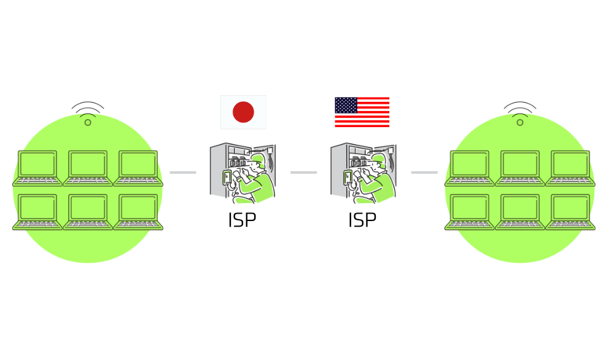

この記事で解決できるお悩み

- [インターネットって何？](#1)

- [インターネットの仕組みが全然わからない...](#2)

- [インターネットについて勉強したいんだけど何から始めたら良いかわからない...](#4)

\[st-kaiwa2 html\_class="wp-block-st-blocks-st-kaiwa"\]

こんな悩みを解決できます！

営業職から会社員WEBエンジニア、  
その後フリーランスWEBエンジニアに転向した自分が解説します。

\[/st-kaiwa2\]

この記事ではインターネットについて、言葉の意味、仕組み、使われている技術などについてできるだけわかりやすく解説します！

この記事を読み終えた時にはインターネットとは何か理解できているはずです！！

## インターネットとは？

インターネットとは一言で言うと、全世界のコンピュータ間でデータのやり取りをできるようにする仕組みです。

私たちがYouTubeで全世界の動画を見ることができるのも、クリエイターがYouTubeに動画をアップできるのもインターネットがあることで可能になっています。

## インターネットの構造

次にインターネットがどのように作られているか説明していきます。

ざっくりと説明すると、インターネットは世界中に無数にある小さなネットワークを1つに繋げることで作られています。

まず全体像を掴んでもらうため、下のネットワークのイメージ図を眺めてみてください。

以下のイメージでは3つの要素が存在しています。

1. [LAN](#2-1)

3. [WAN](#2-2)

5. [ISP](#2-3)

それぞれについて、細かく解説していきます。



実際にはもっと色々な要素が組み合わさってできているのですが、わかりやすくするために簡略化しています。

### LAN（Local Area Network）

LAN（Local Area Network）とはオフィスや家庭など、同じ建物や敷地内にあるコンピュータ同士が繋がってできるネットワークのことを指します。

つまりあなたの家には1つのLANが存在し、隣の家にはまた別のLANが存在しています。

ケーブルなどを使ってコンピュータ同士を直接繋げて作る有線LANと、Wifiルーターなどを使って電波でデータをやり取りする無線LANが存在します。

LANの特徴として、外部のコンピュータが無断でデータをやり取りすることはできません。

それができてしまうと個人情報が漏洩したりデータが改竄されたりとプライバシーもくそもなくなってしまうので当然ですね。

### WAN（Wide Area Network）

WAN（Wide Area Network）はLAN同士を結んだネットワークのことを指します。

自宅の機器を繋げてLANを作っても、インターネットに繋がなければGoogle検索や動画再生などはすることができません。

そのため自宅のLANと、どこかに存在するGooleやYoutubeのLANを繋げる必要があります。

実際にはLAN同士を直接繋ぐわけではなく、後述するISPと呼ばれる窓口を経由してそれぞれのLANが繋がり、WANが作られます。

WANで使われる回線は基本的に回線業者が管理しているため回線利用料を支払う必要があります。また、インターネットへアクセスするためにはISPを経由する必要があるのでそちらにもプロバイダ利用料を支払う必要があります。  
つまり一般的に言われる『インターネット料金』とは回線使用料とプロバイダ利用料を合わせたもの、ということですね。

### ISP（Internet Service Provider）

ISP（Internet Service Provider）はインターネットへの接続窓口です。

自宅のネット環境を整備する時によく出てくる『プロバイダ』というのがこれにあたります。

ISPは各国に複数存在しており、ISP同士がネットワークを形成しています。

そのため自宅のLANがISPに繋がると別の地域や別の国にあるISPを経由して、遠くにあるLANとデータをやり取りすることができるようになります。



具体的には、日本における J:COM、ドコモ光、NURO光などの業者のことを指します。

### インターネットは世界中のコンピュータを1つに繋げたもの

ここまでの話をまとめると、

小さなネットワークである『LAN』を『ISP』を経由して繋げることで、大きなネットワーク『WAN』が作られます。

そうして世界中にある無数のコンピュータを1つに繋げたもの = インターネットです。

## インターネット通信のルール

インターネットが構築されて世界中のコンピュータと繋がっても、『どうやってデータの送受信先を特定するか』『データをどうやって送るか』などのルールが決まっていないとどうすればデータのやり取りができるかわかりません。

そのためインターネットを使用する際の取り決めとして、さまざまなルールが定められています。

ここでは特に重要な以下3つについて説明します。

1. [TCP/IPプロトコル](#3-1)

3. [IPアドレス](#3-2)

5. [ドメイン](#3-3)

### TCP/IPプロトコル

TCP/IPプロトコルとは「インターネットを使うときはこの手順に従ってデータをやり取りしてくださいね」という、インターネット通信全体について定められているルールです。

TCP/IPプロトコルではインターネット通信のやり取りを大きく4つに分けています。

1. ネットワークインターフェース層 ... 直接接続された機器同士のデータのやり取りをする（LAN内でのデータのやり取り）

3. インターネット層 ... 他のネットワークとのデータのやり取りをする（WANを使ったデータのやり取り）

5. トランスポート層 ... 品質重視のデータ送信、速度重視のデータ送信など、目的に合ったデータ送信を行う

7. アプリケーション層 ... メールやWebなどのサービスを行う

それぞれの層で細かいルールが定められています。

一旦はネットワークの諸々のルールをまとめている『TCP/IPプロトコル』というものがあるんだな、と理解してもらえると良いと思います。

ちなみにトランスポート層で定められている『TCPプロトコル』と、インターネット層で定められている『IPプロトコル』から名前を取り『TCP/IPプロトコル』と呼ばれています。

詳細は別記事にまとめる予定です。

### IPアドレス

IPアドレスとはコンピュータの住所を表す数値です。

インターネットの中では無数にコンピュータが存在しているため、データをやり取りしたいコンピュータを特定するための情報が必要になります。

それがIPアドレスで、

```
192.0.2.0
```

のように10進数で表した数値をドットで4つの塊に区切った形で扱われます。

上記のものは『IPv4』と呼ばれる形式のIPアドレスで、新しいIPアドレスとして『IPv6』が導入されつつあります。

『IPv6』は

```
2001:0db8:1234:5678:90ab:cdef:0000:0000
```

のように16進数で表した数値をコロンで8つの塊に区切った形で扱われます。

これらは基本的に世界に1つしかない数値であり、各コンピュータにユニークなIPアドレスが割り当てられています。

コンピュータへのIPアドレスの割り当てや、IPアドレスを見て送り先を特定するなどの処理は『[TCP/IPプロトコル](#3-1)』のインターネット層にあたります。

\[st-postgroup html\_class="" id="601" rank="0"\]

### ドメイン名

ドメイン名とはIPアドレスを人間が読みやすい形に変換したものです。

IPアドレスを使うことで相手のコンピュータを特定できると言いましたが、`192.0.2.0`のような数字の羅列は人間にとっては非常に覚えづらいです。

そのため「それぞれのIPアドレスに人間が覚えやすいような名前を付けよう！」ということでドメイン名が生まれました。

ドメイン名は

```
example.com
```

のように英数字で表されます。

ドメイン名はIPアドレスと1対1で紐づいており、同じドメイン名は世界に1つとして存在しません。

例えばブラウザで `https://example.com/index.html`にアクセスすると、ルーターなどの機器が「`example.com`に対応するIPアドレスは...これだ！」といった感じで相手のコンピュータの住所を特定してくれます。

\[st-postgroup html\_class="" id="617" rank="0"\]

## まとめ

この記事ではインターネットとは何か、インターネットの仕組みなどについて解説しました。

この記事で少しでもインターネットに対する理解が深まってくれると嬉しいです。

最後にもう一度ポイントをまとめておきます。

- インターネットとは全世界のコンピュータ間でデータのやり取りをできるようにする仕組みのこと

- インターネットは世界中のコンピュータを繋げることで作られている

- インターネット通信のルールとしてTCP/IPプロトコルなどが定められている

「これからインターネットについてじっくり学んでいきたい！」という方向けに、おすすめの本を1冊紹介します。

[イラスト図解式　この一冊で全部わかるネットワークの基本 第2版](http://www.amazon.co.jp/dp/4815617678)

インターネットはルールや関わる要素が多くて混乱しがちですが、こちらの本では順を追ってわかりやすく説明してくれているので初めてインターネット関連の本を読む方におすすめです！
