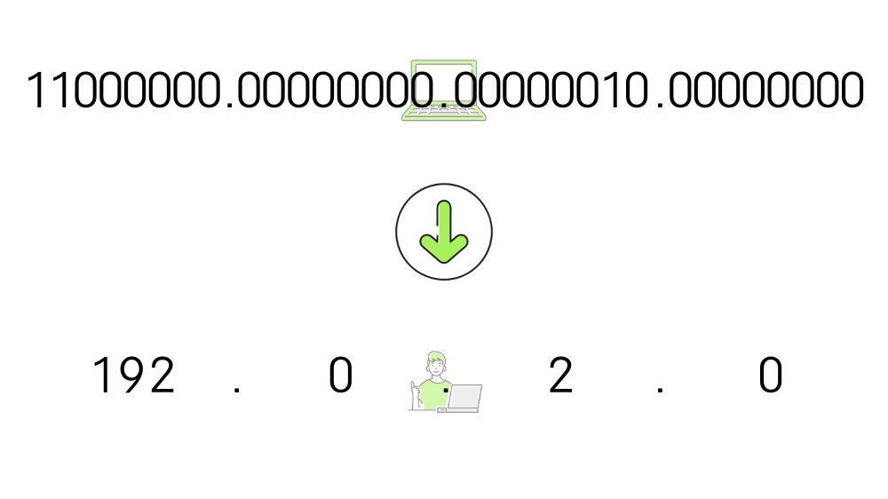
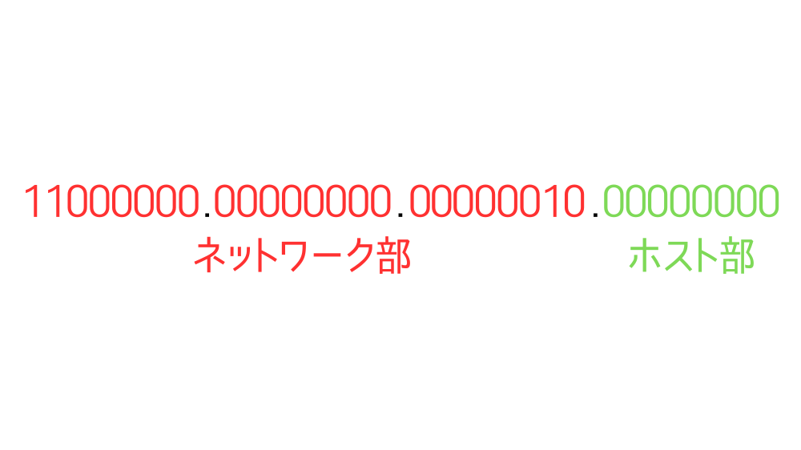
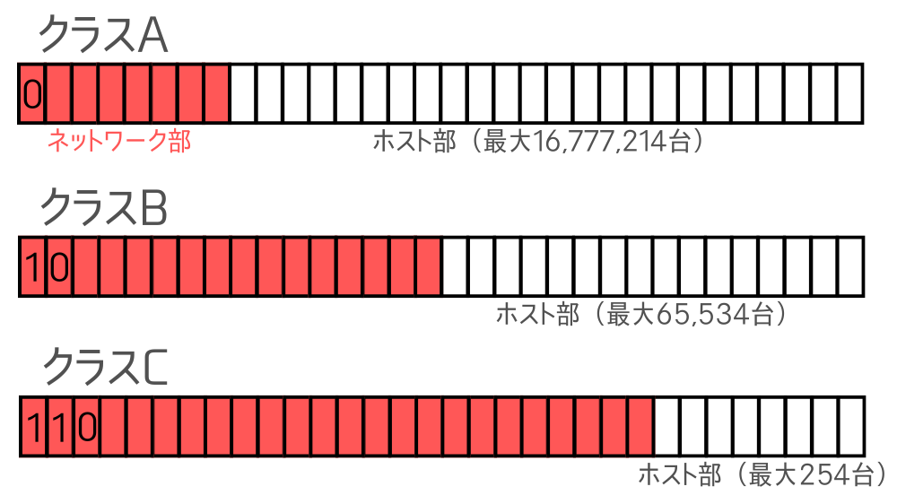
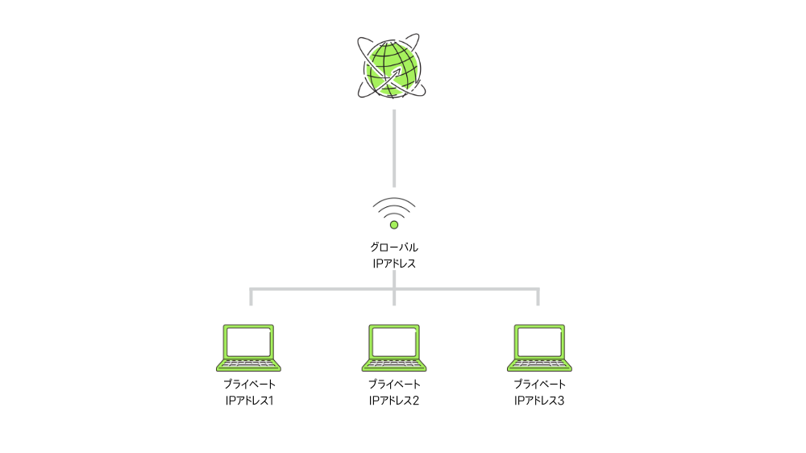
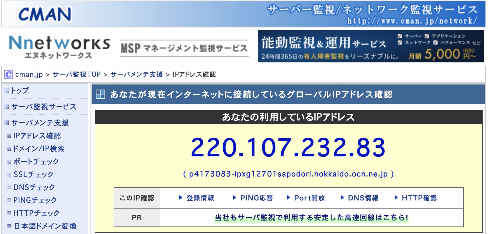
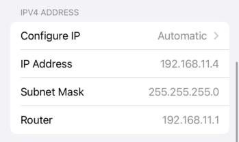

この記事で解決できるお悩み

- [IPアドレスが何なのかわからない...](#ipアドレスとは)

- [IPv4、IPv6って何？](#ipアドレスの構造)

- [自分のIPアドレスを確認する方法を知りたい](#ipアドレスの調べ方)

\[st-kaiwa2 html\_class="wp-block-st-blocks-st-kaiwa"\]

こんな悩みを解決できます！

営業職から会社員WEBエンジニア、  
その後フリーランスWEBエンジニアに転向した自分が解説します。

\[/st-kaiwa2\]

## IPアドレスとは？

IPアドレスとは、インターネットにおけるコンピュータの住所です。

例えばYouTubeで動画を見たい時には、インターネット上の無数のコンピュータの中からYouTubeのコンピュータ（サーバー）を見つける必要があります。

そんな時に使われるのがIPアドレスです。

IPアドレスを使うことでデータをやり取りしたい相手の場所を特定することができます。

そのため、基本的には同じIPアドレスはこの世に1つとして存在しません。

現在主に使われているIPアドレスはIPv4（Internet Protocol version 4）です。

この記事ではIPv4をメインに解説しつつ、IPアドレスの新バージョンであるIPv6についても解説していきます。

## IPアドレスの構造

IPアドレス（IPv4）は

```
192.0.2.0
```

のように10進数で表された4つの数字をドットで区切った形で使われます。

ただこれは人間が読みやすいようにした形で、コンピュータ内部では2進数で扱われています。

上のIPアドレスを2進数に直すと

```
11000000.00000000.00000010.00000000
```

になります。

このように、IPアドレスはコンピュータ内部では8ビットの数値をドット区切りで4つ並べた合計32ビットの形で扱われます。



### ネットワーク部とホスト部

IPアドレスには『ネットワーク部』と『ホスト部』が存在します。

ネットワーク部とは、そのコンピュータがどのネットワーク（LAN）にあるかを示す値です。

住所で言うところの都道府県からマンション名までにあたります。

一方でホスト部とは、そのネットワーク（LAN）内のどのコンピュータかを示す値です。

住所で言うところのマンションの部屋番号にあたります。

『LAN』とは、自宅やオフィスなどの1拠点内にあるネットワークのことです。

ネットワーク部とホスト部は、IPアドレスの左から何ビット分がネットワーク部、残りはホスト部というように分けられます。



ネットワーク部とホスト部の分け方は大きく分けて2種類あります。

1. クラス

3. CIDR（Classless Inter-Domain Routing : サイダー）

#### クラス

クラスではネットワーク部の長さが固定されています。

例えばクラスAでは左から8ビットがネットワーク部、残り24ビットはホスト部、というようにネットワーク部の長さが決まっています。

クラスはA~Eまでありますが、ここではよく使われるクラスA~Cについて紹介します。



クラスではクラスAなら先頭は`0`、クラスBなら先頭は`10`、のようにそれぞれの先頭数ビットの値は決まっています。

そのため、IPアドレスの先頭を見ればどのクラスが使われているか推測することができます。

また、ネットワーク部が長くなればなるほどホストとして割り当てられるコンピュータの数も少なくなるので、ネットワークの規模に応じてどのクラスにするか決めることになります。

#### CIDR（Classless Inter-Domain Routing : サイダー）

クラスの場合はネットワーク部の長さは固定です。

一方でCIDRという表記方法を使えばネットワーク部の長さをより柔軟に設定することができます。

CIDRを使用する場合はネットワーク部の長さが固定ではないため、以下のように「左から何ビット目までがネットワーク部か」を表す数字をIPアドレスの末尾に付けます。

```
192.0.2.0/24
```

この場合は`192.0.2.0` を2進数に変換した数値の左から24ビットまでがネットワーク部ということになります。

ここまでネットワーク部とホスト部について話してきましたが、普段のインターネット利用で意識することはないと思います。  
IPアドレスを見てネットワーク部・ホスト部を判断し、相手のコンピュータを特定するのはルーターの役割です。

## IPアドレスの枯渇対策

ここまでIPv4（Internet Protocol version 4）について解説しました。

現状はIPv4が主流であると言いましたが、IPv4で表せるIPアドレスの数は約43億通りなのに対し、現在の地球の人口が約80億人なので全く足りていないというIPアドレス枯渇問題が発生しています。

その問題を解消するため、主に2つの対策が行われています。

1. グローバルIPとプライベートIP

3. IPv6

### グローバルIPアドレスとプライベートIPアドレス

1つ目の対策は、IPアドレスを使い回すことができるようにする、です。

具体的にはIPアドレスの種類を以下の2つに分けました。

1. プライベートIPアドレス ... LAN内だけで使用できる【使い回し可能】

3. グローバルIPアドレス ... インターネット上での通信に使用できる【使い回し不可能】

こうすることで、LANが異なれば同じプライベートIPアドレスを使い回して割り当てられるというルールにしました。

ただしプライベートIPアドレスを使ったインターネット通信はできないため、LAN内の機器のうち1つにはグローバルIPアドレスを割り当てる必要があります。

グローバルIPアドレスは基本的にルーターに割り当てられ、スマホ・PCとインターネットとの中継役を担います。

そうすることで各機器がルーターを経由してインターネットと通信することが可能になります。



### IPv6（Internet Protocol version 6）

2つ目の対策は、新しいIPアドレスを使う、です。

IPv4では32ビットで表していたところを、その4倍の128ビットで表すIPv6（Internet Protocol version 6）が登場しました。

IPv6では340澗個（340兆の1兆倍の1兆倍）のIPアドレスを扱うことができるので全世界のコンピュータに不足なく割り当てられると考えられています。

また十分な数のIPアドレスを扱えるため、全ての機器にグローバルIPアドレスを割り当てることができます。

#### 構造

IPv6は

```
2001:0db8:0000:0000:0000:0000:0000:0000
```

のように16進数をコロンで8分割した形で扱われます。

またIPv6では省略形で記述することが推奨されており、

1. 先頭の0は省略する  
    `0db8` => `db8`

3. `0000`が連続する場合は`::`の形で省略する

などのルールに従って下記のように表記されることがほとんどです。

```
2001:db8::
```

ちなみに2進数に変換すると上記のIPアドレスは  
0010000000000001:0000110110111000:0000000000000000:0000000000000000:  
0000000000000000:0000000000000000:0000000000000000:0000000000000000  
となり、128ビットの値をコロンで16ビット×8個に分割した形になります。

#### ネットワーク部とホスト部

IPv4におけるネットワーク部とホスト部は、IPv6だと呼び名が変わり、それぞれ『プレフィックス』と『インターフェースID』と呼ばれます。

プレフィックスの長さはIPv4と同じく、

```
2001:db8::/32
```

のように記載され、上記の場合「2進数表記の左から32ビットがプレフィックス（ネットワーク部）」と判断することができます。

## 動的IPアドレス、固定IPアドレス

IPアドレスは自宅の機器にどのように設定されるのでしょうか？

IPアドレスはISP（Internet Service Provider）と呼ばれるインターネット接続窓口がルーターを経由して各機器に割り当てます。

『ISP』とはいわゆる『プロバイダ』と呼ばれる業者のことです。

IPアドレスの割り当てには以下の2種類があります。

1. 動的IPアドレス

3. 固定IPアドレス

動的IPアドレスは、インターネットに接続するたびに機器のIPアドレスが変わります。

家庭用Wi-fiや公衆Wi-fiなどはこちらのタイプがほとんどです。

一方で固定IPアドレスはその名の通り変わることがありません。

固定IPアドレスは基本的にオプションなので、ISPへの追加料金が発生することが多いです。

ISPの役割について詳しく知りたい方は下記の記事をおすすめします。

\[st-postgroup html\_class="" id="578" rank="0"\]

## IPアドレスの調べ方

では最後に、自分の機器のIPアドレスの調べ方を解説します。

### グローバルIPアドレス

こちらはルーターなどのIPアドレスになります。

[CMAN](https://www.cman.jp/network/support/go_access.cgi)にアクセスすると現在インターネットに接続している機器のIPアドレスを表示してくれます。



### プライベートIPアドレス

こちらは自宅や社内で扱っているスマートフォンやPCなどのIPアドレスになります。

確認方法は機器によって違いますが、ここではiPhoneでの確認方法を説明します。

1. 「設定」を開く

3. 「Wi-Fi」をタップ

5. 現在接続しているWi-Fiのℹ️マークをタップ

7. 「IPアドレス」欄を確認



### IPアドレスから個人情報がバレる？

バレません。

IPアドレスからは国や地域などの大まかな情報しか取得することができません。

ただし、インターネット契約のために登録しているプロバイダには個人情報が保管されているため、開示請求によって公開されることはあり得ます。

## まとめ

最後にもう一度ポイントをまとめておきます。

- IPアドレスとはインターネットにおけるコンピュータの住所

- IPv4は枯渇しており、プライベートIPアドレスやIPv6などの対策が講じられている

- IPアドレスの割り当てには、定期的にIPアドレスが変わる動的IPアドレスと、変わることがない固定IPアドレスがある

IPアドレスとは切っても切り離せない要素として、ドメイン名があります。

ドメイン名についても知りたいという方はこちらの記事を読んでみてください。

\[st-postgroup html\_class="" id="617" rank="0"\]

また、ネットワークについて基礎から勉強したい方向けにおすすめの教材を紹介します。

[イラスト図解式　この一冊で全部わかるネットワークの基本 第2版](http://www.amazon.co.jp/dp/4815617678)

インターネットはルールや関わる要素が多くて混乱しがちですが、こちらの本では順を追ってわかりやすく説明してくれているので初めてインターネット関連の本を読む方におすすめです！
