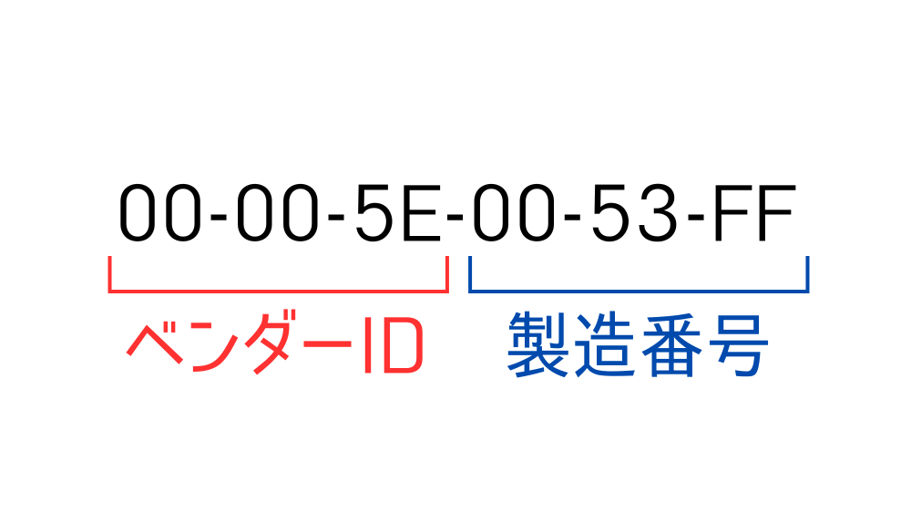
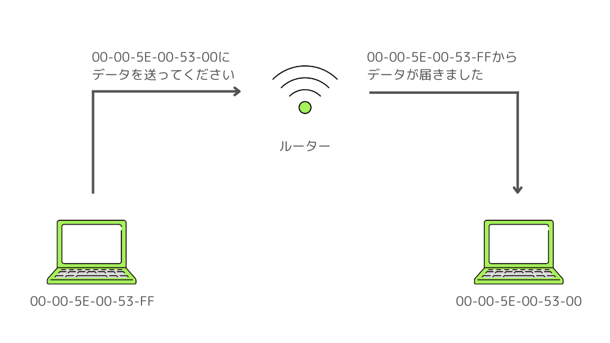
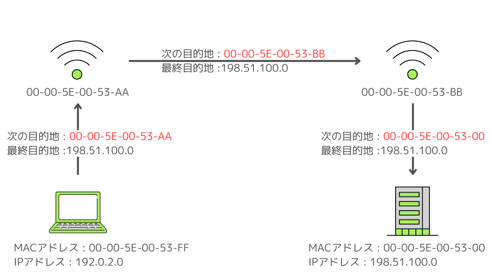
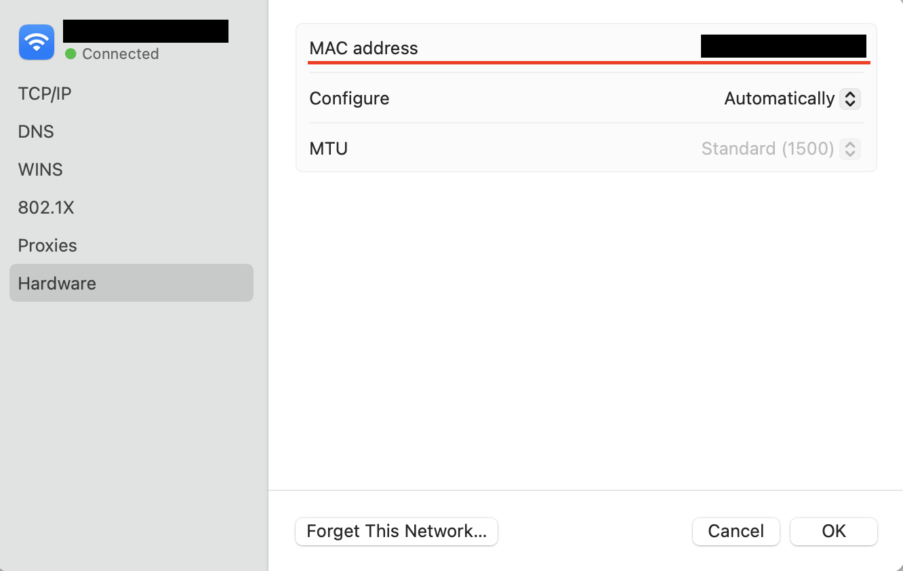

この記事で解決できるお悩み

- [MACアドレスって何...？](https://rootful.net/internet/mac-address#1)

- [MACアドレスは何に使われるの？](https://rootful.net/internet/mac-address#3)

- [MACアドレスはどうやって調べたらいい？](#4)

ネットワークの基礎として重要な『MACアドレス』。

この記事ではその仕組みや実際の用途、調べ方までを初心者向けに詳しく解説します。

## MACアドレスとは？

MAC（Media Access Control）アドレスとはパソコンやスマホ、ルーターなどのネットワーク機器に割り当てられている識別番号です。

MACアドレスとAppleが提供するMacシリーズは全く関係ありません。

人間で言うところのマイナンバーに近いものと考えてもらうと理解しやすいです。

MACアドレスは

```
00-00-5E-00-53-FF
```

のように6バイトの16進数をハイフンまたはコロンで区切った形で表します。

MACアドレスは基本的には世界で一意であり、同じMACアドレスは1つとして存在しません。

ただし、特定のソフトウェアを使用して変更できる場合もあり、その場合重複の可能性があります。

## MACアドレスの構造

MACアドレスの構成要素は大きく分けて2つです。

1. ベンダーID

3. 製造番号

MACアドレスの前半6桁はベンダーIDと呼ばれ、機器メーカーを特定するための識別番号です（例：Apple=00-1A-2Bなど）。

後半6桁は機器ごとに割り当てられる製造番号で、同一メーカー内で重複しないように割り当てられます。

メーカーごとのユニークなID、メーカー内の機器ごとのユニークなIDを合わせることでMACアドレスは一意性を実現しています。



## MACアドレスの用途

MACアドレスはネットワーク内の通信において、データの送信元と宛先の特定に使われます。

ネットワーク内にある機器のMACアドレスはスイッチと呼ばれる機器、もしくはスイッチ機能を搭載したルーターで管理することができます。

スイッチはどのポート（LANケーブルの接続口）にどの機器が接続しているかをMACアドレスで管理しています。

そのため受信したデータの宛先MACアドレスを確認して、該当ポートにのみデータを転送することができます。



### MACアドレスとIPアドレスの関係

MACアドレスと似たものにIPアドレスがあります。

IPアドレスは

```
192.0.2.0
```

のような形で表され、インターネット上におけるネットワーク機器の住所を表します。

IPアドレスについて詳しく知りたい方はこちらの記事がおすすめです。

\[st-postgroup html\_class="" id="601" rank="0"\]

IPアドレスもMACアドレスと同じく、データをやり取りする相手を特定するために使われます。

ではMACアドレスとIPアドレスの違いは何かというと、MACアドレスは『次の目的地』を表し、IPアドレスは『最終目的地』を表します。

MACアドレスは郵便における受取人名、IPアドレスは住所に例えられます。

例えばインターネット上で動画を再生しようとした時、最終目的地は『動画を保存しているサーバー』です。

ですがそこに辿り着くまでには、

1. 自分のPC → 自宅のルーター

3. 自宅のルーター → 別のネットワークのルーター

5. 別のネットワークのルーター → 目的のネットワークのルーター

7. 目的のネットワークのルーター → 目的のサーバー

というように最終目的地に行くためにいくつかの機器を経由します。

上の手順①の『自分のPC』から見た『自宅のルーター』、②の『自宅のルーター』から見た『別のネットワークのルーター』が次の目的地にあたり、これらはMACアドレスで表されます。



このようにIPアドレスは最終目的地を表すので変わることはなく、MACアドレスは次の目的地を表すので毎回変わることになります。

## MACアドレスの確認方法

Windows、MacそれぞれでのMACアドレスの確認方法を説明します。

### Windows11

Windows11での確認方法は以下の手順です。

1. 「設定」を開く

3. 「ネットワークとインターネット」を選択し、「ネットワークの詳細設定」をクリック

5. 「ハードウェアと接続のプロパティを表示」をクリック

7. 「物理アドレス(MAC)」を確認

「Wifi」と「イーサネット」それぞれに「物理アドレス(MAC)」が記載されていると思います。

インターネットに無線で繋いでいる場合は「Wifi」、有線で繋いでいる場合は「イーサネット」が今使っている機器のMACアドレスになります。

### Mac

Macでの確認方法は以下の手順です。

1. 「システム環境設定」を開く

3. 「ネットワーク」をクリック

5. 「Ethernet」を選択し、「詳細」をクリック

7. 「ハードウェア」を選択し、「MACアドレス」を確認



## まとめ

最後にもう一度ポイントをまとめておきます。

- MACアドレスとはネットワーク機器に割り当てられている識別番号

- MACアドレスはデータをやり取りする機器を特定するために使われる

- MACアドレスは『次の目的地』、IPアドレスは『最終目的地』として使われる

MACアドレスはネットワークの基礎知識として非常に重要です。

仕組みを理解することで、効率的なネットワーク設計やトラブルシューティングが可能になります。

ぜひ自分のデバイスのMACアドレスを確認し、実践に活用してみてください。

ネットワークについて基礎から勉強したい方向けにおすすめの教材を紹介します。

[イラスト図解式　この一冊で全部わかるネットワークの基本 第2版](http://www.amazon.co.jp/dp/4815617678)

インターネットはルールや要素が多くて混乱しがちですが、こちらの本では順を追ってわかりやすく説明してくれているので初めてインターネット関連の本を読む方におすすめです！
