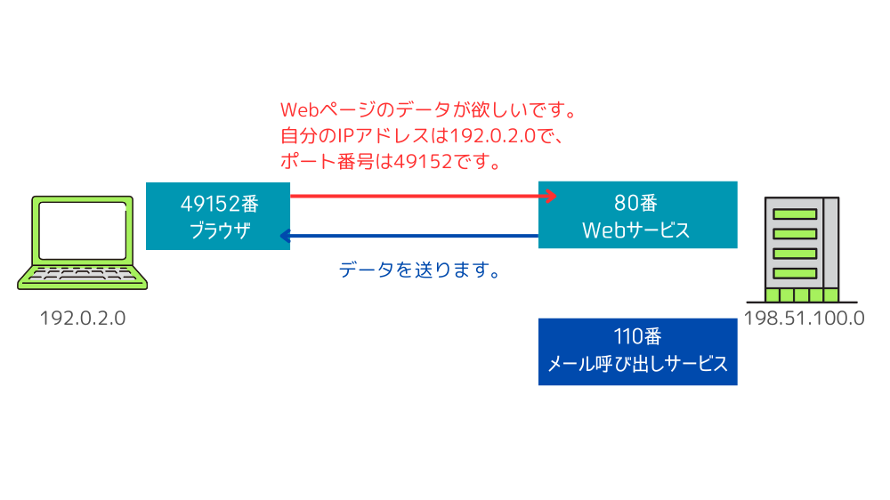
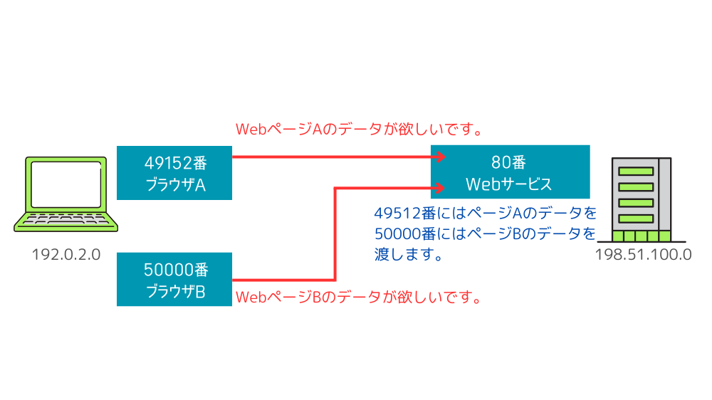

この記事で解決できるお悩み

- [ポート番号って何...？](#ポート番号とは)

- [ポート番号はどうやって使われるの？](#ポート番号を使った通信の流れ)

インターネットを使う上で欠かせない要素のひとつが『ポート番号』です。

しかし、その仕組みや役割を詳しく知っている方は少ないかもしれません。

本記事では、初心者の方でも理解しやすいように、図解を交えながらポート番号の基本を解説します！

## ポート番号とは？

ポート番号とはアプリケーションの識別番号です。

ポート番号は `0~65535` の間の数字で表されます。

インターネット通信ではIPアドレスというものを使い通信相手を特定します。

しかし通信相手のコンピュータ内ではブラウザアプリやメールアプリなど複数のアプリケーションが動いており、どのアプリケーションと通信を行うかを指定する必要があります。

そのために必要なのがポート番号です。

ポート番号を指定することで、相手のコンピュータは受信したデータがどのアプリケーション向けのものか判断することができます。

IPアドレスについて詳しく知りたい方はこちらの記事がおすすめです。

[IPアドレスとは？IPv4・IPv6の仕組みをわかりやすく解説！](/posts/what-is-ip-address/)

## ポート番号の種類

ポート番号は3種類に分けられています。

1. ウェルノウンポート番号

3. 登録済みポート番号

5. ダイナミック/プライベートポート番号

### ウェルノウンポート番号

ポート番号のうち`0~1023`はウェルノウンポート番号と呼ばれ、主要なアプリケーションごとに番号が割り振られています。

これらの番号はIANA（Internet Assigned Numbers Authority : アイアナ）という機関で管理されています。

例えば、Webサイトを閲覧にはポート番号`80`、メールの読み出しにはポート番号`110`が割り当てられています。

以下に代表的なウェルノウンポート番号をまとめました。

| ポート番号 | プロトコル | 主な用途 |
| --- | --- | --- |
| 80 | HTTP | Webへのアクセス |
| 443 | HTTPS | 暗号化されたWebへのアクセス |
| 110 | POP3 | メールボックスの読み出し |
| 143 | IMAP4 | メールボックスへのアクセス |
| 25 | SMTP | サーバー間のメール送信 |
| 587 | SMTP submission | コンピュータからメールサーバーへのメール送信 |
| 20 | FTP data | ファイル転送（データ転送用） |
| 21 | FTP control | ファイル転送（制御用） |

### 登録済みポート番号

ポート番号のうち`1024~49151`は登録済みポート番号と呼ばれ、「ウェルノウンポート番号のように主要なものではないが比較的よく使われる」アプリケーションに割り振られています。

こちらも IANAで管理されています。

代表的なポート番号としては、データベース管理システムであるMySQLの`3306`やPostgreSQLの`5432`などがあります。

### ダイナミック/プライベートポート番号

ポート番号のうち`49152~65535`はダイナミック/プライベートポート番号と呼ばれる、用途が特定されていないポート番号です。

インターネット上で通信を行う際には相手コンピュータのポート番号を指定しますが、同様に自分側のポート番号も指定する必要があります。

その際、ダイナミック/プライベートポート番号から自動的に割り当てられます。

自分側のポート番号は相手からデータを送り返してもらう時などに使用されます。

## ポート番号を使った通信の流れ

ここまでポート番号について説明してきましたが、ここから具体的な通信の流れについて説明します。

ここではインターネット通信をするために必要な要素として以下の4つを取り上げます。

1. 自身のIPアドレス

3. 自身のポート番号

5. 相手のIPアドレス

7. 相手のポート番号

これらを使った通信の流れを図示したものが以下になります。

まずデータをやり取りしたいコンピュータをIPアドレスで指定し、対象のサービスをポート番号で指定します。

そうして指定した相手に自分のIPアドレスとポート番号、「Webページのデータが欲しい」などのリクエストを飛ばします。

リクエストを受け取った相手は送信元のIPアドレス、ポート番号に対してリクエストされたデータを送信します。

といった流れで通信が行われます。

またポート番号には、下図のように相手の同じポート番号に複数のアクセスが発生した場合に、どちらにどのデータを送るかを区別する役割もあります。

## まとめ

最後にもう一度ポイントをまとめておきます。

- ポート番号とはアプリケーションの識別番号である

- IPアドレスで相手のコンピュータを特定し、ポート番号でデータをやり取りするアプリケーションを特定する

- ポート番号はウェルノウンポート番号、登録済みポート番号、ダイナミック/プライベートポート番号の3種類に分けられている

ネットワークについて基礎から勉強したい方向けにおすすめの教材を紹介します。

[イラスト図解式　この一冊で全部わかるネットワークの基本 第2版](http://www.amazon.co.jp/dp/4815617678)

インターネットは多くのルールと要素があり混乱しがちですが、こちらの本では順を追ってわかりやすく説明してくれているので初めてインターネット関連の本を読む方におすすめです！
