この記事で解決できるお悩み

- [正規表現って何なの？](#正規表現とは)

- [何を勉強すればいいの...？](#正規表現を理解するために必要な知識)

- [記号が何を意味するのかわからない...](#メタ文字)

こんな悩みを解決できます！

この記事では正規表現とは何か、正規表現の基礎的な使い方を解説します。

この記事を読み終えた時には正規表現とは何かがわかり、簡単な正規表現なら理解できるようになっているはずです！

## 正規表現とは？

正規表現とは`^`や`$`などの特殊な記号を使うことで、複数の文字列をたった一つの文字列で表す方法です。

正規表現は英語で「**regular expression**」と呼ばれ、略して「**regex**」とされることが多いです。

例えば、以下の文字列が電話番号かどうか判別してくださいと言われたらどうでしょう？

```
090-XXXX-XXXX /* X = 数字 */
```

人間からすれば一目見て電話番号だとわかりますが、コンピュータだとそうはいきません。

コンピュータに「`090-0000-0000`は電話番号だよ、`090-0000-0001`は電話番号だよ、`090-0000-0002`は...」と1つずつ教えれば判別してくれますが、無駄が多すぎます。

そこで「**先頭に0~9までの数字が3つ、その後にハイフン、その後ろに...**」のように電話番号とはどんなパターンの文字列なのかを説明してあげればよいではないか。と昔の偉い人は考えました。

その説明をするために必要なのが正規表現です。

電話番号を正規表現で書くと以下のようになります。

```
[0-9]{3}-[0-9]{4}-[0-9]{4} 
/* = 左から、0~9の数字が3つ、ハイフン1つ、0~9の数字が4つ、ハイフン1つ、0~9の数字が4つある文字列 */
```

電話番号をどこまで厳密にチェックしたいかによってこの正規表現は変わります。

この正規表現を使えばコンピュータ側が電話番号というものを理解し、大量の文章の中から電話番号だけを取得するといったことが可能になります。

このように欲しい文字列のパターンを指定することで、1つの文字列で複数の文字列を表すことができるのが正規表現です。

### 正規表現の活用方法

「正規表現がどんなものか何となくわかってきたけど具体的な使い方のイメージが湧かないな...」という方向けに正規表現を活用できる具体例を2つ紹介します。

#### 文字列検索・置換

正規表現は『大量の文字列の中から特定のパターンを持つものだけ検索・置換したい』という時に非常に便利です。（そのために使われるのがほとんどです）

例えば「HTMLファイルの中からh2タグに囲まれた文字列だけ取得したい！」という時はどうするのが良いでしょうか？

`<h2>`で検索して中の文字列をコピペして、また検索してコピペしてを繰り返せば可能ではありますが、チェックしなくてはいけないファイルが大量にあった場合はかなり時間がかかってしまいます。

そこで、以下のような正規表現を使えばh2タグの中身のみを検索することが可能です。

```
(?<=<h2>)[^<>]+(?=<\/h2>)
```

日本語で言うと『左側に`<h2>`と言う文字列があり、`<`と`>`以外の文字列が1文字以上あり、右側に`</h2>`という文字列がある文字列』という意味です。  
つまりは『h2タグに囲まれていて、かつ中に別のタグが存在していない文字列』を指定しています。

これをVSCode上で実行してみましょう。

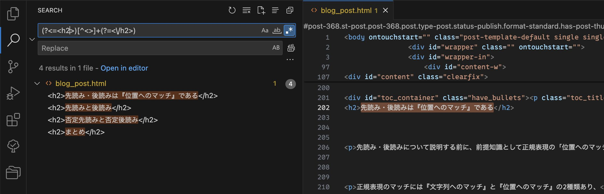

VSCodeで正規表現を使った検索を行う場合は検索窓の右側にある「.\*」のボタンを押す必要があります。

するとこのようにh2タグの中身にのみマッチしていることがわかります。

検索ができるということは、これを別の文字列に置換したり、まとめて削除することもできるということです。

このように大量の文字列の中から欲しい文字列だけをピンポイントで検索・置換ができるのが正規表現の大きな強みです。

#### フォーム送信内容チェック

フォームから送信されたメールアドレス、電話番号、パスワードなどが正常な値かどうか確認する、いわゆるバリデーションも正規表現を使えば可能です。

例えばパスワードは「半角英数字のみを使い8文字以上で指定してください」などの条件が指定されることがよくありますが、この条件を正規表現で表すと以下のようになります。

```
[a-zA-Z0-9]{8,}
```

この正規表現を使い、パスワードが条件を満たしているかJavaScriptで確認してみましょう。

JavaScript

```
const regex = /[a-zA-Z0-9]{8,}/gm;

/* 条件を満たしているパスワード */
const validPassword = 'Password1';
console.log(regex.test(password1)); // true

/* 条件を満たしていないパスワード */
const invalidPassword = 'Pass2';
console.log(regex.test(password1)); // false
```

条件を満たしている場合は`true`を、そうでない場合は`false`を返していることがわかります。

このように正規表現で文字列の条件を指定し、それにマッチするかどうかでバリデーションを行うことができます。

### どの言語で使えるのか？

基本的にはどの言語でも使えます。

またコマンドライン上でのgrepコマンドや、VSCodeやAtomなどのコードエディタ上でも使えるので一度覚えてしまえば一生役に立つといっても過言ではありません。

言語ごとに使えるメタ文字やオプションに若干の違いがあるので、「コピペしたのに動作しない！」という時は言語やツールが正規表現内で使われているメタ文字に対応しているか確認してみてください。

### 正規表現を理解するために必要な知識

では正規表現を理解して使いこなすためには何を勉強すれば良いのでしょうか？

答えは以下の3つです。

1. メタ文字

3. 特殊シーケンス

5. 修飾子（オプション）

メタ文字と特殊シーケンスは正規表現を構成する要素です。

正規表現はこの2つと通常の文字列を組み合わせて作ります。

修飾子（オプション）は正規表現を実行する際の追加ルールのようなものです。

例えば「大文字/小文字を無視して検索する」「複数行の文字列に対して検索を行う」などがあります。

それぞれの要素について詳しく解説していきます。

## メタ文字

正規表現上で特別な効果を発揮する記号のことを「メタ文字」と言います。

電話番号の例で使った`[0-9]`や`{3}`もメタ文字の1つです。

これらはただの文字列としてではなく、それぞれ「**0~9までの数字1文字**」「**直前の文字を3回繰り返す**」という特別な意味を表しています。

### メタ文字一覧

まずは全体像を掴むため、メタ文字一覧をざっと眺めてみてください。

| メタ文字 | 名前 | 意味 | リンク |
| --- | --- | --- | --- |
| . | ドット | 任意の1文字 | [詳細](#ドット) |
| \[...\] | 文字クラス | リストの中の任意の1文字 | [詳細](#文字クラス) |
| \[^...\] | 否定文字クラス | リストに含まれていない任意の1文字 | [詳細](#否定文字クラス) |
| \\char | エスケープ文字 | charがメタ文字の場合はただの文字列として扱う | [詳細](#char) |
| ? | 疑問符 | 直前の文字が0個または1つ | [詳細](#疑問符) |
| \* | スター | 直前の文字が0個以上 | [詳細](#スター) |
| + | プラス | 直前の文字が1個以上 | [詳細](#プラス) |
| {min, max} | 範囲指定 | 直前の文字が min 個以上 max 個以下 | [詳細](#min-max) |
| ^ | キャレット | 行の先頭の位置 | [詳細](#キャレット) |
| $ | ドル | 行の末尾の位置 | [詳細](#ドル) |
| (?=...) | 先読み | 右側に指定の文字列がある位置 | [詳細](#------) |
| (?<=...) | 後読み | 左側に指定の文字列がある位置 | [詳細](#------) |
| (?!...) | 否定先読み | 右側に指定の文字列がない位置 | [詳細](#------) |
| (?<!...) | 否定後読み | 左側に指定の文字列がない位置 | [詳細](#------) |
| \| | 選択 | 区切っている正規表現のどれか | [詳細](#選択) |
| (...) | 括弧 | 1\. 選択の範囲を限定する   2\. 量指定子の対象範囲を指定する   3\. 後方参照のためにキャプチャする | [詳細](#括弧) |

ここから各メタ文字の詳しい説明をしていきます。

実際に自分で試してみたい！という方には[regex101](https://regex101.com/)という正規表現チェッカーをおすすめします。

具体的な使い方やその他の正規表現チェッカーについてはこちらの記事で詳しく説明しています。

- [【厳選】JavaScript用正規表現チェッカーおすすめ4選](/posts/regex-checker-javascript/)

### 文字を表すメタ文字

#### .（ドット）

`.`（ドット）は任意の1文字にマッチします。

つまりそれが文字でも数字でも記号でも何でもいいので1文字あればOK、ということです。

例えば`"おつかれさま"`と`"おつかれさん"`のどちらも検索したい場合は

```
おつかれさ.
```

のように、最後の文字をドットに変えるとどちらにもマッチさせることができます。

実際にマッチ結果をregex101の画面で確認してみましょう。

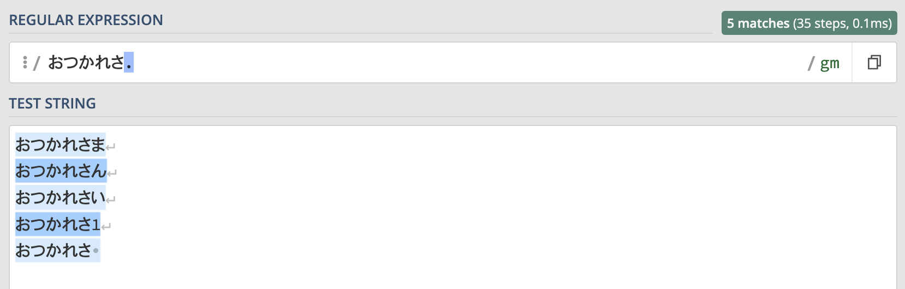

水色にマーキングされている箇所がマッチした文字列です。

`"おつかれさま"`と`"おつかれさん"`どちらにもマッチしていますね。

ただ見てわかる通り、ドットは何にでもマッチしてしまうので`"**おつかれさい**"` `"**おつかれさ1**"` `"**おつかれさ（スペース）"**`などにもマッチします。

このようにドットは何でもいい任意の1文字にマッチします。

#### \[...\]（文字クラス）

このメタ文字は『文字クラス』と呼びます。

ドットはどんな文字にもマッチしてしまいますが、文字クラスを使えば『指定された文字の中でどれか1文字』にマッチさせることができます。

先ほどの例の`"おつかれさま"`と`"おつかれさん"`を検索したい場合、ドットを使うといらない文字列も検索に引っかかってしまいますが、文字クラスを使えば欲しい文字列にだけマッチさせることができます。

文字クラスを使って正規表現を書くとこのようになります。

```
おつかれさ[まん]
```

この正規表現を使った場合の結果も見てみましょう。

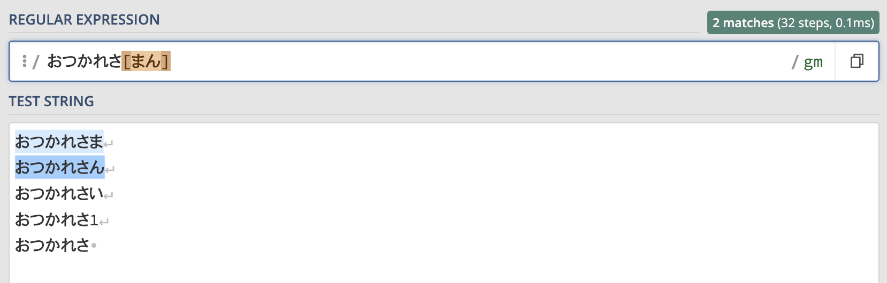

ドットを使った場合は全てにマッチしていたのが、`"おつかれさま"`と`"おつかれさん"`にだけマッチしていることがわかります。

このように、文字クラスは指定された文字の中のどれか1文字にマッチします。

文字クラスを使えば、 **`[0-9]` `[a-z]` `[ぁ-ん]`** などのように指定したい文字列の範囲をハイフンを使って繋げることで『数字1文字』『アルファベット1文字』『ひらがな1文字』などを指定することもできます。

#### \[^...\]（否定文字クラス）

これは文字クラスの否定形なので、否定文字クラスと呼ばれます。

意味も文字クラスの逆で、『指定された文字以外のどれか1文字』を表します。

文字クラスの例とは逆に`"おつかれさま"`と`"おつかれさん"`だけはマッチさせたくない！という場合は以下のように書きます。

```
おつかれさ[^まん]
```

この正規表現を使った結果がこちらです。

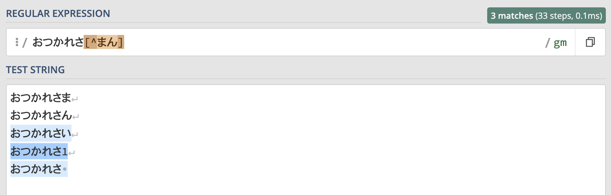

`"おつかれさい"`や`"おつかれさ1"`にはマッチしていますが、`"おつかれさま"`と`"おつかれさん"`にはマッチしていないことがわかります。

このように、否定文字クラスは指定された文字以外のどれか1文字にマッチします。

#### \\char

正規表現においてメタ文字は特別な意味を持つと説明しましたが、ではメタ文字として使われているドットやブラケットなどの記号にマッチさせたい時はどうしたら良いでしょう？

そんな時に使うのが `\`（バックスラッシュ）です。

メタ文字の前にバックスラッシュをつけることで『これはメタ文字扱いして欲しくない』ということを正規表現に伝えることができます。

このように特別な意味を持つ文字や記号を通常の文字列として扱うことを『エスケープ』と呼びます

エスケープして`**"[...]**"`という文字列を検索した例がこちらです。

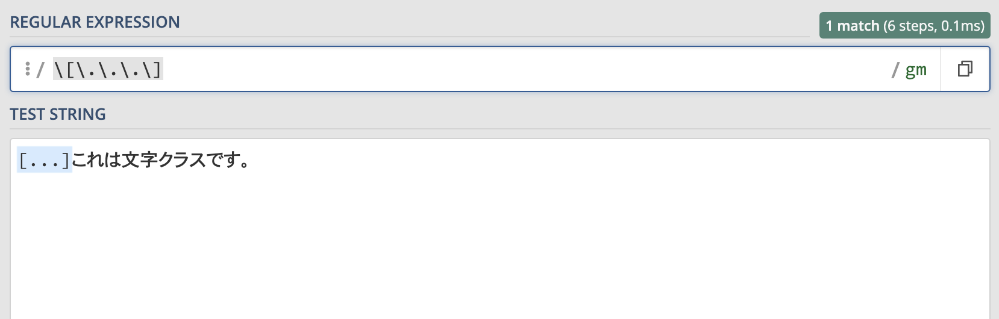

このようにメタ文字であるドットとブラケットの前にバックスラッシュをつけることで`**"[...]**"`という文字列にマッチさせることができます。

正規表現には逆にバックスラッシュをつけることで特別な意味を持つ**特殊シーケンス**というものがあります。  
詳しくは「特殊シーケンス」の項目で説明します。

### 繰り返し回数を表すメタ文字

繰り返し回数を表すメタ文字を『量指定子』と呼びます。

また中級者向けの内容ではありますが、量指定子には『最長一致』『最短一致』という考え方があり、これを理解することで正規表現のパフォーマンスを最大化することもできます。

詳しく知りたい方はこちらの記事を読んでみてください。

[正規表現の繰り返し回数指定と最長一致・最短一致について徹底解説！](/posts/regex-quantifier/)

#### ?（疑問符）

疑問符は直前の文字が0個または1個ある場合にマッチします。

つまり『なくてもいいし、あってもいい』という意味です。

例えば `"こんにちは"`と検索する時に、`"こんにちは！"` とびっくりマークが付いてる場合もマッチさせたい場合はこのように書きます。

```
こんにちは！?
```

この正規表現を使ったマッチ結果は以下のようになります。

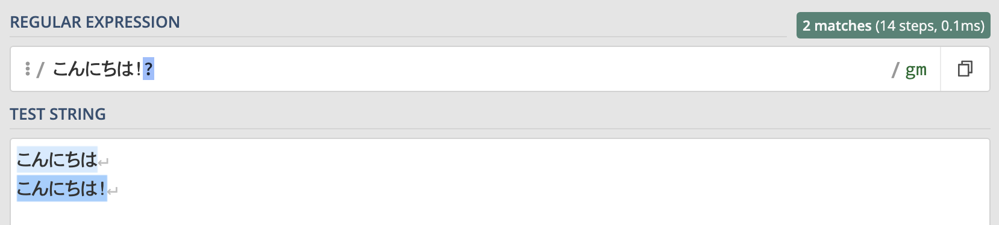

このようにびっくりマークがあってもなくてもマッチしていることがわかります。

`"こんにちは。"`などにもマッチさせたい場合は文字クラスと組み合わせて  
**`こんにちは[！。]?`**  
とすればOKです。

#### \*（スター）

スター（またはアスタリスク）は直前の文字が0個以上ある場合にマッチします。

つまり『なくてもいいし、いくつあってもいい』という意味です。

例えば`"**うわ！**"`という文字列を検索する時に、`"**うわー！**"`や`**"うわーー！**"`のように伸ばし棒ある場合もマッチさせたい場合はこのように書きます。

```
うわー*！
```

この正規表現を使ったマッチ結果は以下のようになります。


このように伸ばし棒の数に関わらず、全ての`"**うわ**！"`にマッチします。

#### +（プラス）

プラスは直前の文字が1個以上ある場合にマッチします。

つまり『少なくとも一つはあって欲しいが、いくつあってもいい』という意味です。

上のスターの例で使った正規表現をプラスを使うように変えてみましょう。

```
うわー+！
```

この正規表現を先ほどの例と同じ文字列に使用した結果はこのようになります。

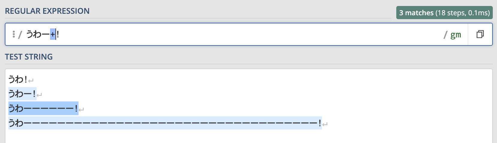

スターを使った場合は`"**うわ！**"`にもマッチしましたが、プラスを使った場合は伸ばし棒が少なくとも1つはないといけないのでマッチしません。

このようにプラスは直前の文字が1個以上ある場合にのみマッチします。

#### {min, max}

ここまでで説明した疑問符やスター、プラスでは直前の文字が最低何個か、最大何個かを指定することはできません。

しかし **{}** （ブレスと呼びます）を使えば範囲指定が可能になります。

先ほどと同じ例を使って、『伸ばし棒が最低2個、最大5個ある』という指定をしてみましょう。

```
うわー{2,5}！
```

この正規表現で検索した結果はこちらです。

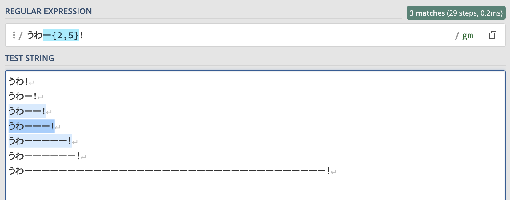

このように伸ばし棒が2~5個ある場合はマッチしますがそれ以外の場合はマッチしません。

範囲指定では直前の文字を最低何回、最大何回繰り返すかを指定することができます。

範囲指定では、**{2}** で直前の文字が2個ある時のみマッチさせたり、**{2,}** で2個以上ある時のみマッチさせたりといった使い方もできます。

### 位置を表すメタ文字

メタ文字について説明する前に、前提知識として正規表現の「位置へのマッチ」について説明します。

正規表現のマッチには『文字列へのマッチ』と『位置へのマッチ』の2種類があります。

例えば`"**REGEX**"`という文字列に対して、

```
REG
```

という正規表現を実行すると


このように文字列`"**REG**"`にマッチします。

関数などで実行した場合は文字列`**"REG**"`が返り値として取得できると思います。

これが『文字列へのマッチ』です。

一方で、文字列`**"REGEX**"`に対して

```
^
```

という『行の先頭』を意味する正規表現を実行すると、


このように文字列にはマッチせず、『行の先頭』つまり位置にマッチします。

この場合は文字列にはマッチしていないので関数を実行しても空の値が返ってきます。

これが「位置へのマッチ」です。

このセクションで説明するのは全て『位置へのマッチ』であり文字列にはマッチしないということに注意してください。

#### ^（キャレット）

キャレット（ハットとも呼びます）は行の先頭にマッチします。

例えば箇条書きリストの`"**・**"`にマッチさせたい場合は以下のように書きます。

```
^・
```

この記事の見出しの一部分を箇条書きにしたものにこの正規表現を実行してみた結果がこちらです。

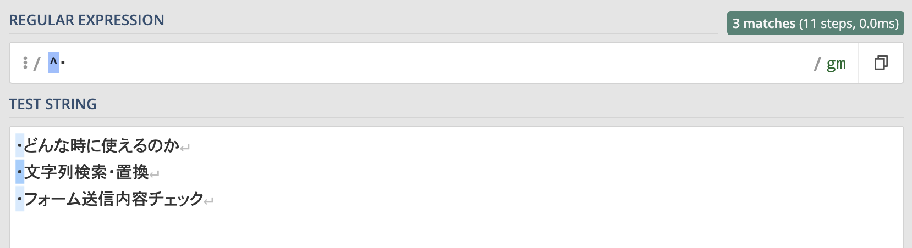

箇条書きリストの中で「**文字列検索・置換**」という箇所に`"**・**"`が含まれているのにも関わらずマッチしていません。

それはキャレットで『行の先頭にある`"**・**"`』を指定しているからです。

このように、キャレットは行の先頭にマッチします。

#### $（ドル）

ドルは行の末尾にマッチします。

例えば行末の`"**。**"`にマッチさせたい場合は以下のように書きます。

```
。$
```

この正規表現を実行した結果がこちらです。

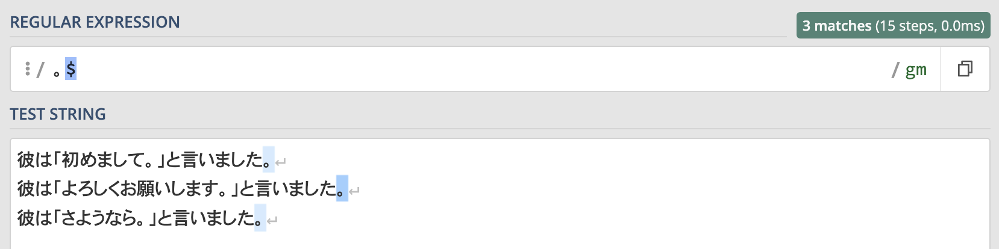

`"**初めまして。**"` `"**よろしくお願いします。**"`など文中にも`"**。**"`がありますが、ドルで行の末尾を指定しているので行末の`"。"`にのみマッチします。

このように、ドルは行の末尾にマッチします。

#### (?=...) / (?<=...) / (?!...) / (?<!....)

これらは先読み・後読みと呼ばれるメタ文字です。

それぞれ『右側に指定の文字列がある位置』『左側に指定の文字列がある位置』にマッチします。

先読み・後読みについては説明が長くなってしまうので別記事で詳しく解説しています。

しっかり理解したい方はこちらを読んでみてください。

[正規表現の（否定）先読み・後読みについてイメージ付きで解説！](/posts/regex-lookahead-lookbehind/)

### その他のメタ文字

#### |（選択）

パイプは『パイプで区切られた正規表現のどれか』にマッチします。

つまり『or』です。

例として`"初めまして"`と`"さようなら"`のどちらにもマッチさせたい場合、正規表現はこのようになります。

```
初めまして|さようなら
```

この正規表現の実行結果は以下のようになります。

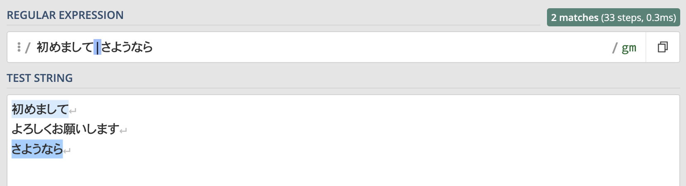

このように`"初めまして"`と`"さようなら"`だけにマッチしていることがわかります。

**`初めまして|よろしくお願いします|さようなら`**  
のように何個でもパイプを繋げることができます。

#### (...)（括弧）

括弧には主に3つの使い方があります。

1. 選択の範囲を限定する

3. 量指定子の対象範囲を指定する

5. 後方参照のためにキャプチャする

説明すると長くなるので詳しくはこちらの記事でまとめています。

[正規表現の括弧を使ったグループ化・キャプチャについて徹底解説](/posts/regex-parentheses/)

## エスケープシーケンス

エスケープシーケンスとは、アルファベット1文字の前にバックスラッシュを付けることで特殊な効果を発揮するものです。

ここでは一般的な特殊シーケンスのみ紹介します。

特殊シーケンスは言語やツールによって差があるので詳しくはそれぞれの公式ドキュメントを参照することをおすすめします。

| エスケープシーケンス | 意味 | 対応する正規表現 |
| --- | --- | --- |
| \\d | 1つの数字にマッチ | \[0-9\] |
| \\D | 数字以外の1つの文字にマッチ | \[^0-9\] |
| \\w | 単語文字 (アルファベット、数字、アンダースコア) のいずれかにマッチ | \[a-zA-Z0-9\_\] |
| \\W | 単語文字以外の1つの文字にマッチ | \[^a-zA-Z0-9\_\] |
| \\n | 改行 | \- |
| \\t | タブ | \- |
| \\s | 空白文字 (スペース、タブ、改行など) のいずれかにマッチ | \[ \\n\\t\] |
| \\S | 空白文字以外の1つの文字にマッチ | \[^ \\n\\t\] |
| \\b | 単語の境界にマッチ | \- |
| \\B | 単語の境界以外の位置にマッチ | \[^\\b\] |

## 修飾子（オプション）

修飾子（オプション）とは、正規表現を実行する際の追加ルールです。

オプションの指定方法としては下記のような形で記述したり、関数の第一引数に正規表現を渡し第二引数にオプションを渡すといったものがあります。

```
/正規表現/オプション
```

こちらもエスケープシーケンスと同じく言語やツールによって差異があるため、一般的なもののみ紹介します。

| 修飾子 | 意味 |
| --- | --- |
| i | 大文字・小文字を区別せずマッチする |
| m | 複数行に渡ってマッチする |
| s | `.`が改行文字にマッチする |
| x | 正規表現を見やすくするため、スペースや改行を挟んで記述することができるようにする |

## まとめ

この記事を最後まで読んでもらえた方は『正規表現とは何か』をざっくり理解できたかと思います。

正規表現を使えば業務効率化やシステム開発など様々なことに活用できるのでぜひ自分でも色々試してみることをおすすめします！

最後にもう一度ポイントをまとめておきます。

- 正規表現とは複数の文字列をたった一つの文字列で表す方法である

- 正規表現を使えば検索・置換・バリデーションなどを様々な言語やツールで使うことができる

- 正規表現を構成する要素は「メタ文字」「エスケープシーケンス」「修飾子」の3つである

正規表現を1から勉強したい！という方はこちらの書籍がおすすめです。

[詳説 正規表現 第3版](http://www.amazon.co.jp/dp/4873113598)

  
なんとなく初心者にとっつきにくいイメージがあるオライリー本ですが、こちらは正規表現に馴染みのない方でも読みやすく初心者にもおすすめです！
